## Import CAD models

The CAD models can be imported to the program as .obj or .stl file.

 

Right after the import, the geometry and mass properties of each rigid body are automatically calculated.

## Rigid Body Properties

The "Body Properties" panel can be opened by clicking the "Body" button or by double-clicking on the Body in the Tree-Hierarchy on the left side of the window.

Once the CAD model is imported or created by the Primitives toolbar, the mass properties are immediately calculated and assigned to each body based on the CAD mesh data and default steel density: ρ = 7850 kg\*m\^3:

-   Volume (mm\^3),
-   Mass (kg),
-   XYZ-coordinates of its Center of Gravity (CoG) relative to the Global reference frame (mm),
-   Inertia Tensor with regards to body’s CoG (kg\*mm²),
-   Principal Moments of Inertia (kg\*mm²): I_xx, I_yy, I_zz,
-   Rotation Matrix of body’s Principal Axes relative to the Global RF,
-   Rotational angles of the body’s principal axes in Global RF (Yaw-Pitch-Roll).

By demand, the density can be changed, then all mass properties will be immediately updated.

By selection the ‘Apply Overall Density’ checkbox (and click ‘Apply’ button), the density and mass properties will be updated for all rigid bodies in the model.

A specific color can be assigned to each body individually or to all bodies in the project.

By demand, a random color can be assigned to all bodies.

The body can be hidden (‘Visible’ button) or disabled (‘Enabled’ button) and not considered in the simulation.

## The Gravity

Once the CAD model is imported or created by the Primitives toolbar, the gravity force is assigned to each body based on the calculated mass properties and the global gravity vector.

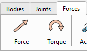

By default, the gravity vector is set to: $$\mathbf{g \ } = \  \left\lbrack 0 , \  - 9 . 8 1 , \  0 \right\rbrack^{T}$$ (m/s\^2)

By demand, the gravity can be changed or deactivated in the Gravity section of the Force Property panel.

The gravity force appears as a green arrow for each body pointing from its CoG.

## Initial linear and angular velocities

By default, the Initial linear and angular velocities of each body are set to 0.0.

By demand, the initial velocities can be updated to the required values, which will be considered at time point t=0 during simulation. The ‘Initial Velocity’ section is available on the ‘Body Properties’ panel.

Since the rotations are solved in local body-fixed reference frame in the solver, the body initial angular velocity is also defined as the vector in the Local body RF for convenience.

Attention / Tip! Unlike a single body, the initial velocities for coupled bodies must be specified with caution. If the velocities of constrained bodies do not match, this can lead to inaccurate simulation results, high reactions in the joints or even solver crash.

## Reference Frame

Reference Frame (RF) is a coordinate system, whose origin and orientation have been specified in physical space relative to the Global reference frame.

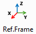

The reference frame is the fundamental unit of the simulation system, since all the basic components (bodies, forces, joints, springs) are defined relative to the reference frame.

The reference frame is defined by 6 parameters: X, Y, Z -coordinates and X_rot, Y_rot, Z_rot rotational angles relative to the Global RF.

The RF can be copied, shifted and rotated relative to the Global and Local RF by the controls on the “RF Properties” panel. The "RF Properties" panel can be opened by click the "Ref.Frame" button or by double-click on the RF in the Tree-Hierarchy on the left side of the main window.

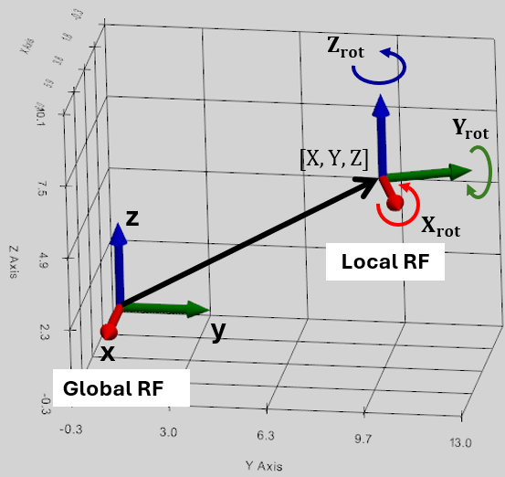 

### The Rotation Sequence (X → Y → Z) in Global RF

The engine uses Tait–Bryan angles, commonly referred to in aerospace and robotics as Roll-Pitch-Yaw. This means, the rotations are applied sequentially in the order: X-axis first, then the Y-axis, and finally the Z-axis relative to the Global RF. When the values are applied, the object rotates around the fixed Global Coordinate System axes.

### The Rotation Sequence (Z → Y → X) in Local Body RF

Because of how 3D rotation matrices multiply, an Extrinsic X-Y-Z sequence in Global RF produces the exact same final spatial orientation as an Intrinsic Z-Y-X sequence in Local RF. This means, to get the same orientation as after XYZ-rotation in Global RF, we need to rotate in ZYX sequence relative to the Local RF.

### Locked reference frames

The reference frame is locked if one of the following features are defined relative to this RF: the Body, Joint or Spring.

### Body shifting and rotation with its CoG RF

We can move and rotate the body with its CoG RF if we check the “Move Body with CoG” checkbox.

## Primitives

Primitives Toolbar is for creating the simple solid models.

### Box

This tool creates a rectangular parallelepiped centered on the user-selected reference frame.

Following box dimensions are defined by the user:

-   Anchor RF: defines the position of the geometric center of symmetry of the Box,
-   Length (X) along X-axis,
-   Width (Y) along Y-axis,
-   Height (Z) along Z-axis.

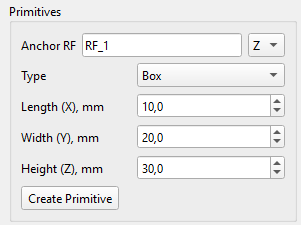 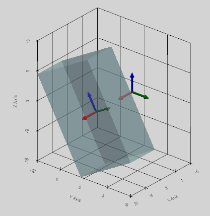

### Tube

This tool creates a hollow cylinder (a tube) centered on a user-selected coordinate system.

The central axis of the cylinder lies along one of the X, Y, or Z axes, as selected by the user.

Following Tube dimensions are defined by the user:

-   Anchor RF: defines the position of the geometric center of symmetry of the Tube,
-   Outer Radius (mm),
-   Inner Radius (mm),
-   Height (mm) is defined along the user selected axis.

 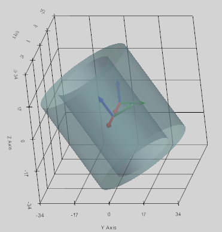

### Sphere

This tool creates a solid sphere centered at a user-selected coordinate system with a specified Radius (mm).

Following Sphere dimensions are defined by the user:

-   Anchor RF: defines the position of the geometric center of the Sphere,
-   Sphere Radius (mm).

 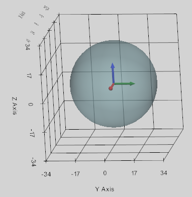

### Prism

This tool creates a uniform prism centered on a user-selected coordinate system.

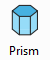

The central axis of the prism lies along one of the X, Y, or Z axes, as selected by the user.

Following Prism dimensions are defined by the user:

-   Anchor RF: defines the position of the geometric center of symmetry of the Prism,
-   Number of sides,
-   Circumradius (mm),
-   Height (mm) is defined along the user selected axis.

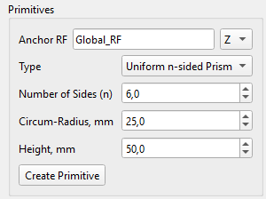 

### Torus

This tool creates a solid torus by moving a disk of minor radius along a circle of major radius within a user-selected coordinate system.

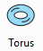

The central axis of the torus lies along one of the X, Y, or Z axes, as selected by the user.

Following Torus dimensions are defined by the user:

-   Anchor RF: defines the position of the geometric center of symmetry of the Torus,
-   Major Radius (mm),
-   Minor Radius (mm).

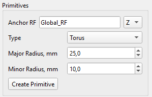 

### Cone

This tool creates a truncated cone centered on a user-selected coordinate system.

The central axis of the cone lies along one of the X, Y, or Z axes, as selected by the user.

Following Cone dimensions are defined by the user:

-   Anchor RF: defines the position of the geometric center of symmetry of the Cone position at half of its height,
-   Bottom Radius (mm),
-   Top Radius (mm),
-   Height (mm) is defined along the user selected axis.

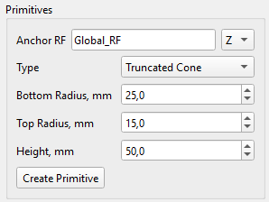 

### Link

This tool creates a rigid connecting rod with user defined dimensions:

-   Rod Radius (mm),
-   The Radius of two Spheres at the ends (mm).

The Link can be established in one of two ways:

1.  Between user defined Anchor and Target reference frames (then XYZ-dropdown is not considered);
2.  With link’s center at Anchor reference frame along one of the X, Y, or Z axes, as selected by the user. In this case, Target RF field is not considered, and Link Length must be specified.

 

## Boolean

Crate new Body as a new united CAD mesh of two selected bodies: Body_I and Body_J.

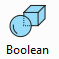

Once the new Body is created, its CoG, mass and inertia properties are automatically calculated and assigned to it. The density of Body_I is considered for the new Body.

If Body_I and Body_J do not intersect, the new body will not be created. In any case, the original Body_I and Body_J remain untouched with all related features (joints, forces, etc.) if defined.

User shall define two bodies to apply the Boolean operation:

-   Body_I: first body for unification,
-   Body_J: second body for unification.

 

## Gears

Three types of Gear models can be created in the program and considered as the solid bodies: Helical Gear, Inner Gear, and Bevel Gear. The details are described in the Gear Constraint section.
