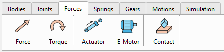
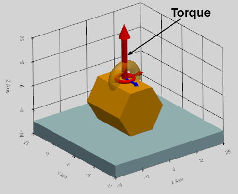
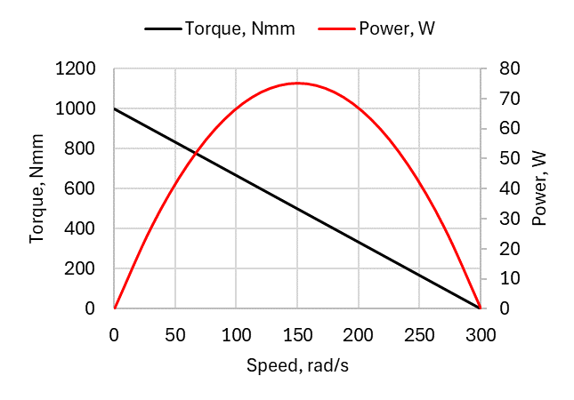
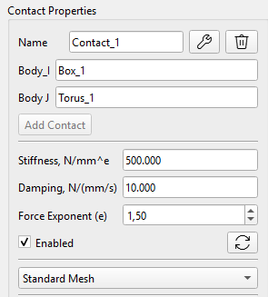
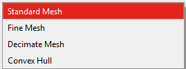
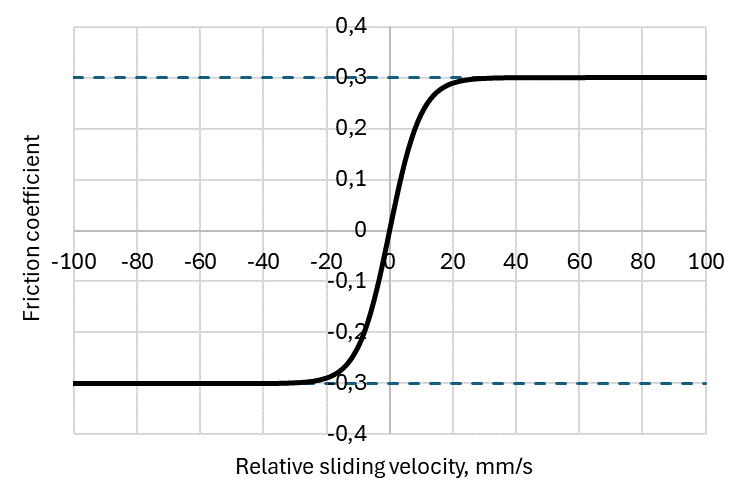

The "Forces" section includes the following components: Force, Torque, Actuator, e-Motor and Contact.

## Force and Torque

The Forces and Torques are applicable to any rigid Body in the simulation, as well as to the Gears. The direction and point of application are defined by the Anchor Reference Frame. Force appears as a blue arrow; the Torque appears as a red arrow with the small torus on its base in the ViewPort.

 

The Force and Torque are defined by the following parameters:

-   Name: the name is automatically assigned and can be changed,
-   Part: the Body to which the Force or Torque is applied,
-   RFrame: Reference Frame as the point of application on the Body,
-   XYZ-dropdown: the Reference Frame axis along which the Force or Torque is directed.
-   Space Fixed / Body Fixed dropdown box defines if the Force/Torque is dynamically constrained to the space or to the body (see explanations below),
-   Value, N/Nmm: Force/Torque magnitude. The Value can be defined as a mathematical function of time (see the details below).

### The "Body Fixed" Standard

Body Fixed force means the force originates from the object's perspective.

-   Point of Application: Glued to a specific coordinate on the moving body.
-   Vector Direction: Glued to the moving body.
-   Real-world equivalent: A rocket thruster bolted to a spaceship. As the spaceship tumbles and rotates, the thruster point moves with the ship, and the thrust vector strictly points wherever the back of the ship points.

### The "Space Fixed" Standard

A Space Fixed (or Global) Force means the environment is applying the Force to a specific spot on the object.

-   Point of Application: Glued to a specific coordinate on the moving body. (This is a common misconception—even in Space Fixed forces, the point still travels with the body!).
-   Vector Direction: Locked to the Global universe (the background). It does not rotate when the body rotates.
-   Real-world equivalent: Gravity, or a crosswind. The wind might be pushing against the top corner of a tumbling box. That top corner moves with the box, but the wind keeps blowing strictly along the global X-axis regardless of how the box rotates.

Note on Torques: Torques are technically "free vectors," meaning the point of application mathematically doesn't matter for the equations of motion, but the vector direction rules (Body/Space Fixed) apply exactly the same way.

### Math functions for the Force and Torque definition

Force and Torque magnitudes can be defined as a combination of the math functions of time. Following functions can be directly entered in the Value field:

sin(t), cos(t), tan(t), sqrt(t) (Square root), exp(t) (Exponential), abs(t) (Absolute value), pi (the constant π ≈ 3.14159).

It is possible to use ‘np.’ to call any standard NumPy math function, for example:

np.cosh(t), np.round(t), np.sign(t), etc.

The full list of the supported math functions:

[https://numpy.org/doc/stable/reference/routines.math.html](https://numpy.org/doc/stable/reference/routines.math.html)

### Custom functions: STEP, IF

Following custom functions are supported in the program:

**STEP function**

The step function changes smoothly between two specified values.

Syntax: step(t; t0; F0; t1; F1)

Example: step(t; 1; 0; 2; 5)

Result: Force is 0N until 1 second, then smoothly curves up to 5N by 2 seconds)

The math formula for the \`step\` function is commonly used in computer graphics and mathematics, known as cubic Hermite interpolation or the smoothstep function.

Assuming $$x_{0} < x_{1}$$, the function can be expressed as:

$$
f ( x ) \  = \begin{cases}h_{0} , \  i f \  x \leq x_{0} \\ h_{0} + \left( h_{1} - h_{0} \right) ( 3 - 2 u ) u^{2} , \  i f \  x_{0} < x < x_{1} \\ h_{1} , i f \  x \geq x_{1}\end{cases}
$$

where $$u$$ is the normalized position of $$x$$ between $$x_{0}$$ and $$x_{1}$$:

$$
u = \frac{x - x_{0}}{x_{1} - x_{0}}
$$

**The IF function**

Syntax: if(\<condition\>; \<value if less or equal to 0\>; \<value if greater than 0\>)

Example: if(t-1;0;2)

Result: If t ≤1, output 0. If t \> 1, output 2.

## Actuator

Actuator in the simulation is the Force with the limited power.

The actuator force (F) decreases as the velocity (v) of the body to which it is applied increases. By selecting the ‘Actuator Mode’ checkbox, the Force is converted into an Actuator.

The force magnitude F(v) depends on the body's speed (v) in the direction of that force's vector, and it is defined as following:

$$F ( v ) = F_{\max} \left( 1 - \frac{v}{v_{\max}} \right)$$**,**

where

$$F_{\max}$$ is the Actuator force when the Body speed is zero in the force direction,

$$v_{\max}$$ is the Body speed at which the applied Actuator force drops to zero. Introducing this will add some realism to the mechanisms by naturally capping their speeds and applying realistic physical damping.

Max Actuator Speed is defined by user. Power limit (N_max) is automatically calculated.

Actuator power:

$$
N = F \cdot v
$$

Actuator max power:

$$
N_{\max} = F_{\max} v_{\max} / 4
$$

Example:

Consider actuator is capable to apply maximum force of F_max=100N to a stationary body (V=0). As the body's speed increases, the actuator force decreases linearly to 0N upon reaching a speed of V_max = 200 mm/s. Below is the graph representing the force over speed and power curves in this case.

In this example, the body cannot accelerate to a speed greater than 200 mm/s under the action of actuator force.

**Speed calculation for the actuator force correlation in the spatial dynamics**

The speed calculation algorithm is seamlessly handling both body-fixed and space-fixed force definitions. For a linear actuator, the speed limit must apply to the exact physical point ($$r_{g l o b}$$) on the body where the force is attached using these exact steps:

1.  Calculation of the global velocity of the body's Center of Gravity ($$v_{c o g}$$).
2.  Conversion of the body's rotational velocity into the Global RF ($$\omega_{g l o b}$$).
3.  Finding the exact Global Velocity vector of the specific point where the force acts using the cross product:

$$
v_{p o i n t} \, = \, v_{c o g} \, + \, \left( \omega_{g l o b} \, \times \, r_{g l o b} \right)
$$

4.  Finally, projection that total Global Velocity vector onto the Global Force axis using the dot product:

$$
v_{c u r r e n t} = \  v_{p o i n t} \cdot a x i s_{g l o b a l}
$$

### Allow Actuator Braking

As can be seen from the definition of the actuator force F(v), if the body's speed exceeds the maximum value V_max (for example, under the gravity), the force becomes negative. In this case, Actuator begins to decelerate the Body. By default, this option is activated by the “Allow Actuator Braking” checkbox. Otherwise, Actuator force remains 0 once Body’s speed exceeds V_max.

## E-Motor

E-Motor in the simulation is the Torque with the limited power.

The E-Motor torque (T) decreases as the angular velocity (ω) of the body to which it is applied increases. E-Motor is activated by the ‘Actuator Mode’ checkbox at the Torque definition section.

The E-Motor torque magnitude T(ω) depends on the Body angular velocity (ω) in the direction of that torque's vector, and it is defined as following:

$$T ( \omega ) = T_{\max} \left( 1 - \frac{\omega}{\omega_{\max}} \right)$$**,**

where

$$T_{\max}$$ is the E-Motor torque when the Body angular velocity is zero in the torque direction,

$$\omega_{\max}$$ is the Body speed at which the applied E-Motor torque drops to zero.

E-Motor Power limit (N_max) is automatically calculated.

E-Motor power:

$$
N = T \cdot \omega
$$

E-Motor max power:

$$
N_{\max} = T_{\max} \omega_{\max} / 4
$$

Example:

The linear torque-speed curve is the standard mathematical model of an ideal brushed DC electric motor. Consider E-Motor stall torque is T_max=1000Nmm and max rotational speed is ω_max=300rad/s. Below is the graph representing the E-Motor torque over speed and power curves.

In this case, the E-Motor cannot accelerate to a speed greater than 300rad/s (2865rpm).

How this behaves in the simulation

1.  **Startup:** When the body is stationary (ω = 0), the motor outputs exactly 100% of the T_max the user defined.
2.  **Acceleration:** As the body speeds up, the dot product increases, and the applied torque automatically tapers off, mimicking the back-EMF of an electric motor.
3.  **Equilibrium:** Once the body reaches ω_max, the torque drops to exactly 0.0, preventing infinite acceleration.
4.  **Overspeeding:** If an external torque accelerates the body *faster* than ω_max, the motor will physically flip its torque vector to act as a **dynamic brake** (regenerative braking)! By default, this option is activated by the “Allow Actuator Braking” checkbox. Otherwise, E-Motor torque remains 0 once Body’s speed exceeds ω_max.

**Speed calculation for the E-Motor torque correlation in the spatial dynamics**

For an E-Motor, the rotational speed for the torque correlation is calculated as projection of the angular velocity vector onto the torque axis using the dot product:

$$
\omega_{c u r r e n t} = \omega_{l o c a l} \cdot a x i s_{l o c a l}
$$

Since the dot product is invariant under rotation, the projecting a local angular velocity vector onto a local torque axis yields the exact same numerical scalar value as projecting a global angular velocity vector onto a global torque axis, covering both: Body-Fixed and Space-Fixed E-Motor torques.

## Contact and Collision Detection

Contacts can be defined between freely moving bodies to model collision interactions in the simulation.

The collision is modeled as a compliant contact (Penalty Method): when bodies overlap, the solver mathematically spawns a temporary, highly non-linear spring-damper system between these bodies.

### Contact force definition

Once the collision between two bodies is detected, the contact force is calculated based on the Hertzian contact model:

$$
F = k \cdot \delta^{e} + C \cdot v_{n} \cdot \delta
$$

where

$$k$$ is the contact stiffness,

$$\delta$$ is the penetration depth of two bodies,

C is damping coefficient,

$$v_{n}$$ is the relative velocity of the bodies at the contact point

e is the force exponent

Note: The damping is multiplied by the penetration depth δ so that the damping force drops smoothly to zero as the bodies separate. This prevents them from "sticking" together like glue.

 

The Contact is defined by the following parameters:

-   Name: the name is automatically assigned and can be changed,
-   Body_I: first body in the contact,
-   Body_J: second body in the contact,
-   Stiffness (N/mm\^e): contact stiffness (k) for the normal force calculation,
-   Damping (Ns/mm): contact damping (C) for the normal force calculation,
-   Force exponent depends on the contact pattern on the Hertzian contact model,
-   Four Contact processing methods are available in the dropdown menu.

### Contact processing methods

For the efficient contact processing, the collision detection method passes through three distinct phases:

1.  Broad Phase: filters bodies using dynamic Axis-Aligned Bounding Boxes (AABBs). At the start of a solver step, it just checks if the maximum and minimum XYZ coordinates of these boxes overlap.
2.  Narrow Phase: calculates exact vertex-to-mesh proximity, extracting the contact manifold which contains penetration depth (δ), normal vector to the contact surface, and contact point (P_c) where in global space the bodies touch.
3.  Penalty Force Injection: calculates the Hertzian contact force (F) and directly injects it into the global Force Vector (Q) of the KKT-matrix.

The following four methods are available and can be specified in the contact settings, depending on the contact characteristics of the interacting bodies:

**Standard Mesh**

Original CAD geometry of the contacted Bodies is considered.

**Fine Mesh**

The body mesh is subdivided (each triangle of the Body mesh into 4 pieces) to increase the accuracy of the contact processing. It also solves some possible undetectable contacts between the simple primitives with the same geometry (like box-to-box collision). Note: the simulation time is increased with this option.

**Proxy Meshes (Convex Hulls)**

CAD models are full of internal holes, chamfers, and dense triangles that slow down the physics engines. Generation of the "Convex Hull" (shrink-wrapping the geometry) reduces fine meshed model to lower vertices, speeding up the collision math while keeping the visual model perfectly detailed on the screen.

**Decimation (Simplification)**

If a Convex Hull is too simple (e.g., you actually need the teeth of a gear to collide), we can use mesh decimation instead of subdivision. This removes 50% of the flat/unnecessary triangles automatically, instantly doubling the solver speed without losing the critical geometric shape.

### Integrators for Collision

**Explicit Integrators (RK4, SciPy's RK45, DOP853)**

Explicit methods calculate the next state of the system based purely on the current state and its current derivative. If the bodies are overlapping by 1 mm, the solver calculates a massive restorative force, resulting in a massive acceleration. The integrator assumes this acceleration remains constant over the time step dt and shoots the body forward.

The Advantage: Explicit methods are incredibly fast per-step.

The Disadvantage (the overshoot): if dt is too large during an impact, the massive force will shoot the body completely out of the floor in a single step, resulting in numerical explosion.

**Implicit Integrators (SciPy's BDF or Radau)**

Implicit methods (Backward Differentiation Formulas) calculate the next state by solving a system of equations that involves the future derivative.

The Advantage (unmatched stability): Because BDF understands that K_contact is pushing back aggressively, it acts like a mathematical shock absorber. It can take significantly larger time steps (dt) during a violent collision without blowing up. It naturally dampens high-frequency numerical noise, making it the industry standard for stiff contact mechanics (like the dog clutch or gear teeth).

The Disadvantage: Constructing the internal Jacobian requires calling the evaluating of derivatives dozens of times per time step. While it takes fewer total steps than RK45, each individual step is computationally heavy.

**Summary and best practice**

|                           | **Explicit Integrators (RK45, DOP853)**                                                                  | **Implicit Integrators (BDF, Radau)**                                                                   |
|---------------------------|----------------------------------------------------------------------------------------------------------|---------------------------------------------------------------------------------------------------------|
| **Best Used For**         | Free-falling bodies, soft springs, simple joints.                                                        | Hard collisions, gear teeth, extremely stiff bushings.                                                  |
| **Contact Stiffness (k)** | Requires Stiffness (k) to be kept relatively low to avoid freezing the solver with microscopic dt steps. | Can handle massive Stiffness (k) values simulating hard steel/rigid impacts.                            |
| **Energy Conservation**   | High accuracy. Traces the exact vibration of the penalty spring.                                         | Lower accuracy during impacts. Tends to mathematically "dampen" or steal energy to guarantee stability. |

### Friction

Friction force at contact point can be activated by the “Contact Friction” checkbox.

The Contact Friction is defined by the following parameters:

-   Friction Coefficient,
-   Slip Tolerance Velocity.

**Regularized Coulomb Friction** is an approximate model used to calculate the force of dry friction. It is governed by the model:

$$
F_{f r i c t i o n} \, = \, \mu \, F_{n o r m a l}
$$

where:

$$F_{f r i c t i o n}$$ is the force of friction exerted by each surface on the other. It is parallel to the contact surface. The direction of the force is exactly opposite to the sliding velocity.

$$F_{n o r m a l}$$ is the normal force exerted by each surface on the other, directed perpendicular (normal) to the contact surface.

$$\mu = \mu ( v )$$ is the coefficient of friction, which is an empirical property of the contacting materials and depends on the relative sliding velocity.

To avoid the mathematical discontinuity and keep the integrators running when the sliding velocity is exactly 0.0mm/s and the friction force instantly jumps from 0N to $$\pm F_{f r i c t i o n}$$, the **Hyperbolic Tangent Regularization Method** is used: Instead of an instant jump, the friction coefficient $$\mu$$ smoothly ramps up from 0 to $$\mu_{0}$$ over a tiny "Slip Tolerance velocity“. The friction coefficient is defined as the function of the sliding velocity:

$$
\mu = \mu_{0} \cdot \tanh \left( \frac{v}{v_{t o l}} \right)
$$

Below is the graph example representing the sliding friction coefficient $$\mu = \mu ( v )$$ considering defined friction $$\mu_{0} = 0 , 3$$ and slip tolerance velocity $$v_{t o l} = 1 0$$mm/s.

Note: as is evident from the definition, when the relative sliding velocity is 0, the static friction (Stiction) is not calculated in this model. The friction force appears as the sliding friction once the relative motion between the contacted bodies along the contact plane is detected.
