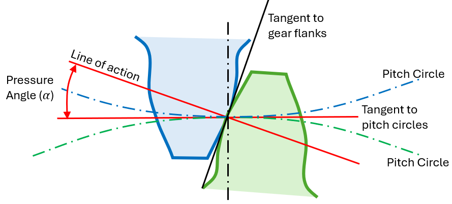
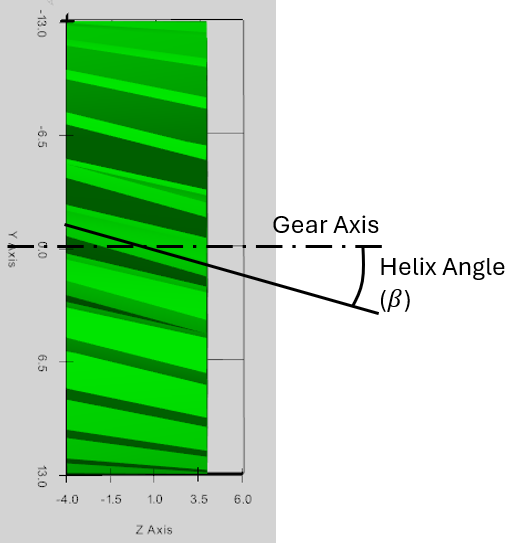
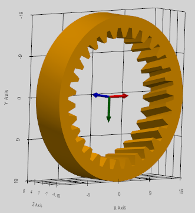
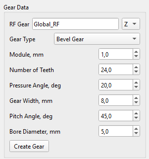
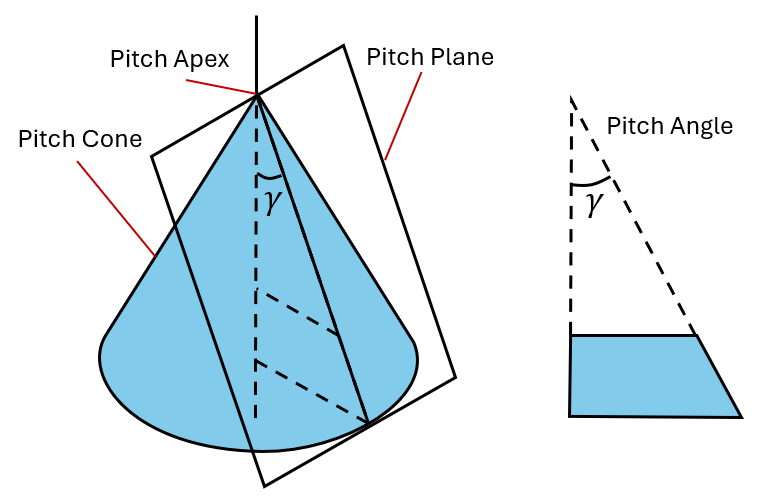
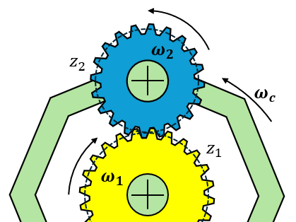
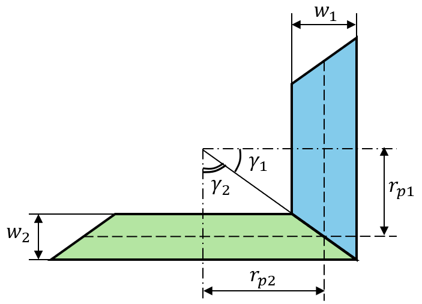
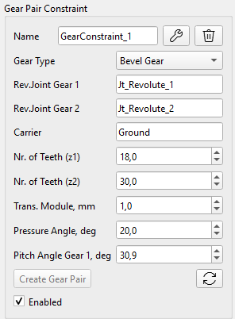
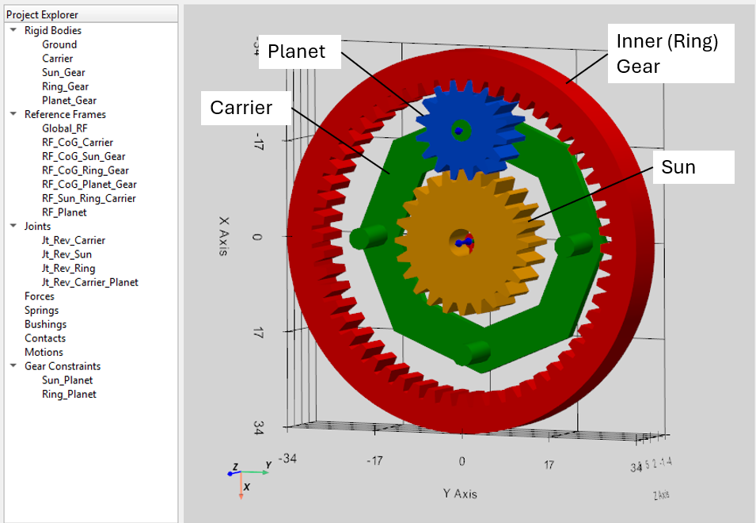
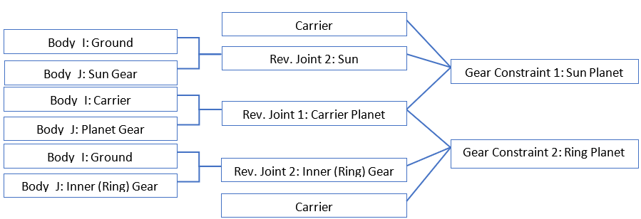

Kinematic Coupler Constraint (the Gear Constraints) is used by MBD engine for the macro-scale Gear power transmission. The Gear Constraint locks the rotational degrees of freedom of two existing Revolute Joints with Gears, enforcing perfect rolling motion at the theoretical pitch cylinders or cones (for bevel gears).

Gears Toolbar allows creation of three basic gear types (Helical, Inner and Bevel Gears) and the Gear Pair Constraint.

## Helical Gear (and Spur Gear)

Helical and Spur Gear models can be created considering the basic Gear macro geometry.

Ones generated, the Gear automatically appears in the ‘Rigid Bodies’ section as the common Rigid Body with automatically calculated mass and inertia properties. Further modification of the Gear properties is not possible. The basic parameters of the Gear Constraint must be defined in the ‘Gear Pair’ section and have no relations to the generated Gear model. This means that any imported Gear model (.obj, .stl) can be considered for the Gear Constraint.

### Helical Gear Definition

Helical and Spur Gears are defined by the following parameters in the User Interface:

-   Module (mm): Gear Transverse Module ($$m_{t}$$) is calculated in the plane of rotation, which is perpendicular to the gear's central shaft axis,
-   Number of Teeth: determines the gear ratio and works with the module to set basic operating diameters,
-   Pressure Angle (deg): the angle between the tooth profile and the radial line at the pitch point, standardly 20° or 25°,
-   Helix Angle (deg): the angle the tooth trace makes with the gear axis (zero for spur gears, larger for helical gears),
-   Gear Width (mm): face width and the axial length of the gear teeth,
-   Bore Diameter (mm): Gear Rim diameter (inner hole).

 

### Helical Gear Macro-geometry

Gear Macro-geometry handles the fundamental mechanical requirements like transmitted torque, rotational speed ratios, as well as the bending strength and overall size limits.

The relationship between the module ($$m$$), pitch diameter ($$d$$), and number of teeth ($$z$$) forms the foundation of metric gear design:

$$
m = \frac{d}{z}
$$

The pictures below describe definition of the basic gear geometry.

 

## Inner Gear

Inner Gear model can be created considering the basic Gear macro geometry.

Ones generated, the Gear automatically appears in the ‘Rigid Bodies’ section as the common Rigid Body with automatically calculated mass and inertia properties. Further modification of the Gear properties is not possible. The basic parameters of the Gear Constraint must be defined in the ‘Gear Pair’ section and have no relations to the generated Gear model.

Inner Gear is defined by the following parameters in the User Interface:

-   Module (mm): Gear Transverse Module ($$m_{t}$$) is calculated in the plane of rotation, which is perpendicular to the gear's central shaft axis,
-   Number of Teeth: determines the gear ratio and works with the module to set basic operating diameters,
-   Pressure Angle (deg): the angle between the tooth profile and the radial line at the pitch point, standardly 20° or 25°,
-   Helix Angle (deg): the angle the tooth trace makes with the gear axis,
-   Gear Width (mm): face width and the axial length of the gear teeth,
-   Outer Rim Diameter (mm).

 

## Bevel Gear

Straight Bevel Gear model can be created considering the basic Gear macro geometry.

Ones generated, the Gear automatically appears in the ‘Rigid Bodies’ section as the common Rigid Body with automatically calculated mass and inertia properties. Further modification of the Gear properties is not possible. The basic parameters of the Gear Constraint must be defined in the ‘Gear Pair’ section and have no relations to the generated Gear model.

### Bevel Gear Definition

Bevel Gear is defined by the following parameters in the User Interface:

-   Module (mm): Gear Transverse Module ($$m_{t}$$) is calculated in the plane of rotation, which is perpendicular to the gear's central shaft axis,
-   Number of Teeth: determines the gear ratio and works with the module to set basic operating diameters,
-   Pressure Angle (deg): the angle between the tooth profile and the radial line at the pitch point, standardly 20° or 25°,
-   Gear Width (mm): face width and the axial length of the gear teeth,
-   Pitch Angle (deg): defining the orientation of the Gear's pitch surface relative to its axis,
-   Bore Diameter (mm): Gear Rim diameter (inner hole).

 

Straight Bevel Gears can be created only: these Gears have no spiral angle (β = 0°). The Gear teeth are straight pointing directly toward the apex of the Gear cone.

### Bevel Gear Macro-Geometry

The Bevel Gears are designed using a reference Pitch Cone as a basis for definition the major geometric entities of the gear. Pitch Plane is the tangent pane to the pitch cone. Pitch Apex is the point at the top of the pitch cone. Both axes of bevel gear pair intersect at pitch apex. Pitch Angle ($$\gamma$$) defines the orientation of the gear's pitch plane relative to its axis.

For a pair of bevel gears, the sum of their pitch angles is equal to the angle between the gears shaft axes (the standard value is 90°):

$$
\gamma_{1} + \gamma_{2} = 9 0 {^\circ}
$$

## Gear Pair Constraint

To model the Gear Pair, instead of relying on collision detection of the gear mesh to transfer the power, the Gear Pair Constraint adds a mathematical equation to the solver that locks the rotational velocity of 1st Gear Joint directly to the rotational velocity of 2nd Gear Joint based on their Gear Ratio.

### Gear Pair Kinematic Formulation

The Gear Constraint relies on matching the instantaneous 3D linear velocity of the theoretical Pitch Point between both Gears, relative to the Carrier body that holds them.

The core velocity constraint is defined by the Willis Equation:

$$
\mathbf{n}_{\mathbf{1}} \mathbf{\cdot} \mathbf{\omega}_{\mathbf{1}} \mathbf{+} \mathbf{n}_{\mathbf{2}} \mathbf{\cdot} \mathbf{\omega}_{\mathbf{2}} \mathbf{-} \left( \mathbf{n}_{\mathbf{1}} \mathbf{+} \mathbf{n}_{\mathbf{2}} \right) \mathbf{\cdot} \mathbf{\omega}_{\mathbf{c}} = 0
$$

where:

$$\mathbf{\omega}_{\mathbf{1}} \mathbf{, \ } \mathbf{\omega}_{\mathbf{2}} \mathbf{, \ } \mathbf{\omega}_{\mathbf{c}}$$ are the angular velocities of the Gear 1, Gear 2 and the Carrier correspondently,

$$\mathbf{n}_{\mathbf{1}} \mathbf{, \ } \mathbf{n}_{\mathbf{2}} \mathbf{\ }$$are the torque transmission vectors defined as:

$$
\mathbf{n}_{\mathbf{1}} = r_{1} \mathbf{\alpha}_{\mathbf{1}}
$$

$$
\mathbf{n}_{\mathbf{2}} = s_{2} r_{2} \mathbf{\alpha}_{\mathbf{2}}
$$

Rotation axes ($$\mathbf{\alpha}_{\mathbf{1}} \mathbf{,} \mathbf{\alpha}_{\mathbf{2}}$$) are the global 3D unit vectors representing the shafts of the Gear Revolute Joints. Pitch Radii ($$r_{1} , r_{2}$$) are calculated from the number of teeth ($$z_{1} , z_{2}$$) and the Gears transverse module ($$m_{t}$$):

$$
r_{1} = \frac{m_{t} \cdot z_{1}}{2}
$$

$$
r_{2} = \frac{m_{t} \cdot z_{2}}{2}
$$

Direction Multiplier ($$s_{2}$$) determines the relative rotational direction based on the gear topology:

1.  External Gears (Spur/Helical/Bevel): $$s_{2} = + 1 . 0$$ (gears rotate in opposite directions relative to the carrier).
2.  Internal Gears (Ring): $$s_{2} = - 1 . 0$$ (gears rotate in the same direction relative to the carrier).

### Extracting Radial and Axial Forces of the Gear teeth contact

The Gear Contact Forces are calculated instantaneously using the exact Lagrangian matrix multipliers ($$\lambda$$) and the user-defined Gear macro-geometry.

Tangential force is the primary driving force that transmits torque from one gear to the other and acts perpendicular to both the shaft axis and the pitch radius vector. Tangential force is extracted as Lagrange Multiplier ($$\lambda$$) for the Gear Pair constraint: $$F_{t} = \lambda$$.

Helical Gears

Radial Force ($$F_{r}$$) pushes the shafts apart:

$$
F_{r} = F_{t} \cdot \frac{\tan \alpha}{\cos \beta}
$$

Axial Force ($$F_{a}$$) pushes along the shaft:

$$
F_{a} = F_{t} \cdot \tan \beta
$$

where:

$$\alpha$$ is the Gear Pressure Angle,

$$\beta$$ is the Gear Helix Angle.

Straight Bevel Gears

The Radial force acts perpendicular to the shaft of rotation, pushing the gears apart:

$$
F_{r} = F_{t} \cdot \tan \alpha \cdot \cos \gamma
$$

The Axial force acts parallel to the shaft of rotation:

$$
F_{a} = F_{t} \cdot \tan \alpha \cdot \sin \gamma
$$

where:

$$\gamma$$ is the Pitch Angle of the Bevel Gear.

Total Contact Force

The Total Contact Force ($$F_{c}$$) represents the absolute magnitude of the 3D force vector acting on the gear tooth flank:

$$
F_{c} = \sqrt{F_{t}^{2} + F_{r}^{2} + F_{a}^{2}}
$$

The Gear Contact Forces are extracted during the Post-Processing and can be observed in the Telemetry Window or exported to the result CSV file.

### Helical Gear Constraint

In order to define the Helical Gear Pair, both Gears must be constraint to the Carrier Body by the Revolute Joints. The Helical Gear Constraint is then applied between these two Revolute Joints. The Joints axes must be parallel and spaced apart by a distance equal to the center distance between the gears. The distance between the Gear Joints is equal to the Gear Center Distance ($$d_{c}$$) calculated based on the defined Gear macro-geometry:

$$
d_{c} = r_{p 1} + r_{p 2} = \frac{m_{t} \left( z_{1} + z_{2} \right)}{2}
$$

The Helical Gear Constraint is defined by the following parameters:

-   Rev. Joint Gear 1: Revolute Joint constraining the Gear 1 to the Carrier Body,
-   Rev. Joint Gear 2: Revolute Joint constraining the Gear 2 to the Carrier Body,
-   Carrier: the Body holding both Gears,
-   Nr. of Teeth (z1): number of teeth on the Gear 1,
-   Nr. of Teeth (z2): number of teeth on the Gear 2,
-   Trans. Module (mm): Gear Transverse Module ($$m_{t}$$) of the paired Gears,
-   Pressure Angle (deg): the pressure angle of both Gears,
-   Helix Angle Gear 1 (deg): the helix angle of the Gear 1.

The Helix Angle ($$\beta_{1}$$) entered in the constraint properties defines the twist direction and angle for Gear 1 (the gear attached to Joint 1). The solver automatically calculates the correct mating helix angle ($$\beta_{2}$$) for Gear 2 to generate the opposing axial thrust forces.

 

Example of the Hierarchy of the Helical Gear Constraint:

**Important rule by the Gear Revolute Joint definition:**

-   Body_I shall be the Carrier, and Body_J shall be the Gear (as it is considered in the solver).

### Inner Gear Constraint

In order to define the Gear Pair with Inner Gear, both Gears must be constraint to the Carrier Body by the Revolute Joints. The Gear Constraint is then applied between these two Revolute Joints. The Joints axes must be parallel and spaced apart by a distance equal to the center distance between the gears. The distance between the Gear Joints is equal to the Gear Center Distance ($$d_{c}$$) calculated based on the defined Gear macro-geometry:

$$
d_{c} = r_{p 2} - r_{p 1} = \frac{m_{t} \left( z_{2} - z_{1} \right)}{2}
$$

The Inner Helical Gear Constraint is defined by the following parameters:

-   Rev. Joint Gear 1: Revolute Joint constraining the Pinion Gear 1 to the Carrier Body,
-   Rev. Joint Gear 2: Revolute Joint constraining the Inner Gear 2 to the Carrier Body,
-   Carrier: the Body holding both Gears,
-   Nr. of Teeth (z1): number of teeth on the smaller Pinion Gear 1,
-   Nr. of Teeth (z2): number of teeth on the Inner Gear 2,
-   Trans. Module (mm): Gear Transverse Module ($$m_{t}$$) of the paired Gears,
-   Pressure Angle (deg): the pressure angle of both Gears,
-   Helix Angle Gear 1 (deg): the helix angle of the Pinion Gear 1.

 

Example of the Hierarchy of the Inner Gear Constraint:

**Important rules for the Inner Gear Constraint Definition!**

-   Inner Gear must be constraint by the ‘Rev. Joint Gear 2’ (as it is considered in the solver);
-   By the Gear Revolute Joint definition, Body_I shall be the Carrier, and Body_J shall be the Gear (as it is considered in the solver).

### Bevel Gear Constraint

In order to define the Bevel Gear Pair, both Gears must be constraint to the Carrier Body by the Revolute Joints. The Bevel Gear Constraint is then applied between these two Revolute Joints.

For a pair of bevel gears, the sum of their pitch angles is equal to the angle between the gears shaft axes, which is defined as the standard value of 90° in the solver:

$$
\gamma_{1} + \gamma_{2} = 9 0 {^\circ}
$$

Various angles of the bevel gears axes are not supported yet in the UI, so please make sure this angle is 90° in the model.

The Bevel Gears are offset relative to the common pitch Apex by a distance equal to their pitch circle radius:

$$
r_{p 1} = m_{t} \cdot z_{1} / 2
$$

$$
r_{p 2} = m_{t} \cdot z_{2} / 2
$$

The Gear Pitch Angle can be calculated as following:

$$
\gamma_{1} = {a t a n} \frac{r_{p 1}}{r_{p 2}}
$$

The Bevel Gear Constraint is defined by the following parameters:

-   Rev. Joint Gear 1: Revolute Joint constraining the Gear 1 to the Carrier Body,
-   Rev. Joint Gear 2: Revolute Joint constraining the Gear 2 to the Carrier Body,
-   Carrier: the Body holding both Gears,
-   Nr. of Teeth (z1): number of teeth on the Gear 1,
-   Nr. of Teeth (z2): number of teeth on the Gear 2,
-   Trans. Module (mm): Gear Transverse Module ($$m_{t}$$) of the paired Gears,
-   Pressure Angle (deg): the pressure angle of both Gears,
-   Pitch Angle Gear 1 (deg): the pitch angle of the Gears 1.

 

**Important rules for the Inner Gear Constraint Definition:**

-   The Pitch Angle of Gear 2 is automatically calculated as: $$\gamma_{2} = 9 0 {^\circ} - \gamma_{1}$$
-   Straight Bevel Gears can be simulated only: these Gears have no spiral angle (β = 0°).
-   By the Gear Revolute Joint definition, Body_I shall be the Carrier, and Body_J shall be the Gear (as it is considered in the solver).

Example of the Hierarchy of the Bevel Gear Constraint:

### Planetary Gearset

Two Gear Constraints must be defined to build a Planetary Gearset:

1.  Sun to Planet,
2.  and Planet to Inner Ring (one Gear Constraint for each Planet).

Example of the Hierarchy of the Gear Constraints for the Planetary Gearset:

 

### User Memo: Rules for the Gears and Gear Pair Constraints

**Gear Modelling:**

-   The Gears can be genrated in the program (on the Gear tool tab), as well as imported as .obj or .stl file developed in other CAD SW.
-   The Gears generated by the program have the rough teeth geometry for the visual purpose only.
-   Once the Gear is generated, it is stored as a normal rigid Body and does not have the Gear macro-geometry properties (module, number of teeth, α, β-angles, etc) visible to the Solver. Therefore, these properties must be defined on the Gear Pair Constraint interface.
-   Do not consider the Gear CoG as the Reference Frame for the Gear Joint definition, because the Gear CoG is calculated based on the Gear 3D mesh and can have the spatial position mismatch related to the theoretical Gear axis position, which can cause the inaccurate solver processing or errors.
-   The Module entered in the UI is treated as the Transverse Module (not the Normal Module). This rule is strictly valid for both the CAD model creation and the Kinematic Gear Constraints.
-   The Joints axes of the Helical Gears must be parallel and spaced apart by a distance equal to the Center Distance between the Gears.
-   When defining the Gear Revolute Joint, the Carrier must be the Body_I, and the Gear must be the Body_J.

**Gear Constraint Assignment:**

-   When defining the Inner Gear Constraint, the Pinion Gear Joint must be the Joint 1, and the Inner Gear Joint must be the Joint 2.
-   When defining the Bevel Gear Constraint, the Pitch Angle of Gear 1 is defined by the user, and the Pitch Angle of Gear 2 is automatically calculated considering the Bevel Gear axes relative angle is 90 degree.
-   The Revolute Joint axes (shafts) for Bevel gears must intersect perfectly in 3D space, and they must be positioned at a standard 90° angle.
-   Carrier definition Rule (important for Planetary gearsets, Differentials, etc): the Carrier Body is the body relative to which the centers of both gears do not move.
