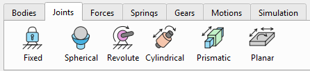
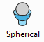
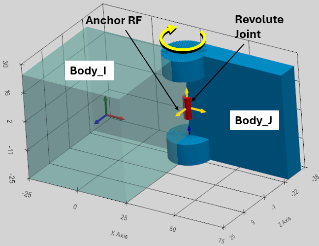
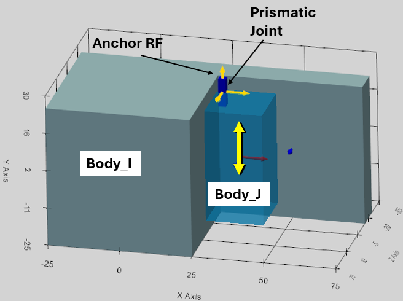

Joint constraints define the kinematic connectivity between bodies in the system. Six joint types can be considered to maintain the kinematic constraints between the bodies in the program: Fixed, Spherical, Revolute, Cylindrical, Prismatic, and Planar.

Important! Only one Joint can be added for the same two bodies. This is to eliminate the redundant over-constraint structure in the system.

The required Joint can be selected by the corresponding button in the main menu or from the drop-down list in the “Joint Properties” panel. The new Joint name is generated automatically and can be modified by demand. The user interface (UI) is the same for all Joint types. Each Joint requires definition of two connecting Bodies (Body_I, Body_J), Joint location (Anchor RF) and direction (Target RF, or XYZ-axis selection of the Anchor RF).

When Joint is selected in the ViewPort, it appears in yellow color, and both constrained Bodies become transparent.

The Reference Frame is locked for edition and renaming if it was used for the Joint definition.

The Joints are further described in a sequence they were implemented in the program.

## Spherical Joint

Spherical joint eliminates the freedom of relative translations between the two bodies, and it allows only three degrees of freedom of relative rotations.

The kinematic constraint of the Spherical Joint requires:

-   Body_I: the first connected Body,
-   Body_J: the second connected Body,
-   Anchor: the Reference Frame of the Joint location

XYZ-dropdown and ‘Target’ are not considered for Spherical Joint.

The Bodies and Reference Frames can be selected in the TreeHierarchy. The Bodies can be also selected in the ViewPort.

Tip! You can use ‘Unselect All’ button to reset the current selections.

The Spherical Joint appears as a small red sphere in the ViewPort.

## Revolute Joint

Revolute Joint allows only one rotational degree of freedom. It eliminates the freedom of relative translations, and allows rotation between two Bodies around the Joint axis.

The kinematic constraint of the Revolute Joint requires:

-   Body_I: the first connected Body,
-   Body_J: the second connected Body,
-   Anchor: the Reference Frame of the Joint location
-   XYZ-dropdown: the axis of the Anchor RF. It defines the Joint axis around which the bodies can rotate. It is considered if Target RF is not defined.
-   Target: this Reference Frame defines the Joint direction as the axis between the Anchor and Target reference frames. XYZ-dropdown is ignored if Target RF is defined.

As is evident from the definition, once Anchor RF is defined, there are two ways to define the Joint axis around which the bodies will rotate:

1.  If Joint axis is one of the Anchor RF axes, then this axis can be selected by XYZ-dropdown box. The Target RF shall not be defined in this case (keep the Target empty);
2.  If Target RF is defined, then Joint axis will connect the Anchor and the Target reference frames (XYZ-dropdown is not considered in this case).

The Revolute Joint appears as a small red cylinder aligned with the Joint axis of rotation in the ViewPort.

## Prismatic Joint

Prismatic Joint allows only one translational degree of freedom. It eliminates the freedom of relative rotations, and allows translation between two Bodies along the Joint axis.

The kinematic constraint of the Prismatic Joint requires:

-   Body_I: the first connected Body,
-   Body_J: the second connected Body,
-   Anchor: the Reference Frame of the Joint location
-   XYZ-dropdown: the axis of the Anchor RF. It defines the Joint axis along which the bodies can move. It is considered if Target RF is not defined.
-   Target: this Reference Frame defines the Joint direction as the axis between the Anchor and Target reference frames. XYZ-dropdown is ignored if Target RF is defined.

As is evident from the definition, once Anchor RF is defined, there are two ways to define the Joint axis along which the bodies will move:

1.  If Joint axis is one of the Anchor RF axes, then this axis can be selected by XYZ-dropdown box. The Target RF shall not be defined in this case (keep the Target empty);
2.  If Target RF is defined, then Joint axis will connect the Anchor and the Target reference frames (XYZ-dropdown is not considered in this case).

The Prismatic Joint appears as a small long blue box aligned with the Joint axis of translation in the ViewPort.

## Cylindrical Joint

Cylindrical Joint allows two degrees of freedom: relative translation and rotation between two Bodies along the Joint axis.

The kinematic constraint of the Cylindrical Joint requires:

-   Body_I: the first connected Body,
-   Body_J: the second connected Body,
-   Anchor: the Reference Frame of the Joint location,
-   XYZ-dropdown: the axis of the Anchor RF. It defines the Joint axis along which the bodies can move and rotate. It is considered if Target RF is not defined.
-   Target: this Reference Frame defines the Joint direction as the axis between the Anchor and Target reference frames. XYZ-dropdown is ignored if Target RF is defined.

As is evident from the definition, once Anchor RF is defined, there are two ways to define the Joint axis:

1.  If Joint axis is one of the Anchor RF axes, then this axis can be selected by XYZ-dropdown box. The Target RF shall not be defined in this case (keep the Target empty);
2.  If Target RF is defined, then Joint axis will connect the Anchor and the Target reference frames (XYZ-dropdown is not considered in this case).

The Cylindrical Joint appears as a small blue cylinder aligned with the Joint axis in the ViewPort.

## Planar Joint

Planar Joint allows 3 degrees of freedom between two bodies. It forces the Bodies to slide and spin along a defined 2D plane.

The Planar Joint is defined by the anchor-target vector directly as the Normal Vector (the Z-axis) perpendicular to the plane of motion.

The kinematic constraint of the Planar Joint requires:

-   Body_I: the first connected Body,
-   Body_J: the second connected Body,
-   Anchor: the Reference Frame of the Joint location,
-   XYZ-dropdown: the axis of the Anchor RF. It defines the Normal Vector direction perpendicular to the plane of motion. It is considered if Target RF is not defined.
-   Target: this Reference Frame defines the Normal Vector direction as the axis between the Anchor and Target reference frames. XYZ-dropdown is ignored if Target RF is defined.

The Planar Joint appears as a small flat gray plane aligned with the plane of motion in the ViewPort.

## Fixed Joint

The Fixed Joint (often called a "Weld" or "Bracket" joint) strictly removes all 6 Degrees of Freedom (DOFs) between two rigid bodies: Body_I and Body_J. It completely prohibits any relative translation or relative rotation, forcing the two bodies to move as a single rigid unit.

The Anchor Reference Frame is defined to establish the Fixed Joint.

The kinematic constraint of the Fixed Joint requires:

-   Body_I: the first connected Body,
-   Body_J: the second connected Body,
-   Anchor: the Reference Frame of the Joint location.

XYZ-dropdown box and Target reference frame do not play any role in the Fixed Joint function, and define the Joint visual only, which appears as a small gray cube in the center of the Joint.
