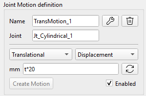
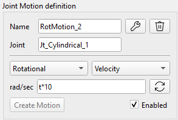
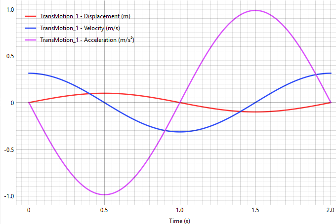
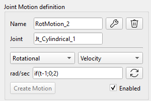

With the Translational and Rotational Motion tools, user can define the relative movement or speed over time of two bodies connected by the joints. This can be used, for example, for the robotic arms simulations or similar mechanisms: user defines the relative angular displacement of the arm joint (as a STEP or other function) and solver results the required torque for the actuator in this joint to move on according to the given motion.

## The Mathematical Foundation

Integrating Kinematic Motion means transitioning from purely scleronomic constraints (timeindependent constraints: $$\Phi ( q ) = \  0$$) to rheonomic constraints (time-dependent):

$$\Phi \left( q , \  t \right) = p ( q ) - f ( t ) = 0$$,

where:

-   $$p ( q )$$ is the actual, physical geometric state (distance or angle) extracted from the bodies' current absolute coordinates $$q$$;
-   $$f ( t )$$ is the user-defined time-dependent function.

The missing velocities and accelerations of the user's motion are instantly calculated automatically by highly accurate Central Finite Differences inside the motion compiler:

Velocity: $$v ( t ) = \frac{f ( t + h ) - f ( t - h )}{2 h}$$

Acceleration: $$a ( t ) = \frac{f ( t + h ) - 2 f ( t ) + f ( t - h )}{h^{2}}$$

Where: $$h = d t$$ is the time step.

Based on the defined Motion Constraints, the Jacobian matrix ($$\Phi_{q}$$) and the velocity/ acceleration right-hand side ($$\gamma^{*}$$) with the Baumgarte Stabilization are updated.

The resulting Lagrange Multiplier (λ) output by the solver for this new Motion Constraint is exactly the required actuator Torque or Force needed to execute the Motion, which is included in the result Telemetry.

## Definition of the Motion

The Motion constraint is defined by the following parameters in the User Interface:

-   Joint: define the Joint to which the Motion constraint is applied. Following Joints are supported: Revolute, Prismatic and Cylindrical.
-   Translational/ Rotational Motion dropdown box: Translational Motion is applicable for the Prismatic and Cylindrical Joints; Rotational Motion is applicable for the Revolute and Cylindrical Joints.
-   Displacement/ Velocity Motion dropdown box.
-   The Motion Function input field: is the user-defined time dependent motion function $$f ( t )$$.

 

Examples of Motion Function:

-   0: the Motion is restricted along this degree of freedom;
-   t\*10: the Motion is proportional to the time.
-   100\*sin(pi\*t): the Body undergoes harmonic oscillations with the angular frequency of π (see the graph below).
    -   Given displacement, mm: $$x ( t ) = 1 0 0 \cdot s i n  ( \pi t )$$
    -   Result speed, mm/s: $$v ( t ) = 1 0 0 \pi \cdot c o s  ( \pi t )$$
    -   Result acceleration, mm/s\^2: $$a ( t ) = - 1 0 0 \pi^{2} \cdot s i n  ( \pi t )$$

## Math functions for the Motion definition

The Motion Constraint can be defined as a combination of the math functions of time. Following functions can be directly entered in the input field:

sin(t), cos(t), tan(t), sqrt(t) (Square root), exp(t) (Exponential), abs(t) (Absolute value), pi (the constant π ≈ 3.14159).

It is possible to use ‘np.’ to call any standard NumPy math function, for example:

np.cosh(t), np.round(t), np.sign(t), etc.

The full list of the supported math functions:

[https://numpy.org/doc/stable/reference/routines.math.html](https://numpy.org/doc/stable/reference/routines.math.html)

## Custom functions: STEP, IF

Following custom functions are supported in the program:

**STEP function**

The step function changes smoothly between two specified values.

Syntax: step(t; t0; F0; t1; F1)

Example for Translational Motion (mm): step(t; 1; 0; 2; 50)

Result: the Body stays at 0mm position until 1 second, then smoothly moves up to 50 mm by 2 seconds. The red curve shows the given motion, the blue curve shows the result speed on the graph.

The math formula for the \`step\` function is commonly used in computer graphics and mathematics, known as cubic Hermite interpolation or the smoothstep function.

Assuming $$x_{0} < x_{1}$$, the function can be expressed as:

$$
f ( x ) \  = \begin{cases}h_{0} , \  i f \  x \leq x_{0} \\ h_{0} + \left( h_{1} - h_{0} \right) ( 3 - 2 u ) u^{2} , \  i f \  x_{0} < x < x_{1} \\ h_{1} , i f \  x \geq x_{1}\end{cases}
$$

where $$u$$ is the normalized position of $$x$$ between $$x_{0}$$ and $$x_{1}$$:

$$
u = \frac{x - x_{0}}{x_{1} - x_{0}}
$$

**The IF function**

Syntax: if(\<condition\>; \<value if less or equal to 0\>; \<value if greater than 0\>).

Example: if(t-1;0;2)

Result: If t ≤1, output 0. If t \> 1, output 2.

The Body remains stationary until the 1st second, then instantly begins rotating at a speed of 2 radians per second.

Warning: As shown in this example, the function exhibits a discontinuity at t=1, which can lead to an unreliable solution or even solver failure. Therefore, it is preferable to use a STEP function with a smooth parameter transition.
