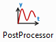
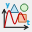

Once the model setup is complete and all essencial system components have been defined (the Bodies, Iitial Velocities, Kinematic Constraints, Forces, Motions, etc.), the Simulation can be launched. A single Body is the mandatory component for the Simulation, the rest can be defined by demand.

## Basic Solver Settings

The Simulation has the following basic Solver Settings in the User Interface:

-   Simulation Time (s): is the total simulation time defined in seconds;
-   Steps per second: is the number of steps per one second;
-   Integrator drop-down box: is the Custom or SciPy build-in integrator for solving the related System of ordinary differential equations (ODEs);
-   ‘Solve’ button is to run the Simulation;
-   ‘Stop’ button is to terminate the running simulation by demand (for example, in case of long estimated simulation time).
-   Progress Bar indicates the status of the running Simulation.

Simulation Time Step (dt = 1 / Steps per second) is considered for the simulation loops of the Custom Integrators (Euler, Symplectic Euler, Custom RK45), and is purely reporting Interval for the SciPy Integrators (RK23, Radau, BDF, etc) while writing the results in the CSV report.

If the system is perfectly smooth (e.g., a pendulum swinging), a SciPy integrator might take a massive internal Max Step (for example, 0.5 seconds) and then use "Dense Output" (polynomial interpolation) to mathematically guess the values at the given Time Step (dt) intervals defined by the user. In some cases (for the Contact processing, for example) Max Step shall be limited in the Advanced Settings (see futher).

## Integrator selection

Choosing the right integrator is crusial in Multibody Dynamics simulation. The wrong choice can lead to extra long simulation time, or worse, produce results that look plausible but are physically unreasonable.

Two types of Intergrators are available in the program:

**Custom Solvers natively develoed in Python:**
-   Euler
-   Symplectic Euler
-   RK45

**SciPy Library built-in Integrators:**
-   RK45 (Best Default choise)
-   RK23 (Adaptive)
-   DOP8543
-   Radau (Stiff)
-   BDF (Stiff Heavy)
-   LSODA (ABM Auto)

Below is a comprehensive guide to understanding the pros, cons, and ideal use cases for each integrator on the list.

### The Explicit & Basic Integrators

These methods calculate the state of the system at a later time from the state of the system at the current time. They are generally fast per step but struggle with stiff systems.

**Euler (Explicit, 1st Order)**

The Euler method is used to find the Body coordinate $$y_{n + 1}$$ from previous coordinate $$y_{n}$$ and velocity $$v_{n}$$:

$$
y_{n + 1} = y_{n} + h \cdot v_{n}
$$

Where $$h = d t$$ is the simulation time step.

-   **Pros:** The absolute simplest algorithm. Computationally inexpensive per step.
-   **Cons:** Extremely inaccurate and highly unstable. It accumulates error linearly and constantly injects artificial energy into the system. Not suitable for Collisions.
-   **Recommended Use:** **Basic Video Games and Real-time Engines.** Use only when performance is paramount, physical accuracy is irrelevant, and the step size is locked to the frame rate. Define higher number of steps to achive the reliable solutions. Do not use for the Contact processing and for the real engineering.

**Symplectic Euler (Semi-Implicit, 1st Order)**

Standard Euler calculates new velocity and new position using the previous velocity. Symplectic Euler calculates the new velocity, and then uses that new velocity to calculate the position.

$$
v_{n + 1} = v_{n} + h \cdot a ( y_{n} , v_{n} )
$$

$$
y_{n + 1} = y_{n} + h \cdot v_{n + 1}
$$

Where *a* is the Body acceleration.

-   **Pros:** Preserves the symplectic structure of separable Hamiltonians, meaning energy oscillates around a baseline rather than drifting to infinity over long periods.
-   **Cons:** Fails on complex MBD constraints (DAEs) and non-separable systems (like the 3D double pendulum). Only 1st-order accurate, meaning the "energy envelope" can still be wide if the step size isn't tiny. Not suitable for Collision processing.
-   **Recommended Use:** **Space and Molecular Dynamics.** Excellent for long-time simulations of unconstrained orbital mechanics (N-body problems) or basic particle systems.

### The Adaptive Runge-Kutta Family

These methods adjust their time-step on the fly. If the system is changing rapidly, they take tiny steps; if the system is coasting, they take massive steps to save time. RK methods are preferred for non-stiff systems.

**RK23 (Bogacki-Shampine)**

RK23 is an adaptive Runge-Kutta method that compares the 2nd-order and 3rd-order results to dynamically control the step size.

-   **Pros:** Takes relatively few calculations per step. Excellent at stepping over and recovering from mild discontinuities (like simple impacts or sudden force changes).
-   **Cons:** Low order of accuracy. To get highly precise results, it is forced to take incredibly small steps, ruining performance.
-   **Recommended Use:** **Simple Engineering and Debugging.** Good for short-time simulations with frequent, mildly chaotic events where you only need a "rough" answer quickly.

**RK45 (Dormand-Prince)**

At every single time step, the algorithm calculates two separate approximations: one using a 4th-order formula and one using a 5th-order formula. It compares these two results to estimate the local truncation error. This error dictates whether the solver needs to shrink or grow the time step for the next calculation to maintain stability and speed.

-   **Pros:** The undisputed "Workhorse." It offers a perfect balance of speed and local error control for standard equations. Highly robust and widely implemented.
-   **Cons:** Like all standard explicit methods, energy drifts over very long durations. It will grind to a halt if the system becomes stiff.
-   **Recommended Use:** **General Engineering and Aerospace.** The default starting point for short-to-medium-term MBD kinematics, smooth robotics, and general non-stiff dynamics.

**DOP853 (Explicit 8th Order)**

-   **Pros:** Incredible accuracy. Because of its high order, it can take massive time steps on smooth systems while maintaining microscopic error tolerances.
-   **Cons:** Very computationally heavy per step. It is highly allergic to discontinuities (impacts, sudden friction changes) and stiffness.
-   **Recommended Use:** **High-Precision Space and Aerospace.** Ideal for smooth, unconstrained celestial mechanics or long-distance orbital trajectories where precision is absolutely critical and no sudden impacts occur.

### The Stiff Solvers

"Stiffness" occurs when a system has vastly different timescales—for example, a heavy rigid truck chassis connected to a highly rigid, tiny suspension bushing. Explicit solvers fail here. Stiff solvers (Implicit methods) look ahead and solve sets of equations to ensure stability, at the cost of heavy computation per step.

**Radau (Implicit Runge-Kutta, 5th Order)**

-   **Pros:** Highly stable (L-stable) and very accurate. It handles Differential Algebraic Equations (DAEs) natively, making it incredibly robust for the constraints and joints used in MBD.
-   **Cons:** Solving the internal Jacobians (matrices) makes it computationally expensive per step.
-   **Recommended Use:** **Stiff Engineering and Complex Mechanisms.** Excellent for moderate-sized MBD assemblies with heavy joint constraints, hard contact mechanics, and flexible bodies (flex).

**BDF (Backward Differentiation Formula)**

-   **Pros:** Highly efficient for massive scale systems. It relies on past steps to compute the next one, making it memory-efficient and incredibly stable.
-   **Cons:** BDF intentionally dampens high-frequency oscillations to maintain stability. While great for math, this can physically "smooth out" real-world vibrations that an engineer might actually want to study. It can also be slow to start up.
-   **Recommended Use:** **Massive Heavy Engineering.** Best for very large MBD models (\>1000 equations), highly stiff flexible structures, or complex vehicle dynamics where high-frequency noise needs to be suppressed.

**LSODA (Livermore Solver with Auto-switching)**

-   **Pros:** The ultimate "Black Box." It monitors the system and dynamically switches between a non-stiff method (Adams) and a stiff method (BDF) depending on what the physics demand at that exact millisecond.
-   **Cons:** The mathematical overhead required to constantly test for stiffness and switch algorithms can cause performance hits, especially if the system rapidly oscillates between stiff and non-stiff states.
-   **Recommended Use:** **Unpredictable Systems and "Set-and-Forget" Users.** Ideal for models that undergo drastic state changes—like a spacecraft coasting smoothly (non-stiff) and then suddenly deploying a highly tensioned parachute (stiff).

**Quick Integrator Selection Matrix**

| System Characteristic             | Recommended Integrator Choice(s) |
|-----------------------------------|----------------------------------|
| Default Starting Point (Smooth)   | RK45                             |
| Real-time Games / VR              | Euler (if forced), RK23          |
| Long-term Orbits (Unconstrained)  | Symplectic Euler, DOP853         |
| High Precision / Smooth Space     | DOP853                           |
| Heavy Constraints & Hard Contacts | Radau                            |
| Massive Scale / Stiff Flex Bodies | BDF                              |
| Unpredictable / Mixed Stiffness   | LSODA                            |

Depending on the specific type of multibody system (e.g., a robotic arm, a vehicle suspension, or a spacecraft) the appropriate integrator can be selected for Simulation.

## Advanced Solver Settings

Following advanced Solver settings are available for the user:

-   Solver Compliance (for systems with overconstraints);
-   Baumgarte Stabilization;
-   Relative Tolerance;
-   Absolute Tolerance;
-   Max Step Limit.

### Solver Compliance: Matrix (Tikhonov) Regularization

In mechanical engineering, an **Overconstrained Mechanism** is a linkage that has more degrees of freedom than is predicted by the mobility formula. The mobility formula evaluates the degree of freedom of a system of rigid Bodies that results when Constraints are imposed in the form of Joints between the links.

[https://en.wikipedia.org/wiki/Overconstrained_mechanism](https://en.wikipedia.org/wiki/Overconstrained_mechanism)

If the links of the system move in three-dimensional space, then the Mobility formula is:

$$
M = 6 ( n - j ) + S
$$

where *n* is the number of Bodies in the system (the Ground is not considered), *j* is the number of joints, and *S* is the number of degrees of freedom of all joints:

$$
S = \sum_{i = 1}^{j} f_{i}
$$

If Z is the total number of the restricted DoFs for all Joints, then the simple Mobility formula is:

$$
M = 6 n - z
$$

If a system of links and joints has Mobility M = 0 or less, yet still moves, then it is called an Overconstrained Mechanism.

For example, the door (with 6 DoF) with 2 hinges (each eliminating 5 DoF) has following Mobility:

$$M \  = \  6 \cdot 1 \  – \  2 \cdot 5 \  = \  - 4$$,

which means this is the Overconstrained Mechanism. In this case, the physics engine asks a mathematically impossible question: "Which of these joints is carrying the load?" Because the Bodies are treated as infinitely rigid, there are an infinite number of valid load distributions, which causes the Jacobian rows to become linearly dependent and crashes the matrix solver.

**Matrix Regularization (Tikhonov Regularization)** is integrated to solve the Overconstraint problem. How it works: mathematically, it relaxes the infinitely rigid kinematic constrain and allows infinitesimal accelerations to pass through the joint, and a microscopic joint drift appears under the joint reaction force. This instantly resolves singular matrices and allows perfectly rigid joints to safely share loads.

In Tikhonov Regularization, the value in the User Intrface Epsilon (for example: -1E-7) is the reciprocal of mass with units of $$kg^{-1}$$ (or Inverse Inertia $$1/kgm^2$$ for rotation). If Epsilon is zero (the default), this corresponds to infinite virtual mass and a perfectly rigid connection. Increasing Epsilon effectively gives the connection a finite virtual mass that shifts slightly under the influence of the connection's reaction forces, thereby avoiding a singularity.

**Example of Usage:**

-   A value of 0.0 (deactivated) means the Joint is infinitely stiff. It can be set for the properly constrained systems without Overconstraints.
-   A value of 1E-5 (soft) means the Joint is made of rubber or similar soft material.
-   A value of 1E-7 (default value) means the Joint is made of hard steel.
-   A value of 1E-9 (hard) or lower is for the simulations of the heavy rigid systems (massive train wheels) .

### Baumgarte Stabilization

The numerical integration causes tiny rounding errors over time. As a result, the Joint can physically drift apart, and the Bodies can slowly disconnect from each other. To fix this failure, the **Baumgarte stabilization** is implemented in the Solver to pull the Joints back together like a spring-damper system. Mathematically, the second time derivative of the kinematic constrain equation

$$
\ddot{\Phi} = 0
$$

is upgraded to the mass-spring-damper system equation in the augmented matrix:

$$
\ddot{\Phi} = - 2 \alpha \dot{\Phi} - \beta^{2} \Phi
$$

Where:

$$\Phi$$is the current position error (kinematic constraint),

$$\dot{\Phi}$$ is the current velocity error,

$$\alpha$$ and $$\beta$$ are the parameters (units: rad/s) representing the damping and stiffness of this “virtual” spring in the Joint. There are three possible states depending on the $$\alpha$$ and $$\beta$$ relation:

-   Underdamped ($$\alpha < \  \beta$$): the error will oscillate around zero;
-   Overdamped ($$\alpha > \  \beta$$): the error will sluggishly return to zero;
-   Critically Damped ($$\alpha = \  \beta$$): the error returns to zero as fast as possible without oscillation.

To prevent the error from oscillating or taking too long to resolve, the error dynamics shall be Critically Damped. Therefore, it is considered that $$\alpha = \beta$$ in the Solver. By default, this values are set to 20rad/s and can be modified in the Advanced Setting UI:

-   If the Joints are drifting too much, increase $$\alpha$$ and $$\beta$$;
-   If the simulation jitters or vibrates, then back the parameters down.

### Error Tolerances and Time Step Limit

Adjusting the Tolerances and integration Time Steps provides additional ways to control the Solver's accuracy. Relative Tolerances and Time Steps are applicable to **Adaptive-Step** solvers (all SciPy integrators) and are not applicable to **Fixed-Step** Solvers (CustomEuler, Custom Symplectic Euler, CustomRK4).

**Relative Tolerance** defines the acceptable error relative to the size of the state variable. The defaults value is set to 1e-3 (0.1% error), which means we accept a 0.1% error in the calculated velocity per step. Time step is reduced if the defined Tolerance is not achieved.

**Absolute Tolerance** defines the acceptable error of the state variable, and it is measured in the same units: Position in meters (m), Velocities in meters per second (m/s), Angular Velocities in radians per second (rad/s), Quaternions are unitless (values between -1.0 and 1.0). The defaults value is set to 1e-6, which means the Solver will demand an accuracy of 0.001 mm for Positions and 0.001 mm/s for Velocities.

**Max Step Limit** defines the maximal Time interval ($$d t$$) during the simulation. The default value for Max Step in SciPy is Auto (no limit), and the Solver assumes it has absolute freedom to increase the Time Step, so long as the mathematical curve fulfills the error tolerances.

Therefore, for example, for the Collision simulations, if Max Step is left to infinity, the Solver might try to take a long 0.5s time step and completely "step over" a Collision that can only last 0.005s. In impact dynamics in this case, it is highly recommended to forcefully set Max Step = dt (or smaller) to force the Solver to physically evaluate the math at every frame, so the Bodies Contact is properly simulated.

## Animation and Playback

Once Simulation is complete, it is ready for the visualisation and Playback using standard media player controls: Play, Pause, Stop, Step Back and Step Forward (by exactly one calculated simulation frame). Video quality can be adjusted using the frame rate (Frames Per Second) setting. Animation speed can be adjusted relative to the simulation's real-time speed (%) by the scroll-bar.

An animated video of the entire simulation can be exported in \*.webm format.

## Postprocessor

Simulation results are stored in the data array and can be reviewed in the Telemetry Window.

Following simulation results are available:

-   Bodies: XYZ-Positions and Angular Orientations, Velocities, Angular velocities, Kinetic, Potential and Total Energy;
-   Joints: Reactuon forces and Torques;
-   Forces: XYZ-Projections in the Global RF;
-   Torques: XYZ-Projections in the Local RF;
-   Contact: Normal Force and Friction Force (if activated);
-   Compression Springs: Defomation, Deformation Velocity, Elastic, Damping and Total Force;
-   Torsion Springs: Angular Defomation, Deformation Velocity, Elastic, Damping and Total Torque;
-   Bushing: XYZ-Deflection and Rotatioal Defomation, XYZ-Reaction Forces and Torques;
-   Gear Constraint: Tangential (Ft), Axial (Fa), Radial (Fr) and Result contact (Fc) Forces in the gear teeth contact;
-   Translation Motion: Displacement, Velocity and Acceleration of the Joint links, as well as the Required Actuator Force;
-   Rotational Motion: Angular Displacement, Velocity and Acceleration of the Joint links, as well as the Required Actuator Torque.

Below is the example of the simulation results of the Physical pendulum.

**Units of measurement** are indicated in parentheses separately for each graph.

**Double-click the graph**, and the mouse pointer will display the exact (x, y) coordinates on the graph.

Following Tools are available in the Telemetry window:

 Fit All Data to View;

 Clear Graph;

 Save Image as PNG;

 Save Image as SVG;

 Export plotted Data as CSV.

## Export Results to CSV-File

The entire Simulation Results can be exported to a single CSV-file.
