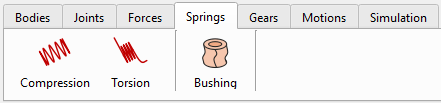
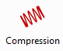
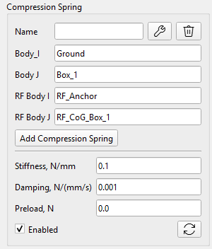
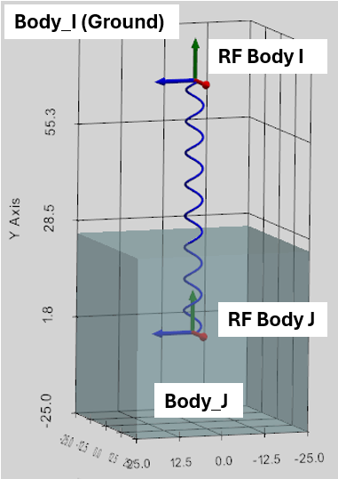
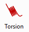
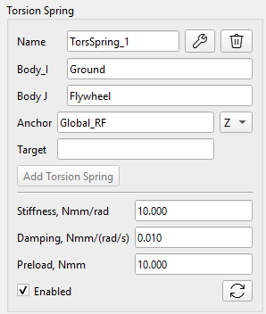

The "Springs" section includes the following components:

-   Compression Spring which acts as a translational spring damper,
-   Torsion Spring which acts as a rotational spring damper,
-   Bushing which acts as a translational and rotational flexible connection element.

## Compression Spring

Compression spring can be defined between any two rigid Bodies and the Ground in the specific points in space defined by the selection of the Reference Frames.

The Compression Spring applies an Action-Reaction pair of forces to two bodies (Body_I, Body_J) simultaneously.

### Definition of the Compression Spring

Compression Spring is defined by the following parameters in the User Interface:

-   Body_I: first action Body or Ground,
-   Body_J: second action Body or Ground,
-   RF Body I: Reference Frame as an action point on the Body_I,
-   RF Body J: Reference Frame as an action point on the Body_J,
-   Stiffness (N/mm): Spring Rate (k),
-   Damping (Ns/mm): Spring Damping (C),
-   Preload (N): Spring initial force preload: it is pushing if positive and compressing if negative.

 

Once the Spring is defined, the Stiffness, Damping and Preload can be later updated, but the related free-standing Reference Frames are locked for edition. At the same time, by demand, the CoG Reference Frame can be shifted with the Spring and related rigid Body.

It is possible do define several Compression Springs between the same Bodies.

### Force calculation of the Compression Spring

The Force magnitude of the Compression Spring is calculated as following:

$$
F_{s p r i n g} = F_{p r e l o a d} - k \mathrm{\Delta} L - C \dot{L}
$$

$$
\mathrm{\Delta} L = L - L_{i n i t i a l}
$$

where:

$$L_{i n i t i a l}$$ is the initial distance between RF_Body_I and RF_Body_J at time point t=0,

$$L$$ is the actual distance as the magnitude of the vector between RF_Body_I and RF_Body_J dynamically calculated by the solver,

$$\mathrm{\Delta} L$$ is the Spring deformation,

$$\dot{L}$$ is the relative velocity of RF_Body_I and RF_Body_J,

The calculated spring force ($$F_{s p r i n g}$$) is applied as an Action-Reaction to the Body_I and Body_J, as well as the local Torques based on the cross product of the lever arms form the Bodies’ CoGs to the points of Spring force application (‘RF Body I’ and ‘RF Body J’).

## Torsion Spring

Torsion spring can be defined between any two rigid Bodies (or Ground) in the specific point along the specific direction.

The Torsion Spring applies an Action-Reaction pair of torques to two bodies (Body_I, Body_J) simultaneously.

### Definition of the Torsion Spring

Torsion Spring is defined by the following parameters in the User Interface:

-   Body_I: first action Body or Ground,
-   Body_J: second action Body or Ground,
-   Anchor: Reference Frame of the Spring location,
-   XYZ-dropdown: the axis of the Anchor RF. It defines the Spring Torque axis. It is considered if Target RF is not defined.
-   Target: this Reference Frame defines the Spring Torque direction as the axis between the Anchor and Target reference frames. XYZ-dropdown is ignored if Target RF is defined.
-   Stiffness (Nmm/rad): Spring Rate (k),
-   Damping (Nmms/rad): Spring Damping (C),
-   Preload (Nmm): Spring initial Torque preload.

As is evident from the definition, once Anchor RF is defined, there are two ways to define the Spring Torque axis:

1.  If Torque axis is one of the Anchor RF axes, then this axis can be selected by XYZ-dropdown box;
2.  If Target RF is defined, then Torque axis will connect the Anchor and the Target reference frames. XYZ-dropdown is not considered in this case.

 

Once the Spring is defined, the Stiffness, Damping and Preload can be later updated, but the related free-standing Reference Frames are locked for edition. At the same time, by demand, Body_I or Body_J can be shifted or rotated by their CoG Reference Frames.

It is possible do define several Torsion Springs between the same Bodies.

### Torque calculation for the Torsion Spring

The Torsion Spring is restricted to act around a primary axis defined by Anchor (and optionally Target) Reference Frames. Torque magnitude of the Torsion Spring is calculated as following:

$$
T_{s p r i n g} = T_{p r e l o a d} - k \mathrm{\Delta} \theta - C \dot{\theta}
$$

where:

$$\mathrm{\Delta} \theta$$ is the Spring deformation calculated as relative rotation of Body_I and Body_J along the Torque axis,

$$\dot{\theta}$$ is the relative angular velocity of Body_I and Body_J along the Torque axis.

The calculated Spring Torque magnitude ($$T_{s p r i n g}$$) is applied as an Action-Reaction Torque to the Body_I and Body_J.

## Bushing

Bushing is a generalized compliant element that exerts translational and rotational spring damper forces across all 6 degrees of freedom.

Mathematically, it operates purely within the local coordinate system of its Anchor Reference Frame. The Bushing element acts as three Compression and three Torsion Springs applied to the same point.

### Bushing definition

Bushing is defined by the following parameters in the User Interface:

-   Body_I: first action Body or Ground,
-   Body_J: second action Body or Ground,
-   Anchor RF: global Reference Frame defining the Bushing position as local Anchor points at Body_I and Body_J,
-   Stiffness Kx, Ky, Kz (N/mm): Translational Stiffness oriented along the Anchor RF,
-   Stiffness KRx, KRy, KRz (Nmm/rad): Rotational Stiffness oriented along the Anchor RF,
-   Damping Cx, Cy, Cz (Ns/mm): Translational Damping,
-   Damping CRx, Cry, CRz (Nmms/rad): Rotational Damping,
-   Preload Fx, Fy, Fz (N): Initial Force preload,
-   Preload Tx, Ty, Tz (Nmm): Initial Torque preload.

 

### Calculation of Bushing reaction Forces and Torques

A Bushing (also known as a 6-DOF Spring-Damper) is essentially 3 independent compression springs and 3 independent torsion springs all bundled into a single element, acting along the local X, Y, and Z axes of a specific Reference Frame. The two Bodies share a single physical hinge point that allows compliant flex in all 6 directions.

 

During the simulation, the current relative position and velocity of Body_I’s and Body_J’s Anchor points are measured and projected onto Body_I’s Anchor RF axes to get the local translational deformation ($$\Delta x$$) and velocity ($$v_{r e l}$$). At the same time, the current relative rotation matrices of Body_I and Body_J are compared to extract the local twist angles ($$\Delta \theta$$) and relative angular velocities ($$\omega_{r e l}$$). Then independent Forces and Torques are calculated for each axis using the standard spring-damper equations:

$$
F_{l o c} = - K_{t r a n s} \mathrm{\Delta} x - C_{t r a n s} v_{r e l} + F_{p r e l o a d}
$$

$$
T_{l o c} = - K_{r o t} \mathrm{\Delta} \theta - C_{r o t} \omega_{r e l} + T_{p r e l o a d}
$$

These local Force and Torque vectors are multiplied by rotation matrix of Anchor RF to get the them in global 3D space:

($F_{glob_I} = - F_{glob_J}$ and $T_{glob_I} = - T_{glob_J}$)

The force $$F_{g l o b}$$ is applied at the Anchor point, which is in the general case at a distance ($$R$$) from Body's CoG. As a result, the force $$F_{g l o b}$$ creates a mechanical torque for Body_I and Body_J. Finally, the total torque:

$$
T_{total_I} = T_{glob_I} + ( R_I \times F_{glob_I} )
$$

$$
T_{total_J} = T_{glob_J} + ( R_J \times F_{glob_J} )
$$
