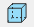
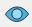
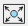
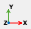
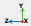
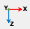

The User Interface consists of the 3D Viewport, the main Toolbar, objects Tree hierarchy, the Property panel, and traceback window.

The main Toolbar includes all required to assembly the simulation model: the Bodies, Reference Frames, Springs and Forces, Motions and the Simulation controls. The objects created in the simulation model immediately appear in the Objects Tree. Being selected by double-click the object properties are displayed in the Property panel for review and modifications.

The 3D Viewport includes following control buttons:

 Display / hide 3D Body edges,

 Display / hide Grid,

 Hide all objects except selected Body,

 Unhide All objects in the Viewport,

 Toggle bright / dark background in the Viewport,

 Unselect All objects,

 Hide visuals for Reference Frames, Joints, Forces and Torques,

 Freeze the actual size of the visuals for Reference Frames, Joints, Forces and Torques

 Toggle the 3D Viewport between Perspective and Orthographic (Parallel) projection,

 Fit All object in the current view,

 Orient current view in XY-plane,

 Orient current view in ZY-plane,

 Orient current view in XZ-plane.
