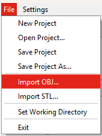
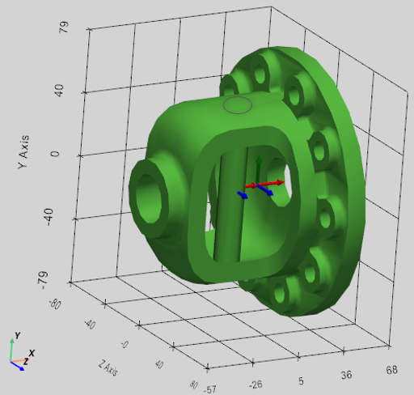
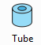
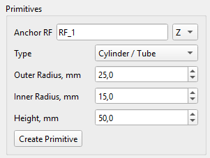
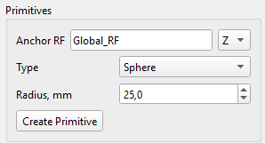
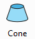
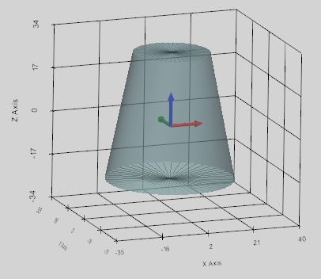
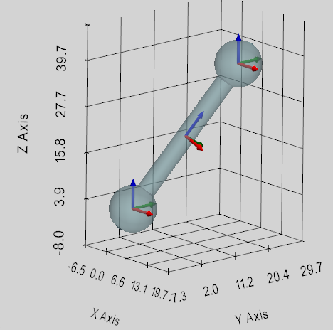
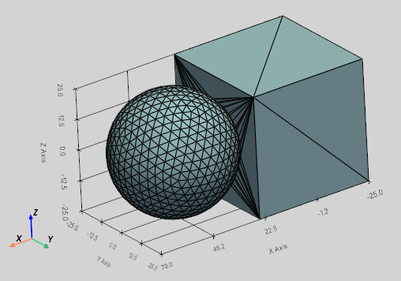

## Импорт готовой 3D-модели

3D-модели можно импортировать в программу в виде .obj или .stl-файла.

 

Сразу после импорта автоматически вычисляются центр тяжести, главные оси и массовые свойства каждой детали.

## Свойства деталей

Панель сойства детали «Body Properties» можно открыть, нажав кнопку «Body» или дважды кликнув по объекту в дереве иерархии слева от 3D-окна.

После импорта или создания CAD-модели с помощью панели инструментов сразу вычисляются массовые свойства и присваиваются каждому телу на основе 3D-данных и стандартной плотности стали: ρ = 7850 кг\*м\^3:

-   Объём (мм\^3),
-   Масса (кг),
-   XYZ-координаты центра тяжести ЦТ (center of gravity: CoG) относительно глобальной системы отсчёта (мм),
-   Тензор инерции относительно ЦТ тела (кг\*мм²),
-   Основные моменты инерции (kg\*mm²): I_xx, I_yy, I_zz,
-   Матрица вращения главных осей тела относительно глобальной системы координат,
-   Углы вращения главных осей тела в глобальной системе координат (рыскание-тангаж-крен).

Плотность детали может быть изменена при необходимости, после чего масса и тензор инерции будут немедленно пересчитаны.

Выбрав галочку «Применить плотность ко всем деталям» (Apply Overall Density) и нажав кнопку «Применить», свойства плотности и массы обновятся для всех деталей системы.

Цвет можно назначить любой детали отдельно (Body Color) или сразу всем телам в системе (All Bodies).

При необходимости можно присвоить случайный цвет всем деталям (Random).

Любую деталь можно скрыть (Visible) или отключить (Enabled) и не учитывать в симуляции.

## Гравитация

После импорта или создания CAD-модели с помощью панели инструментов сила гравитации присваивается каждому телу на основе рассчитанной массы и заданного вектора гравитации.

По умолчанию вектор гравитации задан следующим образом: (m/s\^2)

$$
\mathbf{g} \mathbf{\ } = \  \left\lbrack 0 , \  - 9 . 8 1 , \  0 \right\rbrack^{T}
$$

При необходимости гравитация может быть изменена или деактивирована в разделе «Гравитация» (Gravity) панели свойств силы (Forces).

Сила гравитации показана в виде зелёного вектора с началом в центре тяжести тела.

## Начальные линейные и угловые скорости

По умолчанию начальные линейные и угловые скорости каждого тела установлены равными 0.0.

При необходимости начальные скорости могут быть обновлены до требуемых значений, которые будут учтены в момент времени t=0 в симуляции. Секция задания начальных скоростей ‘Initial Velocity’ доступна на панели свойства объектов ‘Body Properties’.

Поскольку вращательные движения решаются в локальной фиксированной системе отсчёта тела, начальная угловая скорость тела также определяется как вектор в локальной системе отсчета этого тела.

Внимание / Совет! В отличие от одного тела, начальные скорости для связанных тел должны указываться с осторожностью. Если скорости кинематически связанных тел не совпадают, это может привести к неточным результатам моделирования, высоким реакциям в соединениях или даже к сбоям решателя.

## Система координат

Система координат СК (Reference Frame, RF) — это прямоугольная (декартова) система координат с началом координат и ориентацией заданными в физическом пространстве относительно глобальной системы отсчёта.

Система координат является фундаментальной единицей системы моделирования, поскольку все базовые компоненты (тела, силы, шарниры, пружины) определяются относительно системы координат.

Система координат определяется 6 параметрами: X, Y, Z -координатами и X_rot, Y_rot, Z_rot углами вращения относительно глобальной системы отсчёта.

СК можно копировать, смещать и вращать относительно глобальной или локальной СК с помощью элементов управления на панели «RF Properties». Панель «RF Properties» можно открыть, нажав кнопку «Ref.Frame» или дважды кликнув по СК на панели иерархии Reference Frame слева от главного окна.

 

### Последовательность вращения (X → Y → Z) в глобальной системе отсчета

Решатель SimPhant использует углы Тейта–Брайана, которые в аэрокосмической и робототехнике обычно называют Roll-Pitch-Yaw. Это означает, что вращения задаются последовательно в порядке: сначала ось X, затем ось Y, и, наконец, ось Z, относительно глобальной СО. Когда значения углов поворота задаются, объект вращается вокруг фиксированных осей глобальной системы отсчета.

### Последовательность вращения (Z → Y → X) в локальной системе отсчета

Учитывая перемножение 3D-матриц вращения, внешняя последовательность X-Y-Z в глобальном СК даёт точно такую же конечную пространственную ориентацию, как и внутренняя последовательность Z-Y-X в локальном СК. Это означает, что чтобы получить ту же ориентацию, что и после вращения XYZ в глобальной СК, нам нужно вращаться в последовательности ZYX относительно локальной СК.

### Заблокированные системы координат

Система координат блокируется (ее невозможно изменить), если относительно этой СК определена одна из следующих компонентов системы: деталь, связь или пружина.

### Сдвиг и вращение детали с его системой координат

Тело можно перемещать и вращать вместе с его системой координат, если поставим галочку «Move Body with CoG».

## Примитивы: создание простейших 3D-объектов

Панель инструментов Детали предназначен для создания простых 3D-моделей.

### Кубоид (Box)

Этот инструмент создаёт прямоугольный параллелепипед, расположенный по центру выбранной пользователем системы отсчёта.

Пользователь определяет следующие размеры кубоида:

-   Target RF - Опорная Система координат, определяющая положение геометрического центра симметрии,
-   Length (X) - Длина (мм) вдоль оси X,
-   Width (Y) - Ширина (мм) по оси Y,
-   Height (Z) - Высота (мм) по оси Z.

 

### Трубка (Tube)

Этот инструмент создаёт полый цилиндр (трубку), центрированный вокруг выбранной пользователем системы координат.

Центральная ось цилиндра расположена вдоль одной из осей X, Y или Z, выбранных пользователем.

Пользователь определяет следующие размеры трубки:

-   Anchor RF - Опорная Система координат, определяющая положение геометрического центра симметрии трубки,
-   Outer Radius (mm) - Внешний радиус (мм),
-   Inner Radius (mm) - Внутренний радиус (мм),
-   Height (mm) - Высота (мм) определяется вдоль выбранной пользователем оси.

 

### Шар (Sphere)

Этот инструмент создаёт шар, с центром в выбранной пользователем системе координат и с заданным радиусом (мм).

Пользователь определяет следующие параметры шара:

-   Anchor RF: Опорная Система координат, определяющая положение геометрического центра сферы,
-   Sphere Radius (mm) - Радиус шара (мм).

 

### Призма (Prism)

Этот инструмент создаёт прямую правильную призму, центрированную вокруг выбранной пользователем системы координат.

Центральная ось призмы расположена вдоль одной из осей X, Y или Z, выбранных пользователем.

Пользователь определяет следующие измерения призмы:

-   Anchor RF: Опорная Система координат, определяющая положение геометрического центра симметрии призмы,
-   Number of side - Количество сторон,
-   Circumradius (mm) - радиус описанной окружности основания призмы (мм),
-   Height (mm) - Высота (мм) призмы определяется вдоль выбранной пользователем оси.

 

### Тор (Torus)

Этот инструмент создаёт сплошной тор, посредством перемещения диска малого радиуса вдоль круга с большим радиусом внутри выбранной пользователем системы координат.

Центральная ось тора расположена вдоль одной из осей X, Y или Z, выбранных пользователем.

Пользователь определяет следующие измерения тора:

-   Anchor RF: Опорная Система координат, определяющая положение геометрического центра симметрии тора,
-   Major Radius (mm) - Большой радиус (мм),
-   Minor Radius (mm) - Малый радиус (мм).

 

### Конус (Cone)

Этот инструмент создаёт усечённый конус, центрированный по выбранной пользователем системе координат.

Центральная ось конуса расположена вдоль одной из осей X, Y или Z, выбранных пользователем.

Пользователь определяет следующие размерности конуса:

-   Anchor RF: Опорная Система координат, определяющая положение геометрического центра симметрии положения конуса на половине его высоты,
-   Bottom Radius (mm) - радиус нижнего основания (мм),
-   Top Radius (mm) – радиус верхнего основания (мм),
-   Height (mm) - Высота (мм) определяется вдоль выбранной пользователем оси.

 

### Жесткая Опора (Link)

Этот инструмент создаёт жёсткую опору (стержень) с заданными размерами:

-   Cylinder Radius (mm) - Радиус стержня (мм),
-   Sphere Radius (mm) - Радиус двух шаров на концах (мм).

Опора может быть задана одним из двух способов:

1.  Между системами координат Anchor RF и Target RF (тогда выпадающее меню XYZ не учитывается);
2.  Опора с центром в системе отсчёта Anchor RF вдоль одной из осей X, Y или Z, выбранной пользователем. В этом случае Target RF не учитывается, и длина опоры (Length, mm) должна быть задана.

 

## Объединение (Boolean)

Создание нового тела (Body) как объединенной CAD-модели двух выбранных тел: Body_I и Body_J.

После создания нового тела для него автоматически рассчитываются и назначаются центр масс (CoG), масса и тензор инерции. При этом для нового тела учитывается плотность тела Body_I.

Если тела Body_I и Body_J не пересекаются, новое тело не создается. В любом случае исходные тела Body_I и Body_J остаются неизменными, сохраняя все связанные с ними элементы (шарниры, силы и т. д.), если таковые были определены.

Для выполнения булевой операции объединения пользователь должен указать два тела:

-   Body_I: первое тело для объединения,
-   Body_J: второе тело для объединения.

 

## Шестерни (Gears)

В программе можно создать три типа зубчатых колес (Gear): цилиндрические и косозубые, с внешним и внутренним зацеплением, а также конические шестерни. Детали описаны в разделе Зубчатые передачи (Gear Constraint).
