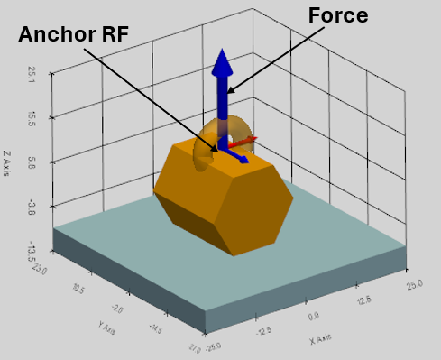
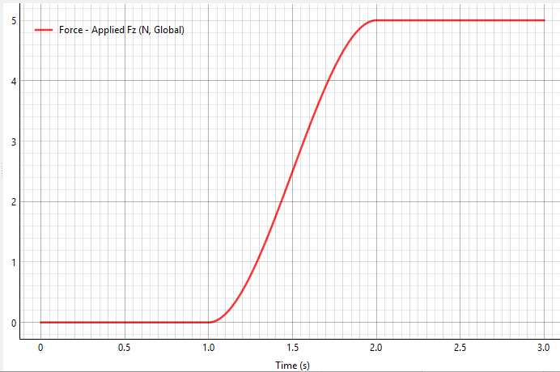
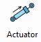
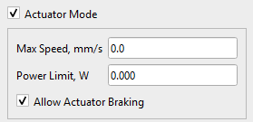
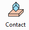
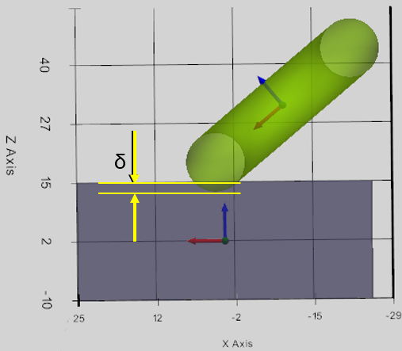
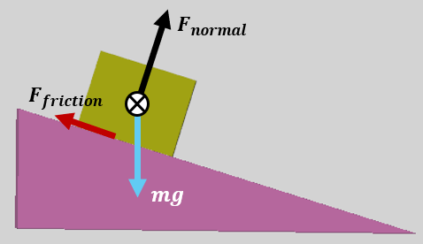

Раздел «Силы» включает следующие компоненты: сила (Force), крутящий момент (Torque), привод (Actuator), электродвигатель (E-Motor) и контакт (Contact).

## Сила и крутящий момент

Силы и крутящие моменты применимы к любому жёсткому телу в симуляции, а также к шестерням. Направление и точка приложения определяются опорной системой координат Anchor RF. Сила появляется в виде синей стрелки, а момент силы отображается как красная стрелка с маленьким тором у основания.

 

Сила и крутящий момент определяются следующими параметрами:

-   Name: имя присваивается автоматически и может быть изменено,
-   Part: Тело, на которое действует сила или крутящий момент,
-   RFrame: Система отсчёта как точка приложения на теле,
-   Выпадающее меню XYZ: ось выбранной системы отсчета, вдоль которой направлена сила или крутящий момент.
-   Выпадающее меню Space Fixed / Body Fixed определяет привязку вектора силы или крутящего момента к телу или к пространству (см. объяснения ниже),
-   Value, N/Nmm: величина силы или крутящего момента. Значение можно определить как математическую функцию времени (см. подробности ниже).

### Стандарт «Body Fixed»

Сила, связанная с телом (body-fixed force), — это сила, положение и направление которой связано с системой отсчета самого объекта.

-   Точка приложения: связана с определённой точкой движущегося тела.
-   Векторное направление: Связано с движущимся телом.
-   Реальный аналог: ракетный двигатель, прикреплённый к космическому кораблю. Когда космический корабль маневрирует и вращается, положение тяги двигателя движется вместе с кораблём, а вектор тяги строго указывает туда, куда направлена задняя часть корабля.

### Стандарт «Space Fixed»

Под силой, фиксированной в пространстве или глобальной силой (Space Fixed), понимается сила, которую внешняя среда прикладывает к конкретной точке объекта.

-   Точка приложения: связана с определённой точкой движущегося тела. (Это распространённое заблуждение — даже в Space Fixed Forces точка всё равно движется вместе с телом!).
-   Векторное направление привязано к глобальной системе отсчета. Вектор силы не вращается, когда тело вращается.
-   Реальный аналог: гравитация или боковой ветер. Ветер продолжает дуть строго вдоль конкретной оси, независимо от того, как расположено тело.

Примечание о крутящих моментах: С технической точки зрения крутящие моменты являются «свободными векторами»: это означает, что для уравнений движения точка их приложения математически не имеет значения, однако правила определения направления вектора (относительно связанной или неподвижной системы координат) применяются точно так же, как и к силам.

### Математические функции для определения силы и крутящего момента

Величины силы и крутящего момента можно определить как сочетание математических функций времени. Следующие функции можно напрямую ввести в поле Value:

sin(t), cos(t), tan(t), sqrt(t) (квадратный корень), exp(t) (экспоненция), abs(t) (абсолютное значение), pi (константа π ≈ 3.14159).

Можно использовать 'np.' для вызова любой стандартной математической функции NumPy, например:

np.cosh(t), np.round(t), np.sign(t) и т.д.

Полный список поддерживаемых математических функций:

[https://numpy.org/doc/stable/reference/routines.math.html](https://numpy.org/doc/stable/reference/routines.math.html)

### Пользовательские функции: STEP, IF

В программе поддерживаются следующие пользовательские функции:

**Функция STEP**

Шаговая функция плавно меняется между двумя заданными значениями.

Синтаксис: step(t; t0; F0; t1; F1)

Пример: step(t; 1; 0; 2; 5)

Результат: сила составляет 0N до 1й секунды, затем плавно увеличивается до 5N на 2й секунде)

Математическая формула для функции «step» широко используется в компьютерной графике и математике, известная как кубическая интерполяция Эрмита или функция гладкого шага.

При условии, что $$x_{0} < x_{1}$$, функция может быть выражена как:

$$
f ( x ) \  = \begin{cases}h_{0} , \  i f \  x \leq x_{0} \\ h_{0} + \left( h_{1} - h_{0} \right) ( 3 - 2 u ) u^{2} , \  i f \  x_{0} < x < x_{1} \\ h_{1} , i f \  x \geq x_{1}\end{cases}
$$

Где $$u$$ — нормированное положение $$x$$ между $$x_{0}$$ и :$$x_{1}$$

$$
u = \frac{x - x_{0}}{x_{1} - x_{0}}
$$

**Функция IF**

Синтаксис: if(\<условие\>; \<значение если меньше или равно 0\>; \<значение если больше 0\>)

Пример: if(t-1; 0; 2)

Результат: если t ≤1, вывод 0. Если t \> 1, вывод 2.

## Привод (Actuator)

Актуатор (привод) в симуляции — это cила с ограниченной мощностью.

Сила привода (F) уменьшается по мере увеличения скорости (v) тела, на которое она действует. Выбрав галочку «Режим привода» (Actuator Mode), cила преобразуется в привод.

Величина силы F(v) зависит от скорости тела (v) в направлении вектора этой силы и определяется следующим образом:

$$F ( v ) = F_{\max} \left( 1 - \frac{v}{v_{\max}} \right)$$**,**

где

$$F_{\max}$$ — сила привода, когда скорость тела в направлении силы равна нулю,

$$v_{\max}$$ — это скорость тела, при которой приложенная сила привода падает до нуля. Введение этого придает механизмам реализма, естественно ограничивая их скорость и добавляя реалистичное физическое затухание.

Максимальная скорость привода определяется пользователем. Предел мощности (N_max) рассчитывается автоматически.

Мощность привода:

$$
N = F \cdot v
$$

Максимальная мощность привода:

$$
N_{\max} = F_{\max} v_{\max} / 4
$$

Пример:

Рассмотрим, что привод способен развить максимальную силу F_max=100N к неподвижному телу (V=0). По мере увеличения скорости тела сила привода линейно уменьшается до 0N при достижении скорости V_max = 200 мм/с. Ниже приведён график, изображающий силу, как функцию скорости, и кривую мощности.

В этом примере тело не может ускориться до скорости более 200 мм/с под действием силы привода.

**Расчёт скорости для корреляции силы привода в пространственной динамике**

Алгоритм расчёта скорости одинаков как для фиксированных сил (Body-Fixed), так и пространственно-фиксированных (Space-Fixed). Для линейного привода ограничение скорости должно применяться к определенной физической точке ($$r_{g l o b}$$) на теле, куда прилагается сила, используя следующие шаги:

1.  Расчёт глобальной скорости центра тяжести тела ($$v_{c o g}$$).
2.  Преобразование скорости вращения тела в глобальной системе отсчета ($$\omega_{g l o b}$$).
3.  Поиск точного вектора глобальной скорости для конкретной точки, где приложена сила, с помощью векторного произведения:

$$
v_{p o i n t} \, = \, v_{c o g} \, + \, \left( \omega_{g l o b} \, \times \, r_{g l o b} \right)
$$

4.  Наконец, проецируем этот общий вектор глобальной скорости на ось глобальной силы с помощью скального произведения:

$$
v_{c u r r e n t} = \  v_{p o i n t} \cdot a x i s_{g l o b a l}
$$

#### Торможение приводом (Allow Actuator Braking)

Как видно из определения силы привода F(v), если скорость тела превышает максимальное значение V_max (например, под действием гравитации), сила становится отрицательной. В этом случае актуатор начинает замедлять тело. По умолчанию эта опция активируется галочкой « Allow Actuator Braking». В противном случае сила привода обнуляется, как только скорость тела превышает V_max.

## Электромотор (E-Motor)

Компонент симуляции Электромотор (E-Motor) — это крутящий момент с ограниченной мощностью.

Крутящий момент (T) уменьшается по мере увеличения угловой скорости (ω) тела, к которому он приложен. Электродвигатель активируется галочкой «Режим привода» (Actuator Mode) в разделе определения крутящего момента.

Величина крутящего момента Электродвигателя T(ω) зависит от угловой скорости тела (ω) в направлении вектора этого момента и определяется следующим образом:

$$T ( \omega ) = T_{\max} \left( 1 - \frac{\omega}{\omega_{\max}} \right)$$**,**

где

$$T_{\max}$$ — это крутящий момент электродвигателя, когда угловая скорость корпуса равна нулю в направлении крутящего момента,

$$\omega_{\max}$$ — это скорость тела, при которой приложенный крутящий момент электродвигателя падает до нуля.

Предел мощности электродвигателя (N_max) рассчитывается автоматически.

Мощность электромотора:

$$
N = T \cdot \omega
$$

Максимальная мощность:

$$
N_{\max} = T_{\max} \omega_{\max} / 4
$$

Пример:

Линейная зависимость крутящего момента от частоты вращения представляет собой стандартную математическую модель идеального коллекторного электродвигателя постоянного тока. Рассмотрим электромотор с пусковым моментом T_max=1000 Нмм и максимальной скоростью вращения — ω_max=300 рад/с. Ниже приведён график, показывающий крутящий момент и мощность электромотора, как функции скорости вращения.

В этом случае электромотор не может разгоняться до скорости выше 300 рад/с (2865 об/мин).

Как это работает в симуляции

1.  **Запуск:** Когда тело неподвижно (ω = 0), мотор выдает ровно 100% крутящего момента T_max, который определил пользователь.
2.  **Ускорение:** По мере ускорения тела (ротора) приложенный крутящий момент автоматически снижается.
3.  **Равновесие:** Когда скорость ротора достигает ω_max, крутящий момент падает ровно до нуля, что предотвращает бесконечное ускорение.
4.  **Превышение скорости:** Если внешний крутящий момент ускоряет кузов *быстрее* ω_max, двигатель физически переворачивает вектор крутящего момента, чтобы действовать как **динамический** тормоз (рекуперативное торможение)! Эта опция активируется галочкой «Разрешить торможение приводом» (Allow Actuator Braking). В противном случае крутящий момент двигателя обнуляется, если скорость тела (ротора) превышает ω_max.

**Расчёт скорости корреляции крутящего момента E-Motor в пространственной динамике**

Для электродвигателя скорость вращения для корреляции крутящего момента рассчитывается как проекция вектора угловой скорости на ось крутящего момента с помощью скального произведения:

$$
\omega_{c u r r e n t} = \omega_{l o c a l} \cdot a x i s_{l o c a l}
$$

Поскольку скалярное произведение инвариантно относительно поворота, проекция вектора локальной угловой скорости на ось локального момента дает точно такое же числовое значение, как и проекция вектора глобальной угловой скорости на ось глобального момента. Это справедливо как для моментов электродвигателя, заданных в системе координат, связанной с телом, так и для моментов, заданных в неподвижной системе координат.

## Контакты и столкновения (Contact and Collision)

Для моделирования взаимодействий столкновений между свободно движущимися телами могут быть заданы контакты в симуляции.

Столкновение моделируется как соответствующий контакт (Penalty Method): когда тела перекрываются, решатель математически создаёт временную, нелинейную систему пружинных демпферов между этими телами.

### Определение силы контактного взаимодействия

После обнаружения столкновения двух тел контактная сила рассчитывается на основе контактной модели Герца.:

$$
F = k \cdot \delta^{e} + C \cdot v_{n} \cdot \delta
$$

где

$$k$$ — это жёсткость контакта,

$$\delta$$ — глубина проникновения двух тел,

C — коэффициент демпфирования,

$$v_{n}$$ — относительная скорость тел в точке контакта,

e — показатель степени.

Примечание: демпфирование (затухание) умножается на глубину проникновения δ, так что сила затухания плавно снижается до нуля при разделении тел. Это не даёт им «склеиться» вместе.

 

Контакт определяется следующими параметрами:

-   Name: имя присваивается автоматически и может быть изменено,
-   Body_I: первое тело контакта,
-   Body_J: второе тело контакта,
-   Stiffness (N/mm\^e): жёсткость контакта (k) для вычисления нормальной силы,
-   Damping (Ns/mm): затухание (C) для расчёта нормальной силы,
-   Показатель степени (e) в выражении для силы зависит от типа контакта, определяемого моделью Герца,
-   В выпадающем меню доступны четыре метода обработки контактов.

### Методы обработки контактов

Для эффективной обработки контактов метод обнаружения столкновений проходит через три отдельные фазы:

1.  Широкая фаза (Broad Phase): фильтрует тела с помощью краевых графических контейнеров, выровненных по осям (Axis-Aligned Bounding Boxes: AABB). В начале шага решателя просто проверяется, перекрываются ли максимальные и минимальные XYZ координаты этих контейнеров сталкивающихся тел.
2.  Узкая фаза (Narrow Phase): вычисляет точную близость вершины к сетке, извлекая глубину проникновения (δ), нормальный вектор к поверхности контакта и точку контакта (P_c), где в глобальном пространстве соприкасаются тела.
3.  Добавление силы соприкосновения (Penalty Force Injection): вычисляет контактную силу (F) и напрямую добавляет её в глобальный вектор силы (Q) матрицы KKT.

В настройках контакта доступны четыре метода, в зависимости от характеристик контакта взаимодействующих тел:

**Стандартная сетка (Standard Mesh)**

Рассматривается оригинальная 3D-геометрия контактирующих тел.

**Тонкая сетка (Fine Mesh)**

Тело делится на части (каждый треугольник сетки - на 4 части) для повышения точности контактной обработки. Это также решает некоторые возможные необнаруживаемые контакты между простыми деталями с одинаковой геометрией (например, столкновение одинаковых кубов). Примечание: с этой опцией время симуляции увеличивается.

**Прокси-сетки /выпуклые оболочки (Convex Hulls)**

3D-модели реальных деталей полны внутренних отверстий, фасок и срезов, которые замедляют работу физических движков. Генерация выпуклой оболочки (метод «обтягивания» геометрии) позволяет преобразовать детализированную модель в упрощенную версию с меньшим количеством вершин. Это ускоряет расчеты столкновений, сохраняя при этом высокую визуальную детализацию модели на экране.

**Децимация /упрощение (Decimation /Simplification)**

Если выпуклая оболочка (Convex Hull) оказывается слишком простой (например, когда требуется корректная обработка столкновений зубьев шестерни), вместо разбиения (subdivision) можно использовать децимацию сетки. Это позволяет автоматически удалить 50% плоских или избыточных треугольников и мгновенно удвоить скорость работы решателя, сохранив при этом ключевые геометрические характеристики формы.

### Интеграторы для столкновений

**Явные интеграторы (Explicit Integrators: RK4, RK45 от SciPy, DOP853)**

Явные методы вычисляют следующее состояние системы, основываясь исключительно на текущем состоянии и его производной. Если тела перекрываются на 1 мм, решатель вычисляет огромную силу упругости, что приводит к возникновению колоссального ускорения. Интегратор полагает, что это ускорение остается постоянным на протяжении шага по времени dt, и резко перемещает тело вперед.

Преимущество: явные методы отличаются невероятной скоростью выполнения одного шага.

Недостаток (эффект «проскока»): если во время столкновения шаг dt слишком велик, огромная сила может за один шаг полностью вытолкнуть тело из области симуляции, что приведет к недостоверному результату.

**Неявные интеграторы (Implicit Integrators: BDF или Radau от SciPy)**

Неявные методы (формулы обратного дифференцирования, или BDF) вычисляют следующее состояние системы путем решения уравнений, включающих производную для будущего момента времени.

Преимущество (исключительная устойчивость): поскольку метод BDF учитывает, что контактная жесткость (k) создает сильное противодействие, он работает как математический амортизатор. Это позволяет использовать значительно большие шаги по времени (dt) при резких столкновениях без потери устойчивости вычислений (расходимости решения). Метод естественным образом подавляет высокочастотный численный шум, благодаря чему стал отраслевым стандартом для задач контактного взаимодействия с высокой жесткостью (например, в кулачковых муфтах или зубчатых передачах).

Недостаток: формирование внутренней матрицы Якоби требует многократного (десятки раз за один шаг) вычисления производных. Хотя общее количество шагов меньше, чем в методе RK45, каждый отдельный шаг требует значительных вычислительных затрат.

**Резюме и рекомендации**

|                                  | **Явные интеграторы (RK45, DOP853)**                                                                                              | **Неявные интеграторы (BDF, Radau)**                                                                            |
|----------------------------------|-----------------------------------------------------------------------------------------------------------------------------------|-----------------------------------------------------------------------------------------------------------------|
| **Лучше всего использовать для** | Свободно падающие тела, мягкие пружины, простые шарниры.                                                                          | Жёсткие столкновения, зубья шестерен, крайне жёсткие втулки и соединения.                                       |
| **Жесткость контакта (k)**       | Рекомендуется задавать жёсткость (k) относительно низкой, чтобы избежать зависания решателя с помощью микроскопических шагов dt . | Может справляться с огромными значениями жёсткости (k), имитируя жесткие столкновения и удары по твёрдой стали. |
| **Сохранение энергии**           | Высокая точность. Отслеживает точную вибрацию контактной силы.                                                                    | Ниже точность при ударах. Математически «демпфирует» или крадёт энергию, чтобы гарантировать стабильность.      |

### Трение

Сила трения в точке контакта может быть активирована галочкой «Контактное трение» (Contact Friction).

Контактное трение определяется следующими параметрами:

-   Friction Coefficient - Коэффициент трения,
-   Slip Tolerance Velocity - Допустимая скорость проскальзывания.

**Регулярное кулоновское трение** — это приближённая модель, используемая для расчёта силы трения:

$$
F_{f r i c t i o n} \, = \, \mu \, F_{n o r m a l}
$$

где:

$$F_{f r i c t i o n}$$ — сила трения между контактирующими поверхностями, направленная по касательной к поверхности контакта. Направление силы противоположно скорости относительного скольжения касающихся тел.

$$F_{n o r m a l}$$ — это нормальная сила, оказываемая каждой поверхностью на другую, направленная перпендикулярно (нормально) контактной поверхности.

$$\mu = \mu ( v )$$ — коэффициент трения, который является эмпирическим свойством контактирующих материалов и зависит от относительной скорости скольжения.

Чтобы избежать математического разрыва функции $$\mu$$ и упростить работу интеграторов, когда скорость скольжения равна 0,0 мм/с, а сила трения мгновенно скачет с 0 до $$\pm F_{f r i c t i o n}$$ , используется **метод реггуляризации гиперболического касания**: вместо мгновенного скачка коэффициент трения плавно увеличивается от 0 до $$\mu_{0}$$ в рамках заданной допустимой скорости проскальзывания. Коэффициент трения $$\mu$$ определяется как функция скорости скольжения:

$$
\mu = \mu_{0} \cdot \tanh \left( \frac{v}{v_{t o l}} \right)
$$

Ниже приведён график примера, показывающего коэффициент трения скольжения $$\mu = \mu ( v )$$ с учётом заданного трения $$\mu_{0} = 0 , 3$$ и допустимой скорости проскальзывания $$v_{t o l} = 1 0$$ мм/с.

Примечание: как видно из определения, когда относительная скорость скольжения равна 0, статическое трение (Stiction) не рассчитывается в этой модели. Сила трения проявляется как трение скольжения после обнаружения относительного движения между контактными телами вдоль плоскости контакта.
