Кинематическая связь типа «зубчатая передача» (Gear Constraint) используется для моделирования передачи мощности посредством зубчатых механизмов. Зубчатая передача связывает вращательные степени свободы двух имеющихся шарниров, обеспечивая режим идеального вращения, согласно заданным теоретическим параметрам шестереночной пары.

Панель «Gears Toolbar» позволяет создавать три основных типа зубчатых колес: косозубые, с внутренним зацеплением и конические, а также зубчатую передачу.

## Косозубая шестерня (Helical Gear)

Модели косозубых и прямозубых зубчатых колес могут быть созданы на основе их базовой макрогеометрии.

После создания шестерня автоматически появляется в разделе «Жесткие тела» (Rigid Bodies) как тело с автоматически рассчитанными характеристиками массы и инерции. Дальнейшее изменение свойств шестерни невозможно (но можно создать новую). Базовые параметры зубчатой ​​передачи (Gear Constraint) задаются в разделе «Зубчатая пара» (Gear Pair) и не связаны с геометрией сгенерированной шестерни. Это означает, что для создания зубчатой ​​передачи (Gear Constraint) можно использовать любую импортированную модель шестерни (в форматах .obj или .stl).

### Определение параметров зубчатого колеса

Шестерни определяются следующими параметрами в пользовательском интерфейсе:

-   Module (mm): Торцовый модуль (модуль в торцовом сечении) $$m_{t}$$ рассчитывается в плоскости вращения, перпендикулярной центральной оси вала шестерни,
-   Number of Teeth: Количество зубьев определяет передаточное число и задает с модулем базовые рабочие диаметры,
-   Pressure Angle (deg): Угол профиля зуба (стандартный угол 20°-30°),
-   Helix Angle (deg): Угол наклона зуба (нулевой для прямозубых шестерен, больший для косозубых шестерен),
-   Gear Width (mm): Ширина шестерни и осевая длина зубьев,
-   Bore Diameter (mm): Диаметр внутреннего отверстия.

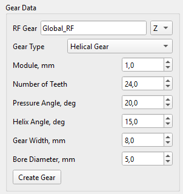 

### Макрогеометрия зубчатого колеса

Макрогеометрия зубчатой ​​передачи определяет основные механические характеристики, такие как передаваемый крутящий момент, передаточное отношение, а также прочность на изгиб и габаритные ограничения.

Взаимосвязь между модулем (m), диаметром делительной окружности (d) и числом зубьев колеса (z) лежит в основе проектирования зубчатых передач в метрической системе:

$$
m = \frac{d}{z}
$$

На рисунке ниже показано определение основных геометрических параметров зубчатого колеса.

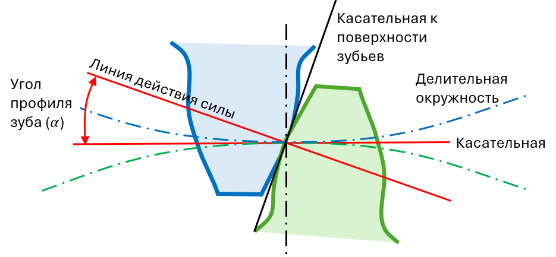 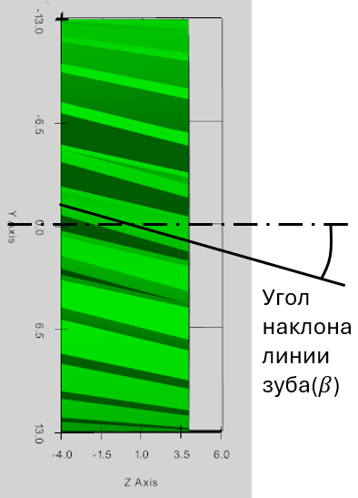

## Зубчатое колесо с внутренним зацеплением (Inner Gear)

Модель зубчатого колеса с внутренним зацеплением может быть создана на основе его базовой макрогеометрии.

После генерации колесо автоматически появляется в разделе «Жесткие тела» (Rigid Bodies) как стандартное жесткое тело с автоматически рассчитанными характеристиками массы и инерции. Дальнейшее изменение свойств колеса невозможно. Базовые параметры зубчатой передачи задаются в разделе «Зубчатая пара» (Gear Pair) и не связаны со сгенерированной моделью шестерни.

Внутренняя шестерня определяется следующими параметрами в пользовательском интерфейсе:

-   Module (mm): Торцовый модуль (модуль в торцовом сечении) $$m_{t}$$ рассчитывается в плоскости вращения, перпендикулярной центральной оси вала шестерни,
-   Number of Teeth: Количество зубьев определяет передаточное число и задает с модулем базовые рабочие диаметры,
-   Pressure Angle (deg): Угол профиля зуба (стандартный угол 20°-30°),
-   Helix Angle (deg): Угол наклона зуба (нулевой для прямозубых шестерен, больший для косозубых шестерен),
-   Gear Width (mm): Ширина шестерни и осевая длина зубьев,
-   Outer Rim Diameter (mm): Наружный диаметр венца (обода) шестерни.

 

## Коническое зубчатое колесо (Bevel Gear)

Модель конического зубчатого колеса может быть создана на основе его базовой макрогеометрии.

После генерации колесо автоматически появляется в разделе «Жесткие тела» (Rigid Bodies) как стандартное жесткое тело с автоматически рассчитанными характеристиками массы и инерции. Дальнейшее изменение свойств колеса невозможно. Базовые параметры зубчатой передачи задаются в разделе «Зубчатая пара» (Gear Pair) и не связаны со сгенерированной моделью шестерни.

### Определение конической шестерни

Коническое зубчатое колесо определяется следующими параметрами в пользовательском интерфейсе:

-   Module (mm): Торцовый модуль (модуль в торцовом сечении) $$m_{t}$$ рассчитывается в плоскости вращения, перпендикулярной центральной оси вала шестерни,
-   Number of Teeth: Количество зубьев определяет передаточное число и задает с модулем базовые рабочие диаметры,
-   Pressure Angle (deg): Угол профиля зуба (стандартный угол 20°-30°),
-   Gear Width (mm): Ширина шестерни и осевая длина зубьев,
-   Pitch Angle (deg): Угол делительного конуса,
-   Bore Diameter (mm): Диаметр внутреннего отверстия.

 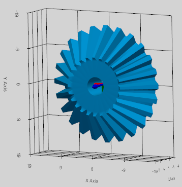

Могут быть созданы только прямозубые конические зубчатые колеса: у таких колес отсутствует угол наклона линии зуба (β = 0°). Зубья колеса — прямые и направлены непосредственно к вершине конуса.

### Макрогеометрия конического зубчатого колеса

При проектировании конических зубчатых колес за основу для определения их основных геометрических параметров принимается начальный конус.

Делительный конус (pitch cone) – это воображаемый базовый конус, ось которого совпадает с осью вращения конического колеса.

Делительная плоскость (pitch plane) – это плоскость, касательная к делительным конусам сопряженных конических зубчатых колес по их общей образующей (мгновенной оси вращения).

Вершина делительного конуса (pitch apex) - точка пересечения оси конического зубчатого колеса с образующими его делительного конуса. В правильно спроектированной конической передаче вершины делительных конусов обоих сопряженных колес совпадают.

Угол делительного конуса ($$\gamma$$) – это угол между осью вращения конического зубчатого колеса и образующей его делительного конуса.

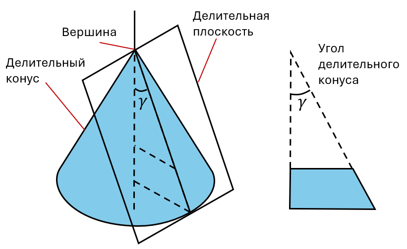

Для пары конических зубчатых колес сумма углов делительных конусов равна углу между осями валов (стандартное значение — 90°):

$$
\gamma_{1} + \gamma_{2} = 9 0 {^\circ}
$$

## Зубчатая передача (Gear Pair Constraint)

Для моделирования зубчатой ​​пары вместо использования «контактов» зубьев в зацеплении для передачи мощности используется инструмент «Зубчатая пара» (Gear Pair Constraint).

Он добавляет в решатель математическое уравнение, которое жестко связывает угловую скорость первого шарнира зубчатого колеса с угловой скоростью второго шарнира в соответствии с их передаточным числом.

### Кинематическая формулировка зубчатой передачи

Связка «зубчатая передача» (Gear Constraint) основана на согласовании мгновенной линейной 3D-скорости теоретической точки зацепления (pitch point) обеих шестерен относительно корпуса водила, на котором они установлены.

Ограничение скорости определяется уравнением Уиллиса:

$$
\mathbf{n}_{\mathbf{1}} \mathbf{\cdot} \mathbf{\omega}_{\mathbf{1}} \mathbf{+} \mathbf{n}_{\mathbf{2}} \mathbf{\cdot} \mathbf{\omega}_{\mathbf{2}} \mathbf{-} \left( \mathbf{n}_{\mathbf{1}} \mathbf{+} \mathbf{n}_{\mathbf{2}} \right) \mathbf{\cdot} \mathbf{\omega}_{\mathbf{c}} = 0
$$

где:

$$\mathbf{\omega}_{\mathbf{1}} \mathbf{, \ } \mathbf{\omega}_{\mathbf{2}} \mathbf{, \ } \mathbf{\omega}_{\mathbf{c}}$$ — угловые скорости Gear 1, Gear 2 и Carrier (водило) соответственно,

$$\mathbf{n}_{\mathbf{1}} \mathbf{, \ } \mathbf{n}_{\mathbf{2}} \mathbf{\ }$$являются векторами передачи крутящего момента, определяемые следующим образом:

$$
\mathbf{n}_{\mathbf{1}} = r_{1} \mathbf{\alpha}_{\mathbf{1}}
$$

$$
\mathbf{n}_{\mathbf{2}} = s_{2} r_{2} \mathbf{\alpha}_{\mathbf{2}}
$$

Оси вращения ($$\mathbf{\alpha}_{\mathbf{1}} \mathbf{,} \mathbf{\alpha}_{\mathbf{2}}$$) — это глобальные единичные 3D-векторы осей шарниров шестеренок. Делительные радиусы ($$r_{1} , r_{2}$$) рассчитываются по количеству зубьев ($$z_{1} , z_{2}$$) и модуля шестерёнок ($$m_{t}$$):

$$
r_{1} = \frac{m_{t} \cdot z_{1}}{2}
$$

$$
r_{2} = \frac{m_{t} \cdot z_{2}}{2}
$$

Множитель направления ($$s_{2}$$) определяет относительное направление вращения на основе топологии зубчатой ​​передачи:

1.  Внешнее зацепление (прямозубые, косозубые или конические колеса): $$s_{2} = + 1 . 0$$ (колеса вращаются в противоположных направлениях относительно водила).
2.  Внутреннее зацепление (колесо с внутренним зубчатым венцом): $$s_{2} = - 1 . 0$$ (колеса вращаются в одном направлении относительно водила).

### Расчет радиальных и осевых сил в зоне контакта зубьев зубчатой ​​передачи

Силы взаимодействия зубьев рассчитываются с использованием точных матричных множителей Лагранжа ($$\lambda$$) и заданной пользователем макрогеометрии зубчатого колеса.

Тангенциальная сила — это основная движущая сила, передающая крутящий момент от одного зубчатого колеса к другому. Она действует перпендикулярно как оси вала, так и вектору радиуса начальной окружности. Тангенциальная сила определяется как множитель Лагранжа ($$\lambda$$) для кинематической связи зубчатой ​​пары: $$F_{t} = \lambda$$.

**Косозубые шестерни**

Радиальная сила ($$F_{r}$$) раздвигает валы:

$$
F_{r} = F_{t} \cdot \frac{\tan \alpha}{\cos \beta}
$$

Осевая сила ($$F_{a}$$) толкает вдоль вала:

$$
F_{a} = F_{t} \cdot \tan \beta
$$

где:

$$\alpha$$ — угол профиля зуба шестерни,

$$\beta$$ — угол наклона линии зуба.

**Конические прямые шестерни**

Радиальная сила действует перпендикулярно валу вращения, раздвигая шестерни:

$$
F_{r} = F_{t} \cdot \tan \alpha \cdot \cos \gamma
$$

Осевая сила действует параллельно валу вращения:

$$
F_{a} = F_{t} \cdot \tan \alpha \cdot \sin \gamma
$$

где:

$$\gamma$$ — это угол делительного конуса.

Результирующая контактная сила

Результирующая контактная сила ($$F_{c}$$) представляет собой абсолютную величину 3D-вектора силы, действующего на боковую поверхность зуба шестерни:

$$
F_{c} = \sqrt{F_{t}^{2} + F_{r}^{2} + F_{a}^{2}}
$$

Силы контакта в зубчатом зацеплении определяются на этапе постобработки. Все силы можно просмотреть в окне телеметрии или экспортировать в результирующий CSV-файл.

### Зубчатая передача (Helical Gear Constraint)

Для задания косозубой зубчатой ​​пары необходимо связать обе шестерни с корпусом водила посредством шарниров вращения (Revolute Joints). Затем между этими двумя шарнирами вращения задается «косозубая передача» (Helical Gear Constraint). Оси шарниров должны быть параллельны и разнесены на расстояние, равное межосевому расстоянию зубчатой ​​передачи. Расстояние между шарнирами шестерен соответствует межосевому расстоянию ($$d_{c}$$), рассчитанному на основе заданной макрогеометрии зубчатых колес:

$$
d_{c} = r_{p 1} + r_{p 2} = \frac{m_{t} \left( z_{1} + z_{2} \right)}{2}
$$

Зубчатая передача определяется следующими параметрами:

-   Rev. Joint Gear 1: Вращающееся соединение, прикрепляющее шестерню 1 к корпусу носителя,
-   Rev. Joint Gear 2: Вращающееся соединение, прикрепляющее шестерню 2 к корпусу носителя,
-   Carrier: Носитель (водило) - тело, держащее обе шестерёнки,
-   Nr. of Teeth (z1): количество зубов на шестерне Gear 1,
-   Nr. of Teeth (z2): количество зубов на шестерне Gear 2,
-   Trans. Module (mm): Торцовый модуль шестерёночной пары ($$m_{t}$$),
-   Pressure Angle (deg): угол профиля зубьев обеих шестерёнок,
-   Helix Angle Gear 1 (deg): угол наклона линии зуба шестерни 1.

Угол наклона зубьев ($$\beta_{1}$$) определяет направление и угол винтовой линии для шестерни 1 (установленной на шарнире 1). Решатель автоматически вычисляет соответствующий угол наклона зубьев ($$\beta_{2}$$) для шестерни 2, обеспечивающий возникновение противоположно направленных осевых сил.

 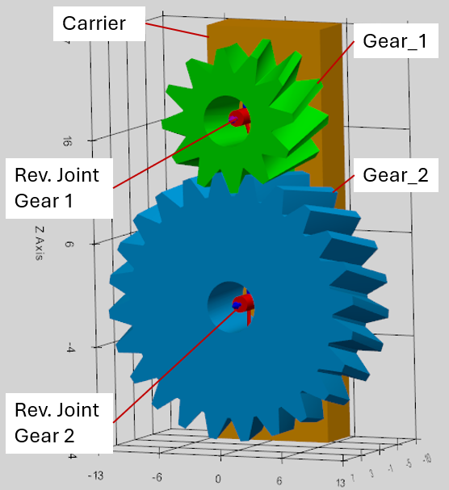

Пример иерархии при моделировании зубчатой передачи:

**Важное правило в определении шарниров для шестеренок (Gear Revolute Joint):**

-   Тело Body_I должно будет носителем (carrier), а тело Body_J — шестерёнкой (как это считается в решателе программы).

### Зубчатая передача с колесом с внутренним зацеплением (Inner Gear Constraint)

Для определения зубчатой ​​пары с внутренним зацеплением необходимо связать обе шестерни с телом водила посредством шарниров вращения. Затем между этими двумя шарнирами вращения задается кинематическая связь типа «зубчатая передача» (Gear Constraint). Оси шарниров должны быть параллельны и разнесены на расстояние, равное межосевому расстоянию шестерен. Расстояние между шарнирами шестерен равно межосевому расстоянию ($$d_{c}$$), рассчитанному на основе заданной макрогеометрии зубчатых колес:

$$
d_{c} = r_{p 2} - r_{p 1} = \frac{m_{t} \left( z_{2} - z_{1} \right)}{2}
$$

Зубчатая передача определяется следующими параметрами:

-   Rev. Joint Gear 1: Вращающееся соединение, прикрепляющее малую шестерню 1 к корпусу носителя,
-   Rev. Joint Gear 2: Вращающееся соединение, прикрепляющее большую шестерню 2 с внутренним зацеплением к корпусу носителя,
-   Carrier: Носитель (водило) - тело, держащее обе шестерёнки,
-   Nr. of Teeth (z1): количество зубов на малой шестерне Gear 1,
-   Nr. of Teeth (z2): количество зубов на большей шестерне Gear 2,
-   Trans. Module (mm): Торцовый модуль шестерёночной пары ($$m_{t}$$),
-   Pressure Angle (deg): угол профиля зубьев обеих шестерёнок,
-   Helix Angle Gear 1 (deg): угол наклона линии зуба шестерни 1.

Угол наклона зубьев ($$\beta_{1}$$) определяет направление и угол винтовой линии для шестерни 1 (установленной на шарнире 1). Решатель автоматически вычисляет соответствующий угол наклона зубьев ($$\beta_{2}$$) для шестерни 2, обеспечивающий возникновение противоположно направленных осевых сил.

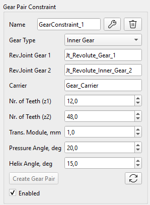 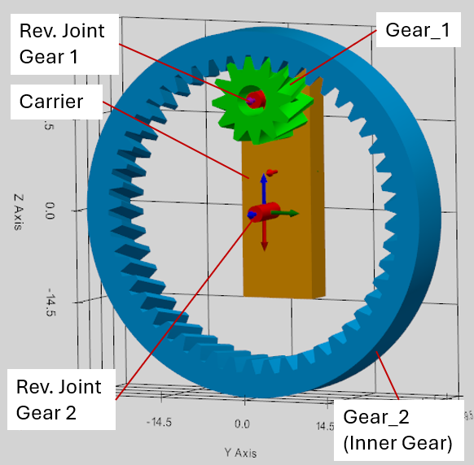

Пример иерархии шестереночной пары с внутренним зацеплением:

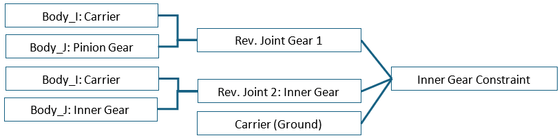

**Важные правила в определении шестереночной пары с внутренним зацеплением:**

-   При определении шарниров, тело Body_I должно будет носителем (carrier), а тело Body_J — шестерёнкой (как это считается в решателе программы).
-   Малая шестерня должна прикрепляться к шарниру 1 «Rev. Joint Gear 1», а большая шестерня (с внутренним зацеплением) должна прикрепляться к шарниру 2 «Rev. Joint Gear 2» (как учитывается в решателе программы).

### Коническая зубчатая передача (Bevel Gear Constraint)

Для задания пары конических зубчатых колес оба колеса должны быть связаны с корпусом водила посредством вращательных шарниров. Затем между этими двумя вращательными шарнирами задается кинематическая связь типа «коническая передача».

Для пары конических зубчатых колес сумма углов делительных конусов равна углу между осями валов колес. В решателе этот угол по умолчанию принимается равным 90°:

$$
\gamma_{1} + \gamma_{2} = 9 0 {^\circ}
$$

Разные углы осей скошеных шестерен в интерфейсе программы пока не поддерживаются, поэтому, пожалуйста убедитесь, что этот угол в модели 90°.

Конические зубчатые колеса смещены относительно общей вершины начальных конусов на расстояние, равное радиусу их начальных окружностей:

$$
r_{p 1} = m_{t} \cdot z_{1} / 2
$$

$$
r_{p 2} = m_{t} \cdot z_{2} / 2
$$

Угол делительного конуса зубчатого колеса можно рассчитать следующим образом:

$$
\gamma_{1} = {a t a n} \frac{r_{p 1}}{r_{p 2}}
$$

Коническая зубчатая передача определяется следующими параметрами:

-   Rev. Joint Gear 1: Вращающееся соединение, прикрепляющее шестерню 1 к корпусу носителя,
-   Rev. Joint Gear 2: Вращающееся соединение, прикрепляющее шестерню 2 к корпусу носителя,
-   Carrier: Носитель (водило) - тело, держащее обе шестерёнки,
-   Nr. of Teeth (z1): количество зубов на шестерне Gear 1,
-   Nr. of Teeth (z2): количество зубов на шестерне Gear 2,
-   Trans. Module (mm): Торцовый модуль шестерёночной пары ($$m_{t}$$),
-   Pressure Angle (deg): угол профиля зубьев обеих шестерёнок,
-   Pitch Angle Gear 1 (deg): угол делительного конуса шестерни 1.

 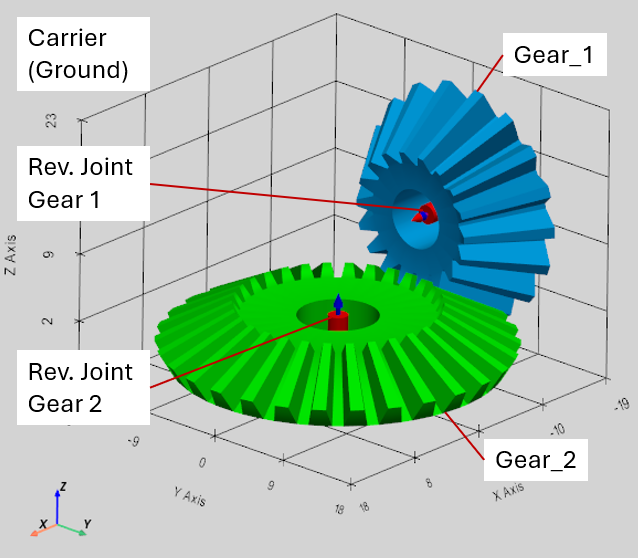

**Важные правила в определении конической зубчатой передачи:**

-   При определении шарниров, тело Body_I должно будет носителем (carrier), а тело Body_J — шестерёнкой (как это считается в решателе программы).
-   Угол делительного конуса шестерни 2 автоматически рассчитывается следующим образом: $$\gamma_{2} = 9 0 {^\circ} - \gamma_{1}$$
-   Моделирование возможно только для прямозубых конических зубчатых колес, у которых отсутствует угол наклона зуба (β = 0°).

Пример иерархии конической шестереночной пары:

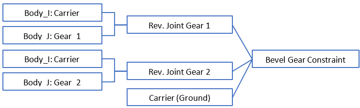

### Планетарная зубчатая передача (Planetary Gearset)

Для построения планетарного механизма необходимо определить две шестереночные пары:

1.  Солнце и Сателлит (Sun to Planet),
2.  Сателлит и Эпицикл (Planet to Inner Ring): одна связь для каждой планетарной шестерни.

Пример иерархии для планетарного механизма:

 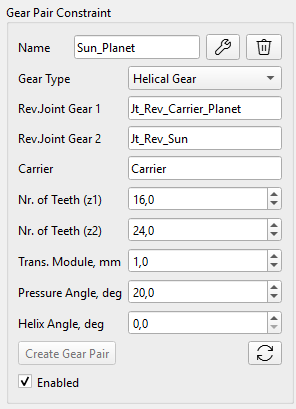

### Памятка пользователя: правила для моделирования шестерёнок и зубчатых передач

**Моделирование шестеренок (Gears):**

-   Зубчатые колеса можно как создавать непосредственно в программе (на вкладке инструментов Gear), так и импортировать в виде файлов форматов .obj или .stl, подготовленных в других CAD-программах.
-   Геометрия зубьев у колес, созданных в программе, является упрощенной и предназначена исключительно для визуализации.
-   После создания зубчатое колесо сохраняется как обычное твердое тело (Rigid Body) и не обладает свойствами макрогеометрии (модуль, число зубьев, углы α, β и т. д.), которые были бы доступны решателю (Solver). Поэтому данные параметры необходимо задавать в интерфейсе настройки зубчатой ​​пары (Gear Pair Constraint).
-   Не следует использовать центр масс (CoG) зубчатого колеса в качестве базовой системы координат при определении кинематического сопряжения (Joint), поскольку положение центра масс рассчитывается на основе 3D-модели и может не совпадать с теоретическим положением оси колеса. Такое расхождение может привести к ошибкам или некорректной работе решателя.
-   Значение модуля, вводимое в интерфейсе, интерпретируется как торцевой модуль (а не нормальный модуль). Это правило строго соблюдается как при создании CAD-модели, так и при настройке кинематических сопряжений зубчатой ​​передачи.
-   Оси сопряжений (Joint axes) для косозубых колес должны быть параллельны друг другу, а расстояние между ними должно соответствовать межосевому расстоянию зубчатой ​​передачи.
-   При определении вращательного сопряжения (Revolute Joint) для зубчатого колеса в качестве Body_I (первого тела) должен выступать водило (Carrier), а в качестве Body_J (второго тела) — само зубчатое колесо.

**Моделирование зубчатых передач (Gear Constraint):**

-   При созадании шестереночной пары с внутренним зацеплением (Inner Gear Constraint) в качестве «Сопряжения 1» (Joint 1) должно выступать сопряжение малой шестерни-сателлита (Pinion Gear Joint), а в качестве «Сопряжения 2» (Joint 2) — сопряжение большего внутреннего зубчатого колеса (Inner Gear Joint).
-   При задании шестереночной пары с для конического зацепления (Bevel Gear Constraint) угол начального конуса (Pitch Angle) для первого колеса задается пользователем, а угол для второго колеса рассчитывается автоматически, исходя из того, что угол между осями конических колес составляет 90 градусов.
-   Оси вращательных сопряжений (валы) конических колес должны точно пересекаться в трехмерном пространстве и располагаться под углом 90° друг к другу.
-   Правило определения водила (важно для планетарных передач, дифференциалов и т. д.): водило — это тело, относительно которого центры обоих зубчатых колес остаются неподвижными.
