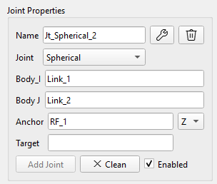
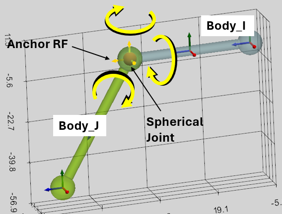
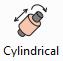
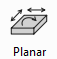
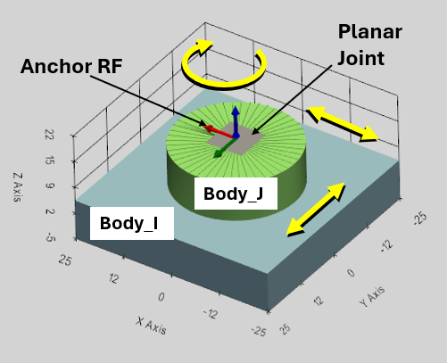

Механические соединения определяют кинематическую связь между телами в системе. Для поддержания кинематических ограничений между телами в программе предусмотрены шесть типов соединений: фиксированные (Fixed Joint), сферические (Spherical Joint), петлевые (Revolute Joint), цилиндрические (Cylindrical Joint), призматические (Prismatic Joint) и плоские (Planar Joint).

Важно! Две детали можно связать только одним соединением. Это делается для устранения избыточной структуры сверхограничений в системе.

Необходимую связь (Joint) можно выбрать соответствующей кнопкой в главном меню или в выпадающем списке в панели «Свойства соединения» (Joint Properties). Новое название связи генерируется автоматически и может изменяться по запросу. Пользовательский интерфейс (user interface UI) одинаков для всех типов соединений. Каждое соединение требует определения двух соединительных тел (Body_I, Body_J), расположения соединения (опорная СК - Anchor RF) и направления (Target RF или одна из осей XYZ опорной СК).

Когда Связь (Joint) выбирается в 3D-окне, она становится желтой, и оба связанных тела становятся прозрачными.

Система отсчёта блокируется для изменений и переименования, если она была использована для создания связи.

Соединения (связи) подробно описаны в последовательности, в которой были реализованы в программе SimPhant.

## Сферическое соединение (Spherical Joint)

Сферический шарнир устраняет возможность взаимного поступательного перемещения двух тел и допускает лишь три степени свободы взаимного вращения.

Сферический шарнир задается следующими параметрами:

-   Body_I: первое связанное Тело,
-   Body_J: второе связанное Тело,
-   Anchor - опорная система отсчёта места соединения

Выпадающее меню XYZ и «Target» не учитываются для сферического соединения.

Совет: Вы можете использовать кнопку «Unselect All» для сброса выделения текущих элементов.

Сферический шарнир отображается в виде маленькой красной сферы в 3D-окне.

## Вращательное соединение (Revolute Joint)

Вращательный шарнир (Revolute Joint) допускает только одну степень свободы — вращение. Оно исключает возможность относительного поступательного перемещения и позволяет двум телам вращаться друг относительно друга вокруг оси сочленения.

Вращательное соединение задается следующими параметрами:

-   Body_I: первое связанное Тело,
-   Body_J: второе связанное Тело,
-   Anchor RF - опорная система отсчёта места соединения
-   XYZ-выпадающее меню: ось опорной системы координат Anchor RF. Она определяет ось соединения, вокруг которой могут вращаться тела. Она учитывается, если Target RF не определена.
-   Target: эта система отсчёта определяет направление оси шарнира, как ось между системами отсчёта Anchor и Target. Выпадающее меню XYZ не учитывается, если задана Target RF.

Как видно из описания, после определения Anchor RF существует два способа определить ось шарнира, вокруг которой будут вращаться тела:

1.  Если ось соединения — одна из осей системы координат Anchor RF, то эту ось можно выбрать с помощью выпадающего меню XYZ. В данном случае система координат Target RF не должна быть определена (нужно оставить поле пустым);
2.  Если задана система координат Target RF, то ось шарнира соединит системы координат Anchor и Target. В этом случае XYZ-выпадающий список не учитывается.

Вращательный шарнир выглядит как небольшой красный цилиндр, сонаправленный с осью вращения соединения в 3D-окне.

## Поступательное соединение (Prismatic Joint)

Поступательное соединение (Prismatic Joint) допускает только одну степень свободы — поступательное перемещение. Оно исключает возможность взаимного поворота и позволяет двум телам перемещаться друг относительно друга исключительно вдоль оси сочленения.

Поступательное соединение задается следующими параметрами:

-   Body_I: первое связанное Тело,
-   Body_J: второе связанное Тело,
-   Anchor RF - опорная система отсчёта места соединения
-   XYZ-выпадающее меню: ось опорной системы координат Anchor RF. Она определяет ось соединения, вдоль которой будут двигаться тела. Она учитывается, если Target RF не определена.
-   Target: эта система отсчёта определяет направление оси соединения, как ось между системами отсчёта Anchor и Target. Выпадающее меню XYZ не учитывается, если задана Target RF.

Как видно из описания, после определения системы координат Anchor RF существует два способа определить ось соединения, вдоль которой будут двигаться тела:

1.  Если ось соединения — одна из осей системы координат Anchor RF, то эту ось можно выбрать с помощью выпадающего меню XYZ. В данном случае система координат Target RF не должна быть определена (нужно оставить поле пустым);
2.  Если задана система координат Target RF, то ось соединит системы координат Anchor и Target. В этом случае XYZ-выпадающий список не учитывается.

Поступательное соединение выглядит как небольшая синяя призма, сонаправленная с осью сдвига соединения в 3D-окне.

## Цилиндрическое соединение (Cylindrical Joint)

Цилиндрическое соединение (Cylindrical Joint) обеспечивает две степени свободы: относительное поступательное перемещение и вращение двух тел вдоль оси сопряжения.

Цилиндрическое соединение задается следующими параметрами:

-   Body_I: первое связанное Тело,
-   Body_J: второе связанное Тело,
-   Anchor RF - опорная система отсчёта места соединения
-   XYZ-выпадающее меню: ось опорной системы координат Anchor RF. Она определяет ось соединения, вдоль которой будут двигаться и вращаться тела. Она учитывается, если Target RF не определена.
-   Target: эта система отсчёта определяет направление оси соединения, как ось между системами отсчёта Anchor и Target. Выпадающее меню XYZ не учитывается, если задана Target RF.

Как видно из описания, после определения системы координат Anchor RF существует два способа определить ось соединения, вдоль которой будут двигаться и вращаться тела:

1.  Если ось соединения — одна из осей системы координат Anchor RF, то эту ось можно выбрать с помощью выпадающего меню XYZ. В данном случае система координат Target RF не должна быть определена (нужно оставить поле пустым);
2.  Если задана система координат Target RF, то ось соединит системы координат Anchor и Target. В этом случае XYZ-выпадающий список не учитывается.

Цилиндрическое соединение выглядит как небольшой синий цилиндр, сонаправленный с осью соединения в 3D-окне.

## Плоское соединение (Planar Joint)

Плоское сопряжение (Planar Joint) обеспечивает три степени свободы между двумя телами. Оно вынуждает тела скользить и вращаться в пределах заданной двумерной плоскости.

Плоское соединение определяется нормальным вектором (по оси Z), перпендикулярным плоскости движения.

Плоское соединение задается следующими параметрами:

-   Body_I: первое связанное Тело,
-   Body_J: второе связанное Тело,
-   Anchor RF - опорная система отсчёта места соединения,
-   XYZ-выпадающее меню: определяет ось опорной системы отсчета Anchor RF. Эта ось определяет направление нормального вектора, перпендикулярного плоскости движения. Она учитывается, если Target RF не определена.
-   Target - эта система отсчёта определяет направление нормального вектора как ось между системами отсчёта Anchor и Target. Выпадающее меню XYZ не учитывается, если определена система отсчета Target RF.

Плоский шарнир выглядит как небольшая серая плоскость, параллельная плоскости движения в 3D-окне.

## Жесткое соединение (Fixed Joint)

Жесткое соединение (Fixed Joint) полностью устраняет все 6 степеней свободы между двумя твердыми телами — Body_I и Body_J. Оно исключает любое относительное поступательное или вращательное движение, заставляя оба тела перемещаться как единое целое.

Опорная система отсчёта (Anchor RF) задает положение фиксированного соединения.

Плоское соединение задается следующими параметрами:

-   Body_I: первое связанное Тело,
-   Body_J: второе связанное Тело,
-   Anchor RF - опорная система отсчёта места соединения.

Выпадающее меню XYZ и система отсчёта Target RF не играют никакой роли в функции фиксированного соединения и определяют только визуальный элемент шарнира, который отображается в виде небольшого серого куба в центре соединения.
