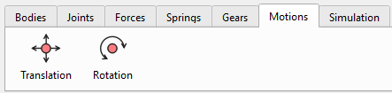

С помощью инструментов для моделирования поступательного и вращательного движения пользователь может задавать относительное перемещение или скорость изменения положения двух тел, соединенных шарнирами. Это можно использовать, например, при моделировании работы роботизированных манипуляторов или аналогичных механизмов: пользователь задает относительное угловое перемещение в шарнире (в виде ступенчатой ​​или иной функции), а решатель вычисляет крутящий момент, необходимый приводу этого шарнира для обеспечения заданного движения.

## Математическая основа для моделирования движения

Учет кинематического движения означает переход от связей, не зависящих от времени: $$\Phi ( q ) = \  0$$) к связям, зависящим от времени:

$$\Phi \left( q , \  t \right) = p ( q ) - f ( t ) = 0$$,

где:

-   $$p ( q )$$ — это фактическое физическое геометрическое состояние (расстояние или угол), извлекаемое из текущих абсолютных координат тел $$q$$;
-   $$f ( t )$$ — это пользовательская функция, зависящая от времени.

Недостающие значения скорости и ускорения движения пользователя автоматически вычисляются внутри компилятора движений с использованием высокоточного метода центральных конечных разностей.:

Скорость: $$v ( t ) = \frac{f ( t + h ) - f ( t - h )}{2 h}$$

Ускорение: $$a ( t ) = \frac{f ( t + h ) - 2 f ( t ) + f ( t - h )}{h^{2}}$$

Где: $$h = d t$$ – временной шаг.

На основе заданных ограничений движения обновляются матрица Якоби ($$\Phi_{q}$$\$) и вектор правой части для скоростей и ускорений ($$\gamma^{*}$$) с учетом стабилизации по методу Баумгарте.

Полученный в результате решения задачи множитель Лагранжа (λ), соответствующий данному ограничению движения, представляет собой именно тот крутящий момент или силу привода, которые необходимы для осуществления движения. Это значение включается в выходные данные телеметрии.

## Определение движения

Движение (Motion) задается следующими параметрами в пользовательском интерфейсе:

-   Joint: шарнир, которому задается движение. Поддерживаются следующие соединения: петлевые, призматические и цилиндрические (Revolute, Prismatic, Cylindrical).
-   Translational/ Rotational Motion: Выпадающее меню линейного/вращательного движения: Прямолинейное движение применимо к призматическим и цилиндрическим суставам. Вращательное движение применимо для петлевых и цилиндрических соединений.
-   Displacement/ Velocity Motion: Выпадающее меню Смещение /Скорость.
-   Поле ввода для задания функции движения — это пользовательская функция движения, зависящая от времени $$f ( t )$$.

 

Примеры функций движения:

-   0: Движение ограничено для этой степени свободы;
-   t\*10: Движение пропорционально времени.
-   100\*sin(pi\*t): тело подвергается гармоническим колебаниям с угловой частотой π (см. график ниже).
    -   Движение (задано), мм: $$x ( t ) = 1 0 0 \cdot \sin  ( \pi t )$$
    -   Скорость (результат), мм/с: $$v ( t ) = 1 0 0 \pi \cdot \cos  ( \pi t )$$
    -   Ускорение (результат), мм/с\^2: $$a ( t ) = - 1 0 0 \pi^{2} \cdot \sin  ( \pi t )$$

## Математические функции для определения движения

Движения можно определить как комбинацию математических функций времени. В поле ввода можно напрямую ввести следующие функции:

sin(t), cos(t), tan(t), sqrt(t) (квадратный корень), exp(t) (экспоненция), abs(t) (абсолютное значение), pi (константа π ≈ 3.14159).

Можно использовать 'np.' для вызова любой стандартной математической функции NumPy, например:

np.cosh(t), np.round(t), np.sign(t) и т.д.

Полный список поддерживаемых математических функций:

[https://numpy.org/doc/stable/reference/routines.math.html](https://numpy.org/doc/stable/reference/routines.math.html)

## Пользовательские функции: STEP, IF

В программе поддерживаются следующие пользовательские функции:

**Функция STEP**

Шаговая функция плавно меняется между двумя заданными значениями.

Синтаксис: step(t; t0; F0; t1; F1)

Пример прямолинейного движения (мм): step(t; 1; 0; 2; 50)

В результате: тело остаётся в положении 0 мм до 1 секунды, затем плавно перемещается на 50 мм к моменту времени 2 секунды. Красная кривая на графике показывает заданное движение, синяя — результат скорости.

Математическая формула для функции «step» широко используется в компьютерной графике и математике, известная как кубическая интерполяция Эрмита или функция гладкого шага.

При условии $$x_{0} < x_{1}$$, функция выражается следующим образом:

$$
f ( x ) \  = \begin{cases}h_{0} , \  i f \  x \leq x_{0} \\ h_{0} + \left( h_{1} - h_{0} \right) ( 3 - 2 u ) u^{2} , \  i f \  x_{0} < x < x_{1} \\ h_{1} , i f \  x \geq x_{1}\end{cases}
$$

где — нормированное положение $$x$$ между $$x_{0}$$ и $$x_{1}$$:

$$
u = \frac{x - x_{0}}{x_{1} - x_{0}}
$$

**Функция IF**

Синтаксис: if(\<условие\>; \<значение, если меньше или равно 0\>; \<значение, если больше 0\>).

Пример: if(t-1; 0; 2)

Результат: если t ≤1, вывод 0. Если t \> 1, вывод 2.

Тело остаётся неподвижным до первой секунды, затем мгновенно начинает вращаться со скоростью 2 радиана в секунду.

Предупреждение: Как показано в этом примере, функция демонстрирует разрыв при t=1, что может привести к неустойчивому решению или даже к сбою решателя. Поэтому предпочтительнее использовать функцию STEP с плавным переходом параметров.
