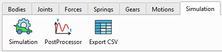
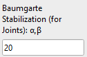
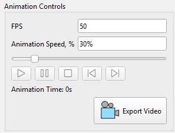
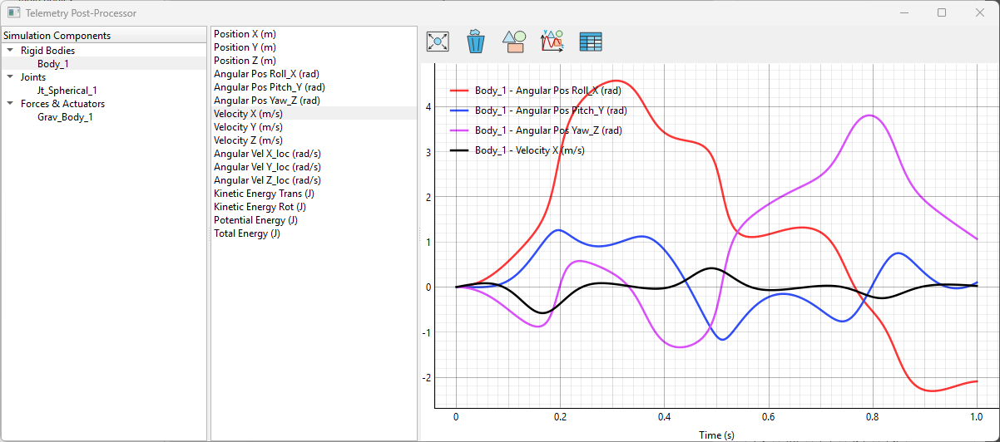
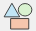

После завершения настройки модели и определения всех необходимых компонентов системы (тела, начальные скорости, кинетические связи, силы, движения и т.д.), симуляция может быть запущена. Одно тело является обязательным компонентом для симуляции, остальные можно задать по необходимости.

## Базовые настройки решателя

Симуляция имеет следующие базовые настройки решателя в пользовательском интерфейсе:

-   Simulation Time (s): Время симуляции – это общее время симуляции, определенное в секундах;
-   Steps per second: количество шагов интегрирования за одну секунду;
-   Выпадающее меню для выбора интегратора: собственный Custom или встроенный SciPy для решения системы дифференциальных уравнений (ODE);
-   Кнопка «Solve» предназначена для запуска симуляции;
-   Кнопка «Stop» предназначена для завершения симуляции по требованию (например, в случае длительного предполагаемого времени симуляции).
-   Индикатор прогресса показывает статус запущенной симуляции.

Параметр «Шаг времени симуляции» (dt = 1 / кол-во шагов в секунду) учитывается в циклах симуляции для пользовательских интеграторов (Euler, Symplectic Euler, Custom RK45), тогда как для интеграторов SciPy (RK23, Radau, BDF и др.) он служит исключительно интервалом записи результатов в CSV-отчет.

Если система ведет себя идеально плавно (например, колеблющийся маятник), интегратор SciPy может использовать очень большой внутренний максимальный шаг (например, 0,5 секунды), а затем применять метод «плотного вывода» (Dense Output — полиномиальную интерполяцию) для математического вычисления значений с заданным пользователем шагом (dt). В некоторых случаях (например, при расчете контактного взаимодействия) максимальный шаг необходимо ограничить в разделе расширенных настроек (см. далее).

## Выбор интегратора

Выбор подходящего численного интегратора имеет решающее значение при моделировании динамики систем твердых тел. Ошибочный выбор может привести к чрезмерно длительному расчету или — что еще хуже — к получению результатов, которые выглядят правдоподобно, но физически некорректны.

В программе доступны два типа интерграторов:

**Пользовательские решатели, разработанные на Python:**
-   Euler
-   Symplectic Euler
-   RK45

**Встроенные интеграторы библиотеки SciPy:**
-   RK45 (рекомендуемый выбор по умолчанию)
-   RK23 (Adaptive)
-   DOP8543
-   Radau (Stiff)
-   BDF (Stiff Heavy)
-   LSODA (ABM Auto)

Ниже представлено подробное руководство, которое поможет разобраться в преимуществах, недостатках и оптимальных сценариях использования каждого интегратора из этого списка.

### Явные и базовые интеграторы

Эти методы позволяют вычислить состояние системы в последующий момент времени на основе её состояния в текущий момент. Как правило, они отличаются высоким быстродействием на каждом шаге, однако плохо справляются с жесткими системами.

**Euler (Explicit, 1st Order)**

Метод Эйлера используется для нахождения координаты тела $$y_{n + 1}$$ на основе предыдущей координаты $$y_{n}$$ и скорости $$v_{n}$$:

$$
y_{n + 1} = y_{n} + h \cdot v_{n}
$$

Где $$h = d t$$ это временной шаг симуляции.

-   **Преимущества:** Максимально простой алгоритм. Низкие вычислительные затраты на один шаг.
-   **Недостатки:** Чрезвычайно низкая точность и высокая неустойчивость. Накапливает ошибку линейно и постоянно вносит в систему искусственную энергию. Не подходит для моделирования столкновений.
-   **Рекомендации по применению:** Простые видеоигры и движки реального времени. Используйте только в тех случаях, когда производительность важнее физической точности, а величина шага жестко привязана к частоте кадров. Для получения надежных результатов увеличивайте количество шагов. Не используйте для обработки контактов и в серьезных инженерных расчетах.

**Symplectic Euler (Semi-Implicit, 1st Order)**

Стандартный метод Эйлера вычисляет новую скорость и новое положение, используя предыдущую скорость. Симплектический метод Эйлера вычисляет новую скорость, а затем использует её для вычисления положения.

$$
v_{n + 1} = v_{n} + h \cdot a ( y_{n} , v_{n} )
$$

$$
y_{n + 1} = y_{n} + h \cdot v_{n + 1}
$$

где a — ускорение тела.

-   **Преимущества:** Сохраняет симплектическую структуру раздельных гамильтонианов, что означает, что энергия осциллирует вокруг некоторого среднего уровня, а не уходит в бесконечность при длительном моделировании.
-   **Недостатки:** Не работает со сложными связями в системах многотельных тел (MBD) и системами, не допускающими разделения переменных (например, трехмерный двойной маятник). Обладает точностью лишь первого порядка, поэтому «огибающая энергии» может оставаться широкой, если не использовать очень малый шаг интегрирования. Не подходит для обработки столкновений.
-   **Рекомендуемая область применения:** Космическая механика и молекулярная динамика. Отлично подходит для длительного моделирования орбитального движения без наложения связей (задача N тел) или простых систем частиц.

### Адаптивные методы Рунге-Кутта (Adaptive Runge-Kutta Family)

В этих методах шаг по времени корректируется «на лету». Если система меняется быстро, они делают очень малые шаги; если же она меняется плавно, то для экономии времени используются крупные шаги. Методы Рунге-Кутты предпочтительны для нежестких систем.

**RK23 (Bogacki-Shampine)**

-   RK23 — это адаптивный метод Рунге-Кутты, в котором для динамического управления размером шага сравниваются результаты, полученные методами второго и третьего порядков.
-   **Преимущества**: требует относительно небольшого объема вычислений на каждом шаге. Отлично справляется с преодолением незначительных разрывов (например, при простых соударениях или резких изменениях силы) и восстановлением после них.
-   **Недостатки**: низкий порядок точности. Для получения высокоточных результатов метод вынужден использовать чрезвычайно малые шаги, что негативно сказывается на производительности.
-   **Рекомендуемая область применения**: простые инженерные задачи и отладка. Подходит для кратковременного моделирования процессов с частыми, умеренно хаотичными событиями, когда требуется быстро получить лишь «приблизительный» ответ.

**RK45 (Dormand-Prince)**

На каждом временном шаге алгоритм вычисляет два независимых приближения: одно — по формуле 4-го порядка, другое — по формуле 5-го порядка. Сравнение этих результатов позволяет оценить локальную погрешность приближения. На основе этой оценки решатель определяет, нужно ли уменьшить или увеличить временной шаг для следующего вычисления, чтобы обеспечить баланс между устойчивостью и скоростью работы.

-   **Преимущества**: Безусловная «рабочая лошадка». Обеспечивает идеальный баланс между скоростью вычислений и контролем локальной погрешности при решении стандартных уравнений. Отличается высокой надежностью и широким распространением.
-   **Недостатки**: Как и у всех стандартных явных методов, при длительном моделировании наблюдается дрейф энергии. Метод становится крайне неэффективным (или практически останавливается), если система оказывается жесткой.
-   **Область применения**: Общее машиностроение и аэрокосмическая отрасль. Рекомендуется в качестве отправной точки по умолчанию для задач кинематики систем тел (MBD) на коротких и средних интервалах времени, моделирования плавной работы робототехнических систем и решения задач динамики, не характеризующихся жесткостью.

**DOP853 (Explicit 8th Order)**

-   **Преимущества**: Исключительная точность. Благодаря высокому порядку метода можно использовать большие шаги по времени в системах с плавным характером движения, сохраняя при этом погрешность на ничтожно малом уровне.
-   **Недостатки**: Высокая вычислительная сложность каждого шага. Метод крайне чувствителен к разрывам (ударам, резким изменениям трения) и жесткости системы.
-   **Рекомендуемая область применения**: Высокоточные задачи в космической и аэрокосмической отраслях. Идеально подходит для задач небесной механики с плавным движением и отсутствием ограничений, а также для расчета орбитальных траекторий на больших расстояниях, где критически важна точность и отсутствуют резкие ударные воздействия.

### Решатели для жестких систем (The Stiff Solvers)

Явление «жесткости» возникает, когда система характеризуется существенно различающимися временными масштабами — например, тяжелое жесткое шасси грузовика, соединенное с миниатюрной и крайне жесткой втулкой подвески. В таких случаях явные методы решения оказываются неэффективными. Решатели для жестких систем (неявные методы) используют упреждающий подход и решают системы уравнений для обеспечения устойчивости, что, однако, требует значительных вычислительных затрат на каждом шаге.

**Radau (Implicit Runge-Kutta, 5th Order)**

-   **Преимущества**: Высокая устойчивость (L-устойчивость) и очень высокая точность. Метод позволяет напрямую работать с дифференциально-алгебраическими уравнениями (ДАУ), что обеспечивает исключительную надежность при моделировании связей и шарниров в задачах многотельной динамики (MBD).
-   **Недостатки**: Вычисление внутренних матриц Якоби делает каждый шаг расчета вычислительно затратным.
-   **Рекомендуемая область применения**: Инженерные задачи со «жесткими» (stiff) системами уравнений и сложные механизмы. Отлично подходит для MBD-сборок средней размерности, содержащих большое количество связей в шарнирах, жесткие контактные взаимодействия и гибкие тела.

**BDF (Backward Differentiation Formula)**

-   **Преимущества**: Высокая эффективность для крупномасштабных систем. Метод использует данные предыдущих шагов для вычисления следующего, что обеспечивает экономию памяти и исключительную устойчивость.
-   **Недостатки**: BDF намеренно подавляет высокочастотные колебания для поддержания устойчивости. Хотя с математической точки зрения это полезно, такой подход может физически «сглаживать» реальные вибрации, которые инженеру, возможно, необходимо исследовать. Кроме того, метод может медленно запускаться.
-   **Рекомендуемая область применения**: Тяжелое машиностроение (крупномасштабные системы). Оптимален для очень больших моделей многотельной динамики (MBD) (более 1000 уравнений), крайне жестких гибких конструкций или сложных задач динамики транспортных средств, где требуется подавление высокочастотного шума.

**LSODA (Livermore Solver with Auto-switching)**

-   **Преимущества**: Идеальный вариант типа «черный ящик». Алгоритм отслеживает состояние системы и динамически переключается между методом для нежестких задач (метод Адамса) и методом для жестких задач (BDF) в зависимости от того, чего требуют физические процессы в конкретный момент времени.
-   **Недостатки**: Вычислительные затраты на постоянную проверку жесткости системы и переключение алгоритмов могут снижать производительность, особенно если система быстро переходит из состояния жесткости в состояние нежесткости и обратно.
-   **Рекомендуемая область применения**: Непредсказуемые системы и сценарии использования по принципу «настроил и забыл». Идеально подходит для моделей, претерпевающих резкие изменения состояния — например, космический аппарат, движущийся по инерции (нежесткая задача), а затем внезапно выпускающий парашют, испытывающий сильное натяжение (жесткая задача).

**Краткая матрица выбора интегратора**

| Характеристика системы                             | Рекомендуемый интегратор |
|----------------------------------------------------|--------------------------|
| Вариант по умолчанию (плавное движение)            | RK45                     |
| Игры в реальном времени / VR                       | Euler (if forced), RK23  |
| Долгосрочные орбиты (без ограничений)              | Symplectic Euler, DOP853 |
| Высокая точность / плавное движение в пространстве | DOP853                   |
| Жесткие сязи и контактные взаимодействия           | Radau                    |
| Масштабные системы / жесткие упругие тела          | BDF                      |
| Непредсказуемое поведение / переменная жесткость   | LSODA                    |

Подходящий для моделирования интегратор выбирается в зависимости от конкретного типа многозвенной системы (например, роботизированный манипулятор, подвеска транспортного средства или космический аппарат).

## Расширенные настройки решателя

Для пользователя доступны следующие расширенные настройки Solver:

-   Solver Compliance (для систем с избыточными связями);
-   Baumgarte Stabilization;
-   Relative Tolerance;
-   Absolute Tolerance;
-   Max Step Limit.

### Матричная регуляризация Тихонова (Solver Compliance: Matrix Tikhonov Regularization)

В машиностроении сверхограниченный механизм — это механизм, обладающий большим числом степеней свободы, чем предсказывает формула подвижности. Формула подвижности позволяет определить число степеней свободы системы твердых тел, возникающее при наложении связей в виде кинематических пар, соединяющих звенья.

[https://en.wikipedia.org/wiki/Overconstrained_mechanism](https://en.wikipedia.org/wiki/Overconstrained_mechanism)

Если звенья системы движутся в трёхмерном пространстве, то формула мобильности выглядит так:

$$
M = 6 ( n - j ) + S
$$

где *n* — количество тел в системе (земля не рассматривается), *j* — количество соединений, а *S* — количество степеней свободы всех связей:

$$
S = \sum_{i = 1}^{j} f_{i}
$$

Если Z — общее число ограниченных степеней свободы для всех связей, то простая формула мобильности выглядит так:

$$
M = 6 n - z
$$

Если система имеет подвижность M = 0 или меньше, но всё равно движется, это называется сверхограниченным механизмом.

Например, дверь (с 6 степенями свободы) с двумя петлями (каждая исключает 5 степеней свободы) имеет следующую подвижность:

$$M \  = \  6 \cdot 1 \  – \  2 \cdot 5 \  = \  - 4$$,

Это означает, что мы имеем дело с переопределенной системой связей (механизмом с избыточными связями). В такой ситуации физический движок сталкивается с математически неразрешимой задачей: «Какое из этих сочленений воспринимает нагрузку?» Поскольку тела считаются абсолютно жесткими, существует бесконечное множество вариантов распределения нагрузки. Это приводит к линейной зависимости строк матрицы Якоби и сбою в работе матричного решателя.

**Метод регуляризации матриц (регуляризация Тихонова)** применяется для решения проблемы избыточных кинематических связей (overconstraint).

Принцип действия: с математической точки зрения этот метод ослабляет условие абсолютно жесткой кинематической связи, допуская возникновение бесконечно малых ускорений в сочленении и микроскопического смещения (дрейфа) под действием сил реакции в соединении. Это мгновенно устраняет проблему вырожденности матриц и позволяет абсолютно жестким соединениям корректно распределять нагрузки.

В рамках регуляризации Тихонова параметр Epsilon, задаваемый в пользовательском интерфейсе (например, -1E-7), представляет собой величину, обратную массе, с размерностью кг⁻¹ (или величину, обратную моменту инерции, 1/(кг·м²), для вращательного движения). Если Epsilon равен нулю (значение по умолчанию), это соответствует бесконечной виртуальной массе и абсолютно жесткому соединению. Увеличение значения Epsilon фактически наделяет соединение конечной виртуальной массой, позволяя ему незначительно смещаться под действием сил реакции, что предотвращает возникновение сингулярности.

**Пример использования:**

-   Значение 0.0 (деактивировано) означает, что сустав бесконечно жесткий. Её можно настроить для систем с правильно ограниченными ограничениями без избыточных связей.
-   Значение 1E-5 (мягкое) означает, что соединение изготовлено из резины или аналогичного мягкого материала.
-   Значение 1E-7 (по умолчанию) означает, что соединение изготовлено из твёрдой стали.
-   Значение 1E-9 (жёсткое) предназначено для моделирования тяжёлых жёстких систем (массивных колёс поезда).

### Стабилизация Баумгарте (Baumgarte Stabilization)

В процессе численного интегрирования со временем накапливаются незначительные ошибки округления. В результате компоненты связей могут физически сместиться друг относительно друга, а связанные тела — постепенно разъединиться. Для устранения этой проблемы в решатель (Solver) внедрена стабилизация Баумгарте (Baumgarte Stabilization), которая возвращает элементы сочленения в исходное положение, действуя подобно системе «пружина-демпфер». С математической точки зрения, вторая производная по времени уравнения кинематической связи

$$
\ddot{\Phi} = 0
$$

модернизируется до уравнения системы массы-пружина-демпфер в дополненной матрице:

$$
\ddot{\Phi} = - 2 \alpha \dot{\Phi} - \beta^{2} \Phi
$$

Где:

$$\Phi$$— текущая ошибка положения (кинематическая связь),

$$\dot{\Phi}$$ — текущая ошибка скорости,

$$\alpha$$ и $$\beta$$ — параметры (в рад/с), определяющие затухание и жесткость данной «виртуальной» пружины в сочленении. В зависимости от соотношения $$\alpha$$ и $$\beta$$ возможны три состояния:

-   Underdamped ($$\alpha < \  \beta$$): ошибка будет совершать колебания вокруг нулевого значения;
-   Overdamped ($$\alpha > \  \beta$$): ошибка будет медленно возвращаться к нулю;
-   Critically Damped ($$\alpha = \  \beta$$): ошибка возвращается к нулю максимально быстро, без колебаний.

Чтобы предотвратить возникновение колебаний или чрезмерно долгий процесс устранения ошибки, динамика ошибки должна соответствовать режиму критического демпфирования. В связи с этим в решателе (Solver) принято, что $$\alpha = \beta$$. По умолчанию эти параметры установлены на уровне 20 рад/с, однако их можно изменить в интерфейсе расширенных настроек (Advanced Settings):

-   если наблюдается значительный дрейф сочленений, увеличьте значения $$\alpha$$ и $$\beta$$;
-   если в процессе симуляции возникают дрожание или вибрация, уменьшите эти параметры.

### Допуски по погрешности (Error Tolerances) и ограничение шага по времени (Time Step Limit)

Настройка допусков и шагов интегрирования по времени предоставляет дополнительные возможности управления точностью решателя. Параметры относительного допуска и шага по времени применимы к решателям с адаптивным шагом (всем интеграторам SciPy) и не используются в решателях с фиксированным шагом (CustomEuler, Custom Symplectic Euler, CustomRK4).

**Относительный допуск (Relative Tolerance)** определяет допустимую погрешность относительно величины переменной состояния. Значение по умолчанию составляет 1e-3 (погрешность 0,1%); это означает, что допускается погрешность в 0,1% от вычисленной скорости на каждом шаге. Если заданный допуск не соблюдается, шаг по времени уменьшается.

**Абсолютный допуск (Absolute Tolerance)** определяет допустимую погрешность переменной состояния в соответствующих единицах измерения: положение — в метрах (м), скорость — в метрах в секунду (м/с), угловая скорость — в радианах в секунду (рад/с); кватернионы безразмерны (значения в диапазоне от -1,0 до 1,0). Значение по умолчанию равно 1e-6; это означает, что решатель будет требовать точности 0,001 мм для положений и 0,001 мм/с для скоростей.

**Ограничение максимального шага (Max Step Limit)** определяет максимальный временной интервал (dt) в ходе симуляции. Для SciPy значение максимального шага по умолчанию — Auto (без ограничений); решатель может свободно увеличивать шаг по времени, пока математическая кривая укладывается в заданные допуски погрешности.

Так, например, при моделировании столкновений, если оставить максимальный шаг равным бесконечности, решатель может попытаться выполнить длинный шаг в 0,5 с и полностью «перешагнуть» через столкновение, длительность которого составляет всего 0,005 с. В задачах динамики удара настоятельно рекомендуется принудительно установить Max Step = dt (или меньше), чтобы заставить решатель выполнять математические вычисления на каждом кадре и тем самым обеспечить корректную симуляцию контакта тел.

## Анимация и воспроизведение

По завершении симуляции она готова к визуализации и воспроизведению с использованием стандартных элементов управления медиаплеером: «Воспроизведение», «Пауза», «Стоп», «Шаг назад» и «Шаг вперед» (ровно на один рассчитанный кадр симуляции). Качество видео можно регулировать с помощью настройки частоты кадров (кадров в секунду). Скорость анимации можно изменять относительно скорости симуляции в реальном времени (в процентах) с помощью ползунка.

Анимированное видео всей симуляции можно экспортировать в формате \*.webm..

## Постпроцессор

Результаты моделирования сохраняются в массиве данных и могут быть просмотрены в окне телеметрии.

Доступны следующие результаты симуляции:

-   Тела (Body): координаты (X, Y, Z) и угловая ориентация, линейные и угловые скорости, кинетическая, потенциальная и полная энергия;
-   Кинематические связи /шарниры (Joints): силы реакции и моменты;
-   Силы (Force): проекции на оси X, Y, Z в глобальной системе координат;
-   Моменты (Torque): проекции на оси X, Y, Z в локальной системе координат;
-   Контакты (Contact): нормальная сила и сила трения (если функция активирована);
-   Пружины сжатия (Compression Spring): деформация, скорость деформации, упругая сила, сила демпфирования и полная сила;
-   Торсионные пружины (Torsion Spring): угловая деформация, скорость деформации, упругий момент, момент демпфирования и полный момент;
-   Втулки (Bushing): линейные (X, Y, Z) и угловые деформации, силы реакции и моменты (по осям X, Y, Z);
-   Зубчатая передача (Gear Constraint): тангенциальная (Ft), осевая (Fa), радиальная (Fr) и результирующая (Fc) силы в зоне контакта зубьев;
-   Поступательное движение (Translational Motion): перемещение, скорость и ускорение звеньев, а также требуемая сила привода;
-   Вращательное движение (Rotational Motion): угловое перемещение, угловая скорость и угловое ускорение звеньев, а также требуемый момент привода.

Ниже приведен пример результатов моделирования физического маятника.

**Единицы измерения** указаны в скобках отдельно для каждого графика.

**Дважды щелкните по графику**, и указатель мыши будет показывать точные координаты (x, y) на графике.

В окне телеметрии доступны следующие инструменты:

 Подгонять все графики по размеру окна;

 Очистить график;

 Сохранить изображение в формате PNG;

 Сохранить изображение в формате SVG;

 Экспорт данных в формат CSV.

## Экспорт результатов в CSV-файл

Все результаты симуляции можно экспортировать в единый CSV-файл.
