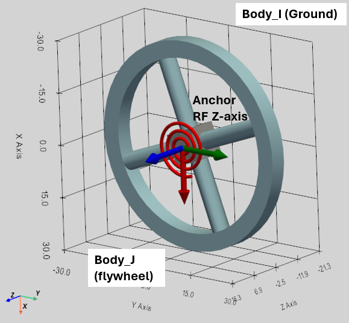
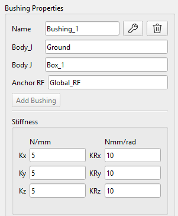
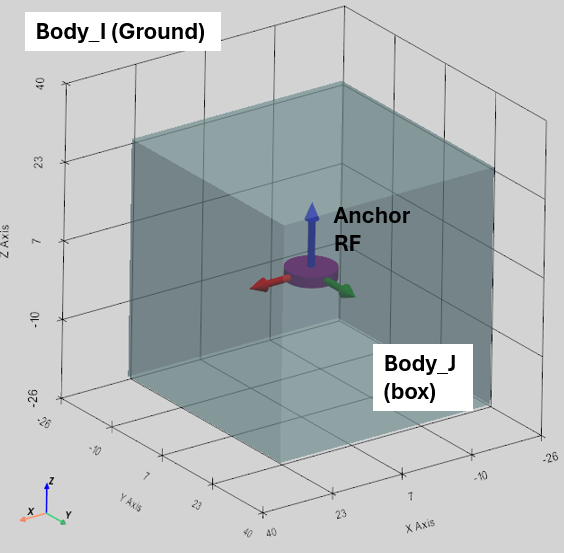
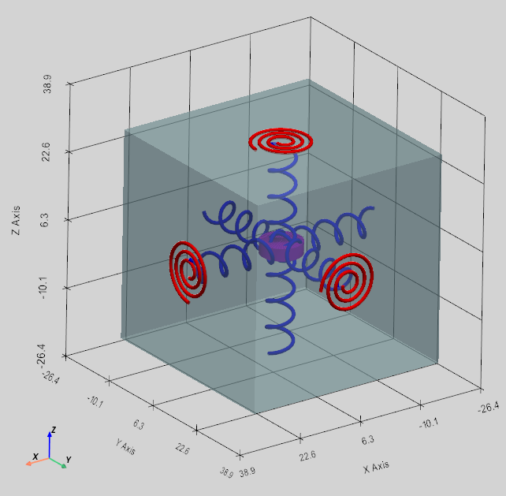

Раздел «Пружины» включает следующие компоненты:

-   Компрессионная пружина (Compression Spring), которая действует как поступательный пружинный амортизатор,
-   Торсионная пружина (Torsion Spring), которая действует как вращательный пружинный амортизатор,
-   Втулка (Bushing), действующая как гибкий соединительный элемент поступательного и вращательного движения.

## Компрессионная пружина (Compression Spring)

Пружина сжатия может быть задана между любыми двумя жёсткими телами и землёй в конкретных точках пространства, определённых выбором систем отсчёта.

Пружина одновременно действует на оба тела (Body_I, Body_J).

### Определение пружины сжатия

Пружина сжатия определяется следующими параметрами в пользовательском интерфейсе:

-   Body_I: первое Тело или земля,
-   Body_J: второе Тело или земля,
-   RF Body I: Система отсчёта как точка действия на Body_I,
-   RF Body J: Система отсчёта как точка действия на Body_J,
-   Stiffness (N/mm) - Жесткость пружины (k),
-   Damping (Ns/mm): коэффициент затухания (C),
-   Preload (N): предварительная натяжка или сжатие пружины: толкает при положительном значении и сжимает при отрицательном.

 

После того как пружина задана, параметры жесткости, затухания и предварительного натяга можно впоследствии изменить, однако связанные с ней независимые системы координат становятся недоступными для редактирования. В то же время при необходимости связанные пружиной тела Body_I или Body_J можно перемещать вместе с пружиной.

Между одними и теми же телами можно определить сразу несколько пружин.

### Расчёт силы пружины сжатия

Величина силы пружины сжатия рассчитывается следующим образом:

$$
F_{s p r i n g} = F_{p r e l o a d} - k \mathrm{\Delta} L - C \dot{L}
$$

$$
\mathrm{\Delta} L = L - L_{i n i t i a l}
$$

где:

$$L_{i n i t i a l}$$ — начальное расстояние между RF_Body_I и RF_Body_J в момент времени t=0,

$$L$$ — фактическое расстояние как величина вектора между RF_Body_I и RF_Body_J динамически вычисляемого решателем,

$$\mathrm{\Delta} L$$ — это деформация пружины,

$$\dot{L}$$ — относительная скорость точек присоединения пружины RF_Body_I и RF_Body_J,

Рассчитанная сила пружины ($$F_{s p r i n g}$$) прикладывается к телам Body_I и Body_J по принципу «действие — противодействие». Также прикладываются локальные моменты, определяемые как векторное произведение рычагов, проведенных от центров масс тел к точкам приложения силы пружины («RF Body I» и «RF Body J»).

## Торсионная пружина (Torsion Spring)

Торсионная пружина может быть задана между любыми двумя жёсткими телами (или землёй) в конкретной точке вдоль определённого направления.

Торсионная пружина одновременно добавляет пару крутящих моментов «действия-реакцию» к двум телам (Body_I, Body_J).

### Определение торсионной пружины

Торсионная пружина определяется следующими параметрами в пользовательском интерфейсе:

-   Body_I: первое Тело или Земля,
-   Body_J: второе Тело или Земля,
-   Anchor: система координат пружины,
-   XYZ-выпадающее меню: ось систеиы координат Anchor RF. Она определяет ось крутящего момента пружины и учитывается только, если система координат Target не определена.
-   Target: эта система отсчёта определяет направление крутящего момента пружины как ось между системами отсчёта Anchor и Target. Выпадающее меню XYZ игнорируется, если задана система координат Target.
-   Stiffness (Nmm/rad): Жёсткость пружины (k),
-   Damping (Nmms/ rad): коэффициент затухания (C),
-   Preload (Nmm): Начальная натяжка пружины.

Как видно из определения, после определения системы координат пружины Anchor существует два способа задания оси крутящего момента пружины:

1.  Если ось крутящего момента — одна из осей Anchor RF, то эту ось можно выбрать с помощью выпадающего меню XYZ;
2.  Если задана система координат Target RF, то ось крутящего момента соединит системы отсчёта Anchor и Target. В этом случае выпадающий список XYZ не рассматривается.

 

После того как пружина задана, параметры жесткости, затухания и предварительного натяга можно впоследствии изменить, однако связанные с ней независимые системы координат становятся недоступными для редактирования. В то же время при необходимости связанные пружиной тела Body_I или Body_J можно перемещать вместе с пружиной.

Можно определить несколько торсионных пружин между одними и теми же телами.

### Расчет крутящего момента для торсионной пружины

Действие торсионной пружины ограничено вращением вокруг главной оси, определяемой системами отсчета «Опора» (Anchor) и (опционально) «Цель» (Target). Величина крутящего момента торсионной пружины рассчитывается следующим образом:

$$
T_{s p r i n g} = T_{p r e l o a d} - k \mathrm{\Delta} \theta - C \dot{\theta}
$$

где:

$$\mathrm{\Delta} \theta$$ — деформация пружины, рассчитанная как относительное вращение Body_I и Body_J вдоль оси крутящего момента,

$$\dot{\theta}$$ — относительная угловая скорость Body_I и Body_J вдоль оси крутящего момента.

Рассчитанная величина крутящего момента пружины ($$T_{s p r i n g}$$) применяется как момент действия и реакции к Body_I и Body_J.

## Втулка (Bushing)

Втулка представляет собой обобщенный эластичный соединительный элемент, который создает поступательные и вращательные пружинно-демпферные силы по всем 6 степеням свободы.

Математически она работает исключительно в локальной системе координат своей опорной системы отсчета. Элемент втулки действует как три пружины сжатия и три пружины кручения, приложенные к одной и той же точке.

### Определение втулки

Втулка определяется следующими параметрами в пользовательском интерфейсе:

-   Body_I: первое Тело или Земля,
-   Body_J: второе Тело или Земля,
-   Anchor RF: глобальная система отсчёта, определяющая положение втулки как локальные точки в Body_I и Body_J,
-   Stiffness Kx, Ky, Kz (N/mm): линейная жесткость, ориентированная вдоль системы координат Anchor RF,
-   Stiffness KRx, KRy, KRz (Nmm/rad): жёсткость вращения, ориентированная вдоль системы координат Anchor RF,
-   Damping Cx, Cy, Cz (Ns/mm): линейное затухание,
-   Damping CRx, Cry, CRz (Nmms/rad): вращательное затухание,
-   Preload Fx, Fy, Fz (N): начальная силовая нагрузка,
-   Preload Tx, Ty, Tz (Nmm): начальный крутящий момент.

 

### Расчёт сил реакции и крутящих моментов втулки

Втулка (также известная как пружинный демпфер с 6-ю степенями свободы) — это по сути 3 независимые пружины сжатия и 3 независимые торсионные пружины, действующие по локальным осям X, Y и Z заданной системы отсчёта Anchor RF. Два тела имеют единую точку эластичного шарнира, что позволяет гибко двигаться во всех 6 направлениях.

 

В процессе моделирования измеряются текущие относительное положение и скорость опорных точек тел Body_I и Body_J Полученные значения проецируются на оси локальной системы координат опорной точки тела Body_I для определения локальной поступательной деформации ($$\Delta x$$) и скорости ($$v_{r e l}$$). Одновременно с этим сравниваются текущие матрицы относительного поворота тел Body_I и Body_J для вычисления локальных углов скручивания ($$\Delta \theta$$) и относительных угловых скоростей ($$\omega_{r e l}$$). Затем для каждой оси рассчитываются независимые силы и моменты с использованием стандартных уравнений для пружинно-демпфирующих элементов:

$$
F_{l o c} = - K_{t r a n s} \mathrm{\Delta} x - C_{t r a n s} v_{r e l} + F_{p r e l o a d}
$$

$$
T_{l o c} = - K_{r o t} \mathrm{\Delta} \theta - C_{r o t} \omega_{r e l} + T_{p r e l o a d}
$$

Эти локальные векторы силы и крутящего момента умножаются на матрицу вращения Anchor RF, чтобы получить их в глобальном 3D-пространстве:

($F_{glob_I} = - F_{glob_J}$ и $T_{glob_I} = - T_{glob_J}$)

Сила ($$F_{g l o b}$$) прикладывается в точке крепления Anchor RF, которая в общем случае находится на расстоянии (R) от центра тяжести тела. В результате сила ($$F_{g l o b}$$) создает механический момент для тел Body_I и Body_J. Наконец, суммарный момент:

$$
T_{total_I} = T_{glob_I} + ( R_I \times F_{glob_I} )
$$

$$
T_{total_J} = T_{glob_J} + ( R_J \times F_{glob_J} )
$$
