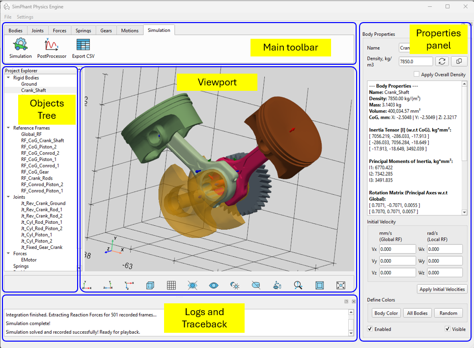
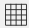
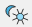
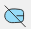
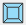

Пользовательский интерфейс состоит из 3D-окна (Viewport), основной панели инструментов (Main Toolbar), дерева объектов (Objects Tree), панели свойств (Properties pannel) и окно журналов (Logs and Traceback).

Основная панель инструментов включает всё, что необходимо для сборки модели симуляции: детали, системы координат, пружины и силы, движения и элементы управления симуляцией. Объекты, созданные в модели симуляции, сразу появляются в дереве объектов. Выбранный объект двойным кликом отображается в панели свойств для просмотра и изменений.

3D-экран включает следующие кнопки управления:

 Отобразить / скрыть края 3D-детали,

 Отображение / скрытие координатной сетки,

 Скрыть все объекты, кроме выбранного объекта,

 Показать все объекты в 3D-окне,

 Переключить яркий/тёмный фон в 3D-окне,

 Снять выделение со всех объектов,

 Скрыть визуализацию для систем отсчёта, соединений, сил и крутящих моментов,

 Зафиксировать фактический размер визуальных элементов для систем отсчета, соединений, сил и крутящих моментов

 Переключить 3D-просмотр между перспективной и ортографической (параллельной) проекцией,

 Поместить все объекты в 3D-окне,

 Показать сцену в плоскости XY,

 Показать сцену в плоскости ZY,

 Показать сцену в плоскости XZ.
