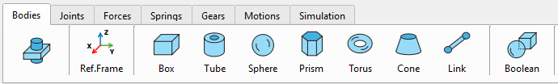

## Імпорт готової 3D-моделі

3D-моделі можна імпортувати в програму у вигляді файлу .obj або .stl.

 

Одразу після імпортування автоматично обчислюються центр ваги, головні осі та масові властивості кожної деталі.

## Властивості деталей

Панель властивостей деталі «Body Properties» можна відкрити, натиснувши кнопку «Body» або двічі клацнувши об'єкт у дереві ієрархії ліворуч від 3D-вікна.

Після імпорту або створення CAD-моделі за допомогою панелі інструментів одразу обчислюються масові властивості та присвоюються кожному тілу на основі 3D-даних і стандартної щільності сталі: ρ = 7850 кг\*м\^3:

-   Об'єм (мм\^3),
-   Маса (кг),
-   XYZ-координати центру ваги ЦВ (center of gravity: CoG) відносно глобальної системи відліку (мм),
-   Тензор інерції відносно ЦВ тіла (кг\*мм²),
-   Основні моменти інерції (кг\*мм²): I_xx, I_yy, I_zz,
-   Матриця обертання головних осей тіла відносно глобальної системи координат,
-   Кути обертання головних осей тіла в глобальній системі координат (рискання-тангаж-крен).

Щільність деталі можна змінити за необхідності, після чого маса та тензор інерції будуть негайно перераховані.

Вибравши опцію «Застосувати щільність до всіх деталей» (Apply Overall Density) і натиснувши кнопку «Застосувати», властивості щільності та маси оновляться для всіх деталей системи.

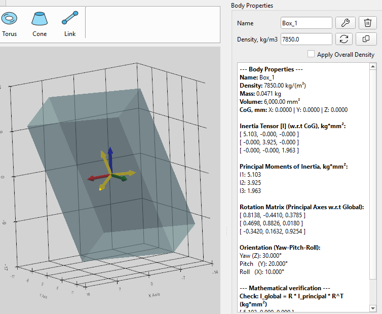

Колір можна призначити будь-якій деталі окремо (Body Color) або одразу всім тілам у системі (All Bodies).

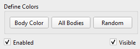

За необхідності можна призначити випадковий колір усім деталям (Random).

Будь-яку деталь можна приховати (Visible) або вимкнути (Enabled) і не враховувати в симуляції.

## Гравітація

Після імпорту або створення CAD-моделі за допомогою панелі інструментів сила гравітації автоматично присвоюється кожному тілу на основі розрахованої маси та заданого вектора гравітації.

За замовчуванням вектор гравітації задається таким чином: (m/s\^2)

$$
\mathbf{g} = \  \left\lbrack 0 , \  - 9 . 8 1 , \  0 \right\rbrack^{T}
$$

За необхідності гравітацію можна змінити або деактивувати в розділі «Гравітація» (Gravity) панелі властивостей сили (Forces).

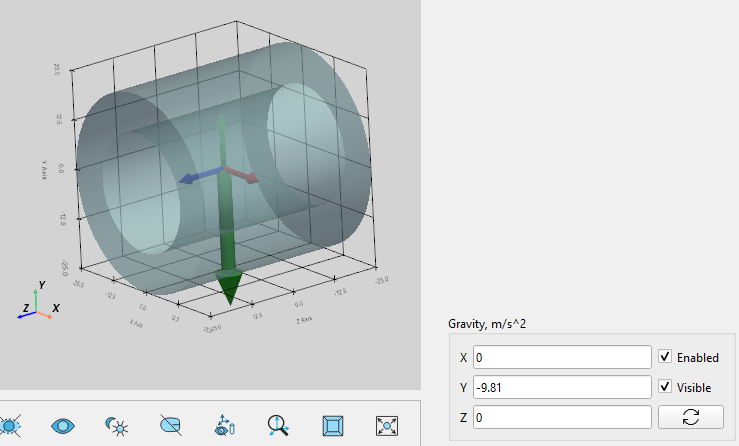

Сила гравітації показана у вигляді зеленого вектора з початком у центрі ваги тіла.

## Початкові лінійні та кутові швидкості

За замовчуванням початкові лінійні та кутові швидкості кожного тіла встановлено рівними 0.0.

За необхідності початкові швидкості можна оновити до потрібних значень, які буде враховано в момент часу t=0 у симуляції. Розділ налаштування початкових швидкостей «Initial Velocity» доступний на панелі властивостей об'єктів «Body Properties».

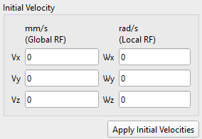

Оскільки обертальні рухи розраховуються в локальній фіксованій системі відліку тіла, початкова кутова швидкість тіла також визначається як вектор у локальній системі відліку цього тіла.

Увага - порада! На відміну від одного тіла, початкові швидкості для зв'язаних тіл слід вказувати з обережністю. Якщо швидкості кінематично пов'язаних тіл не збігаються, це може призвести до неточних результатів моделювання, високих реакцій у з'єднаннях або навіть до збоїв розв'язувача.

## Система координат

Система координат СК (Reference Frame, RF) — це прямокутна (декартова) система координат з початком координат та орієнтацією, заданими у фізичному просторі відносно глобальної системи відліку.

Система координат є фундаментальною одиницею системи моделювання, оскільки всі базові компоненти (тіла, сили, шарніри, пружини) визначаються відносно системи координат.

Система координат визначається 6 параметрами: X, Y, Z -координатами та X_rot, Y_rot, Z_rot кутами обертання відносно глобальної системи відліку.

СК можна копіювати, зміщувати та обертати відносно глобальної або локальної СК за допомогою елементів керування на панелі «RF Properties». Панель «RF Properties» можна відкрити, натиснувши кнопку «Ref.Frame» або двічі клацнувши по СК на панелі ієрархії Reference Frame ліворуч від головного вікна.

 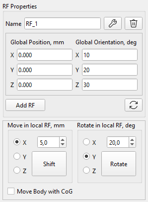

### Послідовність обертання (X → Y → Z) у глобальній системі відліку

Вирішувач SimPhant використовує кути Тейта-Брайана, які в аерокосмічній та робототехнічній галузях зазвичай називають Roll-Pitch-Yaw. Це означає, що обертання задаються послідовно в порядку: спочатку вісь X, потім вісь Y, і, нарешті, вісь Z, відносно глобальної СК. Коли значення кутів повороту задано, об'єкт обертається навколо фіксованих осей глобальної системи відліку.

### Послідовність обертання (Z → Y → X) у локальній системі відліку

З огляду на перемноження 3D-матриць обертання, зовнішня послідовність X-Y-Z у глобальній СК дає точно таку саму кінцеву просторову орієнтацію, як і внутрішня послідовність Z-Y-X у локальній СК. Це означає, що для отримання тієї ж орієнтації, що й після обертання X Y Z у глобальній СК, нам потрібно обертатися в послідовності Z Y X відносно локальної СК.

### Заблоковані системи координат

Система координат блокується (її неможливо змінити), якщо відносно цієї СК визначено один із таких компонентів системи: деталь (Body), зв'язок (Joint) або пружина (Spring).

### Зсув і обертання деталі з її системою координат

Тіло можна переміщати та обертати разом із його системою координат, якщо поставити галочку «Move Body with CoG».

## Примітиви: створення найпростіших 3D-об'єктів

Панель інструментів «Деталі» призначена для створення простих 3D-моделей.

### Кубоїд (Box)

Цей інструмент створює прямокутний паралелепіпед, розташований у центрі обраної користувачем системи відліку.

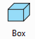

Користувач визначає такі розміри кубоїда:

-   Target RF - Опорна система координат, що визначає положення геометричного центру симетрії,
-   Length (X) - Довжина (мм) вздовж осі X,
-   Width (Y) - Ширина (мм) вздовж осі Y,
-   Height (Z) - Висота (мм) вздовж осі Z.

 

### Трубка (Tube)

Цей інструмент створює порожнистий циліндр (трубку), центрований навколо обраної користувачем системи координат.

Центральна вісь циліндра розташована вздовж однієї з осей X, Y або Z, обраних користувачем.

Користувач визначає такі розміри трубки:

-   Anchor RF - Опорна система координат, що визначає положення геометричного центру симетрії трубки,
-   Outer Radius (mm) - Зовнішній радіус (мм),
-   Inner Radius (mm) - Внутрішній радіус (мм),
-   Height (mm) - Висота (мм) визначається вздовж обраної користувачем осі.

 

### Куля (Sphere)

Цей інструмент створює сферу, центр якої знаходиться у вибраній користувачем системі координат, і має заданий радіус (мм).

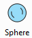

Користувач визначає такі параметри кулі:

-   Anchor RF: Опорна система координат, що визначає положення геометричного центру сфери,
-   Sphere Radius (mm) - Радіус кулі (мм).

 

### Призма (Prism)

Цей інструмент створює пряму правильну призму, центровану навколо обраної користувачем системи координат.

Центральна вісь призми розташована вздовж однієї з осей X, Y або Z, обраних користувачем.

Користувач визначає такі розміри призми:

-   Anchor RF: Опорна система координат, що визначає положення геометричного центру симетрії призми,
-   Number of side - Кількість сторін,
-   Circumradius (mm) - радіус описаного кола основи призми (мм),
-   Height (mm) - Висота (мм) призми визначається вздовж обраної користувачем осі.

 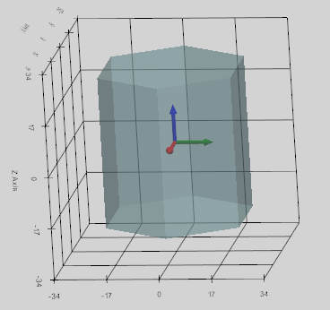

### Тор (Torus)

Цей інструмент створює суцільний тор, переміщуючи диск малого радіуса вздовж кола з великим радіусом у межах обраної користувачем системи координат.

Центральна вісь тора розташована вздовж однієї з осей X, Y або Z, обраних користувачем.

Користувач визначає такі розміри тора:

-   Anchor RF: Опорна система координат, що визначає положення геометричного центру симетрії тора,
-   Major Radius (mm) - Великий радіус (мм),
-   Minor Radius (mm) - Малий радіус (мм).

 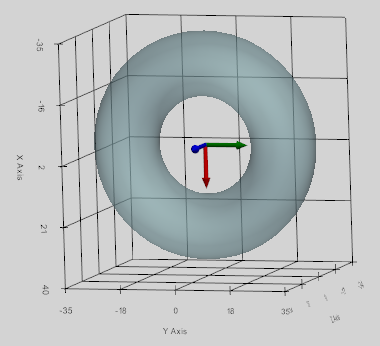

### Конус (Cone)

Цей інструмент створює усічений конус, відцентрований за вибраною користувачем системою координат.

Центральна вісь конуса розташована вздовж однієї з осей X, Y або Z, обраних користувачем.

Користувач визначає такі розміри конуса:

-   Anchor RF: Опорна система координат, що визначає положення геометричного центру симетрії положення конуса на половині його висоти,
-   Bottom Radius (mm) - радіус нижньої основи (мм),
-   Top Radius (mm) – радіус верхньої основи (мм),
-   Height (mm) - Висота (мм) визначається вздовж обраної користувачем осі.

 

### Жорстка опора (Link)

Цей інструмент створює жорстку опору (стрижень) із заданими розмірами:

-   Cylinder Radius (mm) - Радіус стрижня (мм),
-   Sphere Radius (mm) - Радіус двох куль на кінцях (мм).

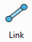

Опору можна задати одним із двох способів:

1.  Між системами координат Anchor RF і Target RF (тоді випадне меню XYZ не враховується);
2.  Опора з центром у системі відліку Anchor RF уздовж однієї з осей X, Y або Z, обраної користувачем. У цьому випадку Target RF не враховується, і довжину опори (Length, mm) потрібно встановити.

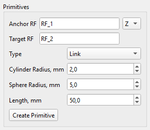 

## Об'єднання (Boolean)

Створення нового тіла (Body) як об'єднаної CAD-моделі двох вибраних тіл: Body_I та Body_J.

Після створення нового тіла для нього автоматично розраховуються та призначаються центр мас (CoG), маса та тензор інерції. При цьому для нового тіла враховується щільність тіла Body_I.

Якщо тіла Body_I та Body_J не перетинаються, нове тіло не створюється. У будь-якому випадку вихідні тіла Body_I та Body_J залишаються незмінними, зберігаючи всі пов'язані з ними елементи (шарніри, сили тощо), якщо такі були визначені.

Для виконання булевої операції об'єднання користувач має вказати два тіла:

-   Body_I: перше тіло для об'єднання,
-   Body_J: друге тіло для об'єднання.

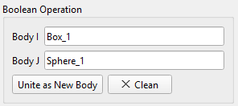 

## Шестерні (Gears)

У програмі можна створити три типи зубчастих коліс (Gear): циліндричні та косозубі, із зовнішнім та внутрішнім зачепленням, а також конічні шестерні. Деталі описано в розділі «Зубчасті передачі» (Gear Constraint).
