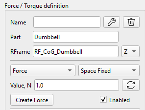
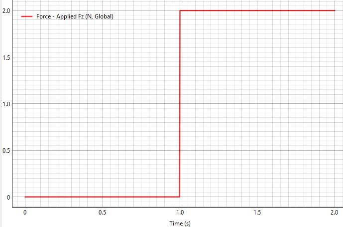
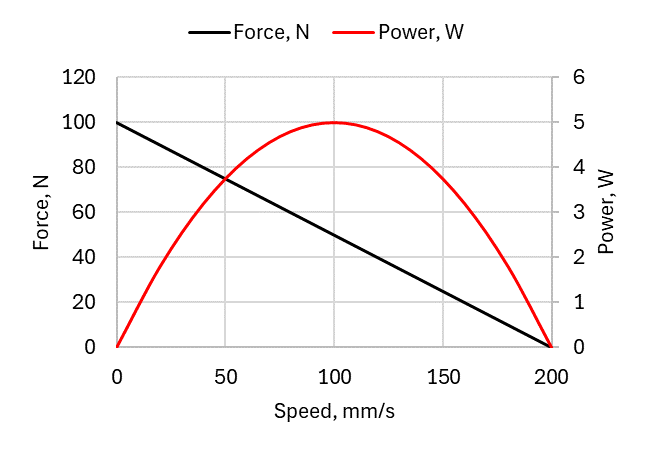
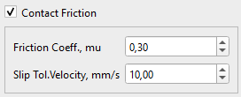

Розділ «Сили» включає такі компоненти: сила (Force), крутний момент (Torque), привід (Actuator), електродвигун (E-Motor) і контакт (Contact).

## Сила та крутний момент

Сили та крутні моменти застосовуються до будь-якого твердого тіла в симуляції, а також до шестерень. Напрямок і точка прикладання визначаються опорною системою координат Anchor RF. Сила з'являється у вигляді синьої стрілки, а момент сили відображається як червона стрілка з маленьким тором біля основи.

 

Сила та крутний момент визначаються такими параметрами:

-   Name: ім'я присвоюється автоматично, і його можна змінити,
-   Part: Тіло, на яке діє сила або крутний момент,
-   RFrame: Система відліку як точка прикладання на тілі,
-   Спадне меню XYZ: вісь обраної системи відліку, уздовж якої спрямовано силу або крутний момент.
-   Спадне меню Space Fixed / Body Fixed визначає прив'язку вектора сили або крутного моменту до тіла або до простору (див. пояснення нижче),
-   Value, N/Nmm: величина сили або крутного моменту. Значення можна визначити як математичну функцію часу (див. подробиці нижче).

### Стандарт «Body Fixed»

Сила, пов'язана з тілом (body-fixed force), — це сила, положення та напрямок якої пов'язані з системою відліку самого об'єкта.

-   Точка прикладання: пов'язана з певною точкою рухомого тіла.
-   Векторний напрямок: пов'язаний із тілом, що рухається.
-   Реальний аналог: ракетний двигун, прикріплений до космічного корабля. Коли космічний корабель маневрує та обертається, положення тяги двигуна рухається разом із кораблем, а вектор тяги строго вказує туди, куди спрямована задня частина корабля.

### Стандарт «Space Fixed»

Під силою, фіксованою в просторі, або глобальною силою (Space Fixed) розуміється сила, яку зовнішнє середовище прикладає до конкретної точки об'єкта.

-   Точка прикладання: пов'язана з певною точкою рухомого тіла. (Це поширена помилка — навіть у Space Fixed Forces точка все одно рухається разом із тілом!).
-   Векторний напрямок прив'язаний до глобальної системи відліку. Вектор сили не обертається, коли тіло обертається.
-   Реальний аналог: гравітація або бічний вітер. Вітер продовжує дути строго вздовж конкретної осі, незалежно від того, як розташоване тіло.

Примітка про крутні моменти: з технічної точки зору крутні моменти є «вільними векторами»: це означає, що для рівнянь руху точка їхнього прикладання математично не має значення, проте правила визначення напрямку вектора (відносно пов'язаної або нерухомої системи координат) застосовуються точно так само, як і до сил.

### Математичні функції для визначення сили та крутного моменту

Величини сили та крутного моменту можна визначити як поєднання математичних функцій часу. Наведені нижче функції можна безпосередньо ввести в полі Value:

sin(t), cos(t), tan(t), sqrt(t) (квадратний корінь), exp(t) (експонента), abs(t) (абсолютне значення), pi (константа π ≈ 3.14159).

Можна використовувати 'np.' для виклику будь-якої стандартної математичної функції NumPy, наприклад:

np.cosh(t), np.round(t), np.sign(t) тощо.

Повний список підтримуваних математичних функцій:

[https://numpy.org/doc/stable/reference/routines.math.html](https://numpy.org/doc/stable/reference/routines.math.html)

### Користувацькі функції: STEP, IF

Програма підтримує такі користувацькі функції:

**Функція STEP**

Крокова функція плавно змінюється між двома заданими значеннями.

Синтаксис: step(t; t0; F0; t1; F1)

Приклад: step(t; 1; 0; 2; 5)

Результат: сила становить 0N до 1-ї секунди, потім плавно збільшується до 5N на 2-ій секунді)

Математична формула для функції «step» широко використовується в комп'ютерній графіці та математиці, відома як кубічна інтерполяція Ерміта або функція плавного кроку.

За умови, що$$x_{0} < x_{1}$$, функція може бути виражена як:

$$
f ( x ) \  = \begin{cases}h_{0} , \  i f \  x \leq x_{0} \\ h_{0} + \left( h_{1} - h_{0} \right) ( 3 - 2 u ) u^{2} , \  i f \  x_{0} < x < x_{1} \\ h_{1} , i f \  x \geq x_{1}\end{cases}
$$

Де $$u$$ — нормоване положення $$x$$ між $$x_{0}$$ і :$$x_{1}$$

$$
u = \frac{x - x_{0}}{x_{1} - x_{0}}
$$

**Функція IF**

Синтаксис: if(\<умова\>; \<значення, якщо менше або дорівнює 0\>; \<значення, якщо більше 0\>)

Приклад: if(t-1; 0; 2)

Результат: якщо t ≤1, вивід 0. Якщо t \> 1, вивід 2.

## Привід (Actuator)

Актуатор у симуляції — це сила з обмеженою потужністю.

Сила приводу (F) зменшується в міру збільшення швидкості (v) тіла, на яке вона діє. Якщо вибрати прапорець «Режим приводу» (Actuator Mode), сила перетворюється на привід.

Величина сили F(v) залежить від швидкості тіла (v) у напрямку вектора цієї сили та визначається таким чином:

$$\mathbf{F} \left( \mathbf{v} \right) \mathbf{=} \mathbf{F}_{\mathbf{\max}} \left( \mathbf{1 -} \frac{\mathbf{v}}{\mathbf{v}_{\mathbf{\max}}} \right)$$,

де

$$F_{\max}$$ — сила приводу, коли швидкість тіла в напрямку сили дорівнює нулю,

$$v_{\max}$$ — це швидкість тіла, за якої прикладене зусилля приводу падає до нуля. Введення цього надає механізмам реалізму, природно обмежуючи їхню швидкість і додаючи реалістичне фізичне затухання.

Максимальну швидкість приводу визначає користувач. Межа потужності (N_max) розраховується автоматично.

Потужність приводу:

$$
N = F \cdot v
$$

Максимальна потужність приводу:

$$
N_{\max} = F_{\max} v_{\max} / 4
$$

Приклад:

Розглянемо, що привід здатний розвинути максимальну силу F_max=100N до нерухомого тіла (V=0). У міру збільшення швидкості тіла сила приводу лінійно зменшується до 0N при досягненні швидкості V_max = 200 мм/с. Нижче наведено графік, що зображає силу як функцію швидкості, і криву потужності.

У цьому прикладі тіло не може прискоритися до швидкості понад 200 мм/с під дією сили приводу.

**Розрахунок швидкості для кореляції сили приводу в просторовій динаміці**

Алгоритм розрахунку швидкості однаковий як для фіксованих сил (Body-Fixed), так і просторово фіксованих (Space-Fixed). Для лінійного приводу обмеження швидкості має застосовуватися до певної фізичної точки ($$r_{g l o b}$$) на тілі, куди прикладається сила, використовуючи такі кроки:

1.  Розрахунок глобальної швидкості центру ваги тіла ($$v_{c o g}$$).
2.  Перетворення швидкості обертання тіла в глобальній системі відліку ($$\omega_{g l o b}$$).
3.  Пошук точного вектора глобальної швидкості для конкретної точки, де прикладається сила, за допомогою векторного добутку:

$$
v_{p o i n t} \, = \, v_{c o g} \, + \, \left( \omega_{g l o b} \, \times \, r_{g l o b} \right)
$$

4.  Нарешті, проєктуємо цей загальний вектор глобальної швидкості на вісь глобальної сили за допомогою скалярного добутку:

$$
v_{c u r r e n t} = \  v_{p o i n t} \cdot a x i s_{g l o b a l}
$$

### Гальмування приводом (Allow Actuator Braking)

Як видно з визначення сили приводу F(v), якщо швидкість тіла перевищує максимальне значення V_max (наприклад, під дією гравітації), сила стає негативною. У цьому випадку актуатор починає сповільнювати тіло. За замовчуванням ця опція активується галочкою «Allow Actuator Braking». В іншому випадку сила приводу обнуляється, щойно швидкість тіла перевищує V_max.

## Електромотор (E-Motor)

Компонент симуляції Електромотор (E-Motor) — це крутний момент з обмеженою потужністю.

Крутний момент (T) зменшується в міру збільшення кутової швидкості (ω) тіла, до якого він прикладається. Електродвигун активується галочкою «Режим приводу» (Actuator Mode) у розділі визначення крутного моменту.

Величина крутного моменту Електродвигуна T(ω) залежить від кутової швидкості тіла (ω) у напрямку вектора цього моменту і визначається таким чином:

$$\mathbf{T} \left( \mathbf{\omega} \right) \mathbf{=} \mathbf{T}_{\mathbf{\max}} \left( \mathbf{1 -} \frac{\mathbf{\omega}}{\mathbf{\omega}_{\mathbf{\max}}} \right)$$,

де

$$T_{\max}$$ - це крутний момент електродвигуна, коли кутова швидкість корпусу дорівнює нулю в напрямку крутного моменту,

$$\omega_{\max}$$ - це швидкість тіла, при якій прикладений крутний момент електродвигуна падає до нуля.

Межа потужності електродвигуна (N_max) розраховується автоматично.

Потужність електромотора:

$$
N = T \cdot \omega
$$

Максимальна потужність:

$$
N_{\max} = T_{\max} \omega_{\max} / 4
$$

Приклад:

Лінійна залежність крутного моменту від частоти обертання є стандартною математичною моделлю ідеального колекторного електродвигуна постійного струму. Розглянемо електромотор із пусковим моментом T_max=1000 Нмм і максимальною швидкістю обертання — ω_max=300 рад/с. Нижче наведено графік, що показує крутний момент і потужність електромотора як функції швидкості обертання.

У цьому випадку електродвигун не може розганятися до швидкості вище 300 рад/с (2865 об/хв).

Як це працює в симуляції

1.  **Запуск:** Коли тіло нерухоме (ω = 0), мотор видає рівно 100% крутного моменту T_max, який визначив користувач.
2.  **Прискорення:** У міру прискорення тіла (ротора) прикладений крутний момент автоматично знижується.
3.  **Рівновага:** коли швидкість ротора досягає ω_max, крутний момент падає рівно до нуля, що запобігає нескінченному прискоренню.
4.  **Перевищення швидкості:** Якщо зовнішній крутний момент прискорює кузов *швидше за* ω_max, двигун фізично перевертає вектор крутного моменту, щоб діяти як **динамічне гальмо** (рекуперативне гальмування). Ця опція активується галочкою «Дозволити гальмування приводом» (Allow Actuator Braking). В іншому випадку крутний момент двигуна обнуляється, якщо швидкість тіла (ротора) перевищує ω_max.

**Розрахунок швидкості кореляції крутного моменту E-Motor у просторовій динаміці**

Для електродвигуна швидкість обертання для кореляції крутного моменту розраховується як проекція вектора кутової швидкості на вісь крутного моменту за допомогою скалярного добутку:

$$
\omega_{c u r r e n t} = \omega_{l o c a l} \cdot a x i s_{l o c a l}
$$

Оскільки скалярний добуток інваріантний відносно повороту, проекція вектора локальної кутової швидкості на вісь локального моменту дає точно таке саме числове значення, як і проекція вектора глобальної кутової швидкості на вісь глобального моменту. Це справедливо як для моментів електродвигуна, заданих у системі координат, пов'язаній із тілом, так і для моментів, заданих у нерухомій системі координат.

## Контакти та зіткнення (Contact and Collision)

Для моделювання взаємодій зіткнень між вільно рухомими тілами можуть бути задані контакти в симуляції.

Зіткнення моделюється як відповідний контакт (Penalty Method): коли тіла перекриваються, розв'язувач математично створює тимчасову, нелінійну систему пружинних демпферів між цими тілами.

### Визначення сили контактної взаємодії

Після виявлення зіткнення двох тіл контактна сила розраховується на основі контактної моделі Герца:

$$
F = k \cdot \delta^{e} + C \cdot v_{n} \cdot \delta
$$

де

$$k$$ — це жорсткість контакту,

$$\delta$$ — глибина проникнення двох тіл,

C — коефіцієнт демпфування,

$$v_{n}$$ — відносна швидкість тіл у точці контакту,

e — показник степеня.

Примітка: демпфування (затухання) множиться на глибину проникнення δ, так що сила затухання плавно знижується до нуля при розділенні тіл. Це не дає їм «склеїтися» разом.

 

Контакт визначається такими параметрами:

-   Name: ім'я присвоюється автоматично, і його можна змінити,
-   Body_I: перше тіло контакту,
-   Body_J: друге тіло контакту,
-   Stiffness (N/mm\^e): жорсткість контакту (k) для обчислення нормальної сили,
-   Damping (Ns/mm): затухання (C) для розрахунку нормальної сили,
-   Показник ступеня (e) у виразі для сили залежить від типу контакту, який визначається моделлю Герца,
-   У випадному меню доступні чотири методи обробки контактів.

### Методи обробки контактів

Для ефективної обробки контактів метод виявлення зіткнень проходить через три окремі фази:

1.  Широка фаза (Broad Phase): фільтрує тіла за допомогою крайових графічних контейнерів, вирівняних по осях (Axis-Aligned Bounding Boxes: AABB). На початку кроку розв'язувача просто перевіряється, чи перекриваються максимальні та мінімальні координати XYZ цих контейнерів тіл, що стикаються.
2.  Вузька фаза (Narrow Phase): обчислює точну близькість вершини до сітки, витягуючи глибину проникнення (δ), нормальний вектор до поверхні контакту та точку контакту (P_c), де в глобальному просторі стикаються тіла.
3.  Додавання сили дотику (Penalty Force Injection): обчислює силу дотику (F) і безпосередньо додає її до глобального вектора сили (Q) матриці KKT.

У налаштуваннях контакту доступні чотири методи, залежно від характеристик контакту тіл, що взаємодіють:

Стандартна сітка (Standard Mesh)

Розглядається оригінальна 3D-геометрія тіл, що контактують.

**Тонка сітка (Fine Mesh)**

Тіло ділиться на частини (кожен трикутник сітки — на 4 частини) для підвищення точності контактної обробки. Це також вирішує деякі можливі невиявлені контакти між простими деталями з однаковою геометрією (наприклад, зіткнення однакових кубів). Примітка: з цією опцією час симуляції збільшується.

**Проксі-сітки /випуклі оболонки (Convex Hulls)**

3D-моделі реальних деталей мають безліч внутрішніх отворів, фасок і зрізів, які уповільнюють роботу фізичних рушіїв. Генерація опуклої оболонки (метод «обтягування» геометрії) дозволяє перетворити деталізовану модель на спрощену версію з меншою кількістю вершин. Це прискорює розрахунки зіткнень, зберігаючи при цьому високу візуальну деталізацію моделі на екрані.

**Децимація /спрощення (Decimation /Simplification)**

Якщо опукла оболонка (Convex Hull) виявляється занадто простою (наприклад, коли потрібна коректна обробка зіткнень зубців шестерні), замість розбиття (subdivision) можна використовувати децимацію сітки. Це дозволяє автоматично видалити 50% плоских або надлишкових трикутників і миттєво подвоїти швидкість роботи розв'язувача, зберігаючи при цьому ключові геометричні характеристики форми.

### Інтегратори для зіткнень

**Явні інтегратори (Explicit Integrators: RK4, RK45 від SciPy, DOP853)**

Явні методи обчислюють наступний стан системи, ґрунтуючись виключно на поточному стані та його похідній. Якщо тіла перекриваються на 1 мм, розв'язувач обчислює величезну силу пружності, що призводить до виникнення колосального прискорення. Інтегратор вважає, що це прискорення залишається постійним протягом кроку за часом dt, і різко переміщує тіло вперед.

Перевага: явні методи відрізняються неймовірною швидкістю виконання одного кроку.

Недолік (ефект «проскоку»): якщо під час зіткнення крок dt занадто великий, величезна сила може за один крок повністю виштовхнути тіло з області симуляції, що призведе до недостовірного результату.

**Неявні інтегратори (Implicit Integrators: BDF або Radau від SciPy)**

Неявні методи (формули зворотного диференціювання, або BDF) обчислюють наступний стан системи шляхом розв'язання рівнянь, що включають похідну для майбутнього моменту часу.

Перевага (виняткова стійкість): оскільки метод BDF враховує, що контактна жорсткість (k) створює сильну протидію, він працює як математичний амортизатор. Це дозволяє використовувати значно більші кроки за часом (dt) у разі різких зіткнень без втрати стійкості обчислень (розбіжності розв'язку). Метод природним чином пригнічує високочастотний чисельний шум, завдяки чому став галузевим стандартом для завдань контактної взаємодії з високою жорсткістю (наприклад, у кулачкових муфтах або зубчастих передачах).

Недолік: формування внутрішньої матриці Якобі вимагає багаторазового (десятки разів за один крок) обчислення похідних. Хоча загальна кількість кроків менша, ніж у методі RK45, кожен окремий крок вимагає значних обчислювальних витрат.

Резюме та рекомендації

|                                  | **Явні інтегратори (RK45, DOP853)**                                                                                                 | **Неявні інтегратори (BDF, Radau)**                                                                           |
|----------------------------------|-------------------------------------------------------------------------------------------------------------------------------------|---------------------------------------------------------------------------------------------------------------|
| **Найкраще використовувати для** | Вільно падаючі тіла, м'які пружини, прості шарніри.                                                                                 | Жорсткі зіткнення, зубці шестерень, надзвичайно жорсткі втулки та з'єднання.                                  |
| **Жорсткість контакту (k)**      | Рекомендується задавати жорсткість (k) відносно низькою, щоб уникнути зависання розв'язувача за допомогою мікроскопічних кроків dt. | Може впоратися з величезними значеннями жорсткості (k), імітуючи жорсткі зіткнення та удари по твердій сталі. |
| **Збереження енергії**           | Висока точність. Відстежує точну вібрацію контактної сили.                                                                          | Нижча точність при ударах. Математично «демпфує» або краде енергію, щоб гарантувати стабільність.             |

### Тертя

Силу тертя в точці контакту можна активувати галочкою «Контактне тертя» (Contact Friction).

Контактне тертя визначається такими параметрами:

-   Friction Coefficient — коефіцієнт тертя,
-   Slip Tolerance Velocity - Допустима швидкість прослизання.

**Регулярне кулонівське тертя** — це наближена модель, яка використовується для розрахунку сили тертя:

$$
F_{f r i c t i o n} \, = \, \mu \, F_{n o r m a l}
$$

де:

$$F_{f r i c t i o n}$$ — сила тертя між контактними поверхнями, спрямована по дотичній до поверхні контакту. Напрямок сили протилежний швидкості відносного ковзання тіл, що контактують.

$$F_{n o r m a l}$$ — це нормальна сила, що діє кожною поверхнею на іншу, спрямована перпендикулярно (нормально) до контактної поверхні.

$$\mu = \mu ( v )$$ — коефіцієнт тертя, який є емпіричною властивістю матеріалів, що контактують, і залежить від відносної швидкості ковзання.

Щоб уникнути математичного розриву функції $$\mu$$ і спростити роботу інтеграторів, коли швидкість ковзання дорівнює 0,0 мм/с, а сила тертя миттєво стрибає з 0 до$$\pm F_{f r i c t i o n}$$, використовується **метод регуляризації гіперболічного торкання**: замість миттєвого стрибка коефіцієнт тертя плавно збільшується з 0 до $$\mu_{0}$$ у межах заданої допустимої швидкості ковзання. Коефіцієнт тертя $$\mu$$ визначається як функція швидкості ковзання:

$$
\mu = \mu_{0} \cdot \tanh \left( \frac{v}{v_{t o l}} \right)
$$

Нижче наведено графік прикладу, що показує коефіцієнт тертя ковзання $$\mu = \mu ( v )$$ з урахуванням заданого тертя $$\mu_{0} = 0 , 3$$ і допустимої швидкості прослизання $$v_{t o l} = 1 0$$ мм/с.

Примітка: як видно з визначення, коли відносна швидкість ковзання дорівнює 0, статичне тертя (Stiction) не розраховується в цій моделі. Сила тертя проявляється як тертя ковзання після виявлення відносного руху між контактними тілами вздовж площини контакту.
