Кінематичний зв'язок типу «зубчаста передача» (Gear Constraint) використовується для моделювання передачі потужності за допомогою зубчастих механізмів. Зубчаста передача пов'язує обертальні ступені свободи двох наявних шарнірів, забезпечуючи режим ідеального обертання, згідно з заданими теоретичними параметрами шестерної пари.

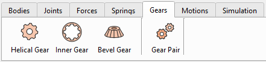

Панель «Gears Toolbar» дозволяє створювати три основні типи зубчастих коліс: косозубі, з внутрішнім зачепленням і конічні, а також зубчасту передачу.

## Косозубі колеса (Helical Gear)

Моделі косозубих і прямозубих коліс можна створити на основі їхньої базової макрогеометрії.

Після створення шестерня автоматично з'являється в розділі «Жорсткі тіла» (Rigid Bodies) як тіло з автоматично розрахованими характеристиками маси та інерції. Подальша зміна властивостей шестерні неможлива (але можна створити нову). Базові параметри зубчастої передачі (Gear Constraint) задаються в розділі «Зубчаста пара» (Gear Pair) і не пов'язані з геометрією згенерованої шестерні. Це означає, що для створення зубчастої передачі (Gear Constraint) можна використовувати будь-яку імпортовану модель шестерні (у форматах .obj або .stl).

### Визначення параметрів зубчастого колеса

Шестерні визначаються такими параметрами в інтерфейсі користувача:

-   Module (mm): Торцевий модуль (модуль у торцевому перерізі) $$m_{t}$$ розраховується в площині обертання, перпендикулярній центральній осі вала шестерні,
-   Number of Teeth: Кількість зубців визначає передавальне число та задає з модулем базові робочі діаметри,
-   Pressure Angle (deg): Кут профілю зуба (стандартний кут 20°-30°),
-   Helix Angle (deg): Кут нахилу зуба (нульовий для прямозубих шестерень, більший для косозубих шестерень),
-   Gear Width (mm): Ширина шестерні та осьова довжина зубців,
-   Bore Diameter (mm): Діаметр внутрішнього отвору.

 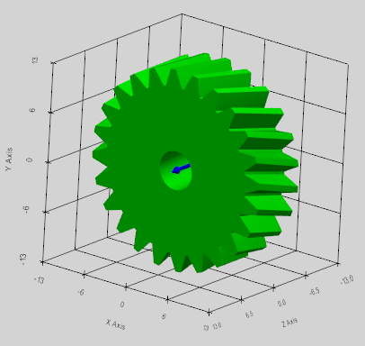

### Макрогеометрія зубчастого колеса

Макрогеометрія зубчастої передачі визначає основні механічні характеристики, такі як крутний момент, що передається, передавальне відношення, а також міцність і габаритні обмеження.

Взаємозв'язок між модулем (m), діаметром ділильного кола (d) і кількістю зубців колеса (z) лежить в основі проєктування зубчастих передач у метричній системі:

$$
m = \frac{d}{z}
$$

На малюнку нижче показано визначення основних геометричних параметрів зубчастого колеса.

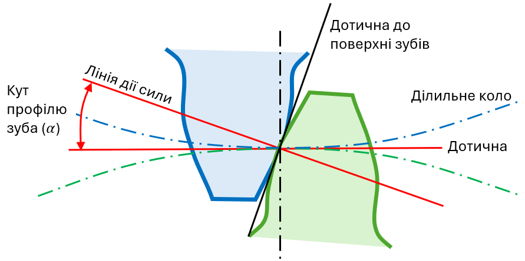 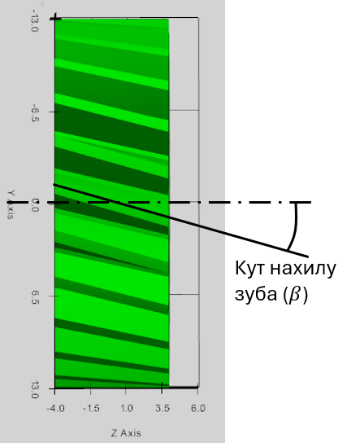

## Шестерня з внутрішнім зачепленням (Inner Gear)

Модель шестерні з внутрішнім зачепленням може бути створена на основі її базової макрогеометрії.

Після генерації шестерня автоматично з'являється в розділі «Жорсткі тіла» (Rigid Bodies) як стандартне жорстке тіло з автоматично розрахованими характеристиками маси та інерції. Подальша зміна властивостей колеса неможлива. Базові параметри зубчастого передання задаються в розділі «Зубчаста пара» (Gear Pair) і не пов'язані зі згенерованою моделлю шестірні.

Внутрішня шестерня визначається такими параметрами в інтерфейсі користувача:

-   Module (mm): Торцевий модуль (модуль у торцевому перерізі) $$m_{t}$$ розраховується в площині обертання, перпендикулярній центральній осі вала шестерні,
-   Number of Teeth: Кількість зубців визначає передавальне число і задає з модулем базові робочі діаметри,
-   Pressure Angle (deg): Кут профілю зуба (стандартний кут 20°-30°),
-   Helix Angle (deg): Кут нахилу зуба (нульовий для прямозубих шестерень, більший для косозубих шестерень),
-   Gear Width (mm): Ширина шестерні та осьова довжина зубців,
-   Outer Rim Diameter (mm): Зовнішній діаметр вінця (обода) шестерні.

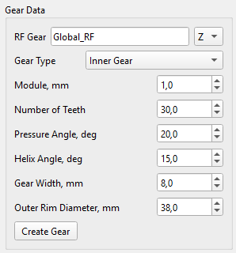 

## Конічне зубчасте колесо (Bevel Gear)

Модель конічного зубчастого колеса може бути створена на основі його базової макрогеометрії.

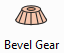

Після генерації зубчасте колесо автоматично з'являється в розділі «Жорсткі тіла» (Rigid Bodies) як стандартне жорстке тіло з автоматично розрахованими характеристиками маси та інерції. Подальша зміна властивостей шестірні неможлива. Базові параметри зубчастої передачі задаються в розділі «Зубчаста пара» (Gear Pair) і не пов'язані зі згенерованою моделлю шестірні.

### Визначення конічної шестерні

Конічне зубчасте колесо визначається такими параметрами в інтерфейсі користувача:

-   Module (mm): Торцевий модуль (модуль у торцевому перерізі) $$m_{t}$$ розраховується в площині обертання, перпендикулярній центральній осі вала шестерні,
-   Number of Teeth: Кількість зубців визначає передавальне число і задає з модулем базові робочі діаметри,
-   Pressure Angle (deg): Кут профілю зуба (стандартний кут 20°–30°),
-   Gear Width (mm): Ширина шестерні та осьова довжина зубців,
-   Pitch Angle (deg): Кут ділильного конуса,
-   Bore Diameter (mm): Діаметр внутрішнього отвору.

 

Можна створити лише прямозубі конічні зубчасті колеса: у таких коліс відсутній кут нахилу лінії зуба (β = 0°). Зубці шестірні — прямі та спрямовані безпосередньо до верхівки конуса.

### Макрогеометрія конічного зубчастого колеса

Під час проєктування конічних зубчастих коліс за основу для визначення їхніх основних геометричних параметрів береться початковий конус.

Ділильний конус (pitch cone) – це уявний базовий конус, вісь якого збігається з віссю обертання конічного колеса.

Ділильна площина (pitch plane) – це площина, дотична до ділильних конусів сполучених конічних зубчастих коліс по їх загальній утворювальній (миттєвій осі обертання).

Вершина ділильного конуса (pitch apex) - точка перетину осі конічного зубчастого колеса з утворювальними його ділильного конуса. У правильно спроектованій конічній передачі вершини ділильних конусів обох сполучених коліс збігаються.

Кут ділильного конуса ($$\gamma$$) — це кут між віссю обертання конічного зубчастого колеса та утворювальною його ділильного конуса.

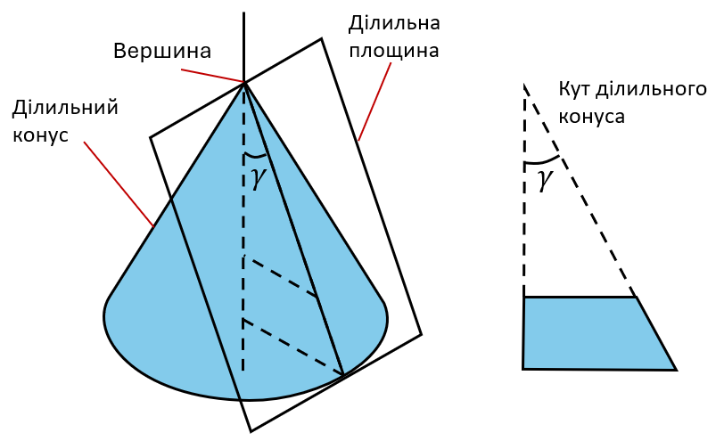

Для пари конічних зубчастих коліс сума кутів ділильних конусів дорівнює куту між осями валів (стандартне значення — 90°):

$$
\gamma_{1} + \gamma_{2} = 9 0 {^\circ}
$$

## Зубчаста передача (Gear Pair Constraint)

Для моделювання зубчастої передачі замість використання «контактів» зубців у зачепленні для передачі потужності використовується інструмент «Зубчаста пара» (Gear Pair Constraint).

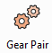

Він додає до розв'язувача математичне рівняння, яке жорстко пов'язує кутову швидкість першого шарніра зубчастого колеса з кутовою швидкістю другого шарніра відповідно до їхнього передавального числа.

### Кінематична формулювання зубчастого передання

Зв'язок «зубчаста передача» (Gear Constraint) заснований на узгодженні миттєвої лінійної 3D-швидкості теоретичної точки зачеплення (pitch point) обох шестерень відносно корпусу тримача, на якому вони встановлені.

Обмеження швидкості визначається рівнянням Вілліса:

$$
\mathbf{n}_{\mathbf{1}} \mathbf{\cdot} \mathbf{\omega}_{\mathbf{1}} \mathbf{+} \mathbf{n}_{\mathbf{2}} \mathbf{\cdot} \mathbf{\omega}_{\mathbf{2}} \mathbf{-} \left( \mathbf{n}_{\mathbf{1}} \mathbf{+} \mathbf{n}_{\mathbf{2}} \right) \mathbf{\cdot} \mathbf{\omega}_{\mathbf{c}} = 0
$$

де:

$$\mathbf{\omega}_{\mathbf{1}} \mathbf{, \ } \mathbf{\omega}_{\mathbf{2}} \mathbf{, \ } \mathbf{\omega}_{\mathbf{c}}$$ — кутові швидкості Gear 1, Gear 2 і Carrier (водила) відповідно,

$$\mathbf{n}_{\mathbf{1}} \mathbf{, \ } \mathbf{n}_{\mathbf{2}}$$є векторами передачі крутного моменту, що визначаються таким чином:

$$
\mathbf{n}_{\mathbf{1}} = r_{1} \mathbf{\alpha}_{\mathbf{1}}
$$

$$
\mathbf{n}_{\mathbf{2}} = s_{2} r_{2} \mathbf{\alpha}_{\mathbf{2}}
$$

Осі обертання ($$\mathbf{\alpha}_{\mathbf{1}} \mathbf{,} \mathbf{\alpha}_{\mathbf{2}}$$) — це глобальні одиничні 3D-вектори осей шарнірів шестерень. Радіуси ($$r_{1} , r_{2}$$) розраховуються за кількістю зубців ($$z_{1} , z_{2}$$) і модулем шестерень ($$m_{t}$$):

$$
r_{1} = \frac{m_{t} \cdot z_{1}}{2}
$$

$$
r_{2} = \frac{m_{t} \cdot z_{2}}{2}
$$

Множник напрямку ($$s_{2}$$) визначає відносний напрямок обертання на основі топології зубчастого передавання:

1.  Зовнішнє зачеплення (прямозубі, косозубі або конічні колеса): $$s_{2} = + 1 . 0$$ (колеса обертаються в протилежних напрямках відносно водила).
2.  Внутрішнє зачеплення (колесо з внутрішнім зубчастим вінцем): $$s_{2} = - 1 . 0$$ (колеса обертаються в одному напрямку відносно водила).

### Розрахунок радіальних та осьових сил у зоні контакту зубців зубчастої передачі

Сили взаємодії зубців розраховуються з використанням точних матричних множників Лагранжа ($$\lambda$$) і заданої користувачем макрогеометрії зубчастого колеса.

Тангенціальна сила — це основна рушійна сила, що передає крутний момент від одного зубчастого колеса до іншого. Вона діє перпендикулярно як до осі вала, так і до вектора радіуса початкової окружності. Тангенціальна сила визначається як множник Лагранжа ($$\lambda$$) для кінематичного зв'язку зубчастої пари: $$F_{t} = \lambda$$.

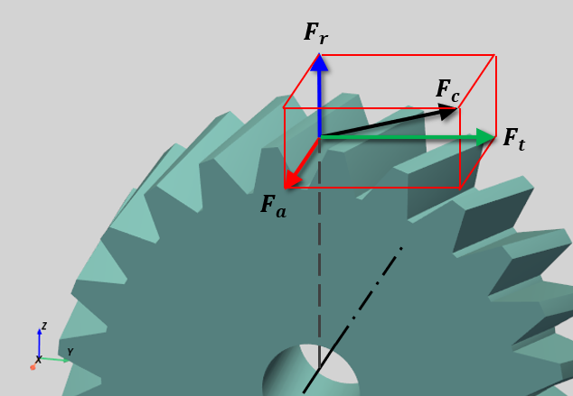

**Косозубі шестерні**

Радіальна сила ($$F_{r}$$) розсуває вали:

$$
F_{r} = F_{t} \cdot \frac{\tan \alpha}{\cos \beta}
$$

Осьова сила ($$F_{a}$$) штовхає вздовж вала:

$$
F_{a} = F_{t} \cdot \tan \beta
$$

де:

$$\alpha$$ — кут профілю зуба шестерні,

$$\beta$$ — кут нахилу лінії зуба.

**Конічні прямі шестерні**

Радіальна сила діє перпендикулярно до вала обертання, розсуваючи шестерні:

$$
F_{r} = F_{t} \cdot \tan \alpha \cdot \cos \gamma
$$

Осьова сила діє паралельно до вала обертання:

$$
F_{a} = F_{t} \cdot \tan \alpha \cdot \sin \gamma
$$

де:

$$\gamma$$ — це кут ділильного конуса.

Результуюча контактна сила

Результуюча контактна сила ($$F_{c}$$) є абсолютною величиною 3D-вектора сили, що діє на бічну поверхню зуба шестерні:

$$
F_{c} = \sqrt{F_{t}^{2} + F_{r}^{2} + F_{a}^{2}}
$$

Сили контакту в зубчастому зачепленні визначаються на етапі постобробки. Усі сили можна переглянути у вікні телеметрії або експортувати у результуючий CSV-файл.

### Зубчаста передача (Helical Gear Constraint)

Для задання косозубчастої пари необхідно зв'язати обидві шестерні з корпусом тримача (Carrier) за допомогою шарнірів обертання (Revolute Joints). Потім між цими двома шарнірами обертання задається «косозуба передача» (Helical Gear Constraint). Осі шарнірів мають бути паралельними та рознесеними на відстань, що дорівнює міжосьовій відстані зубчастого передавання. Відстань між шарнірами шестерень відповідає міжосьовій відстані ($$d_{c}$$), розрахованій на основі заданої макрогеометрії зубчастих коліс:

$$
d_{c} = r_{p 1} + r_{p 2} = \frac{m_{t} \left( z_{1} + z_{2} \right)}{2}
$$

Зубчасте передавання визначається такими параметрами:

-   Rev. Joint Gear 1: Обертальне з'єднання, що прикріплює шестерню 1 до корпусу носія,
-   Rev. Joint Gear 2: Обертальне з'єднання, що прикріплює шестерню 2 до корпусу носія,
-   Carrier: Носій (водило) – корпус, що тримає обидві шестерні,
-   Nr. of Teeth (z1): кількість зубців на шестерні Gear 1,
-   Nr. of Teeth (z2): кількість зубів на шестерні Gear 2,
-   Trans. Module (mm): Торцевий модуль шестерневої пари ($$m_{t}$$),
-   Pressure Angle (deg): кут профілю зубців обох шестерень,
-   Helix Angle Gear 1 (deg): кут нахилу лінії зуба шестерні 1.

Кут нахилу зубців ($$\beta_{1}$$) визначає напрямок і кут спіральної лінії для шестерні 1 (встановленої на шарнірі 1). Вирішувач автоматично обчислює відповідний кут нахилу зубців ($$\beta_{2}$$) для шестерні 2, що забезпечує виникнення протилежно спрямованих осьових сил.

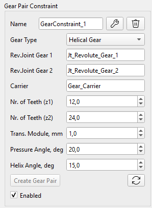 

Приклад ієрархії під час моделювання зубчастої передачі:

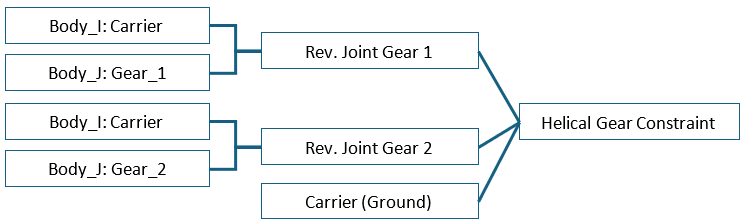

**Важливе правило у визначенні шарнірів для шестерень (Gear Revolute Joint):**

-   Тіло Body_I має бути носієм (carrier), а тіло Body_J — шестернею (як це розраховується у вирішувачі програми).

### Зубчаста передача з колесом із внутрішнім зачепленням (Inner Gear Constraint)

Для визначення зубчастої пари з внутрішнім зачепленням необхідно зв'язати обидві шестерні з тілом тримача за допомогою шарнірів обертання. Потім між цими двома шарнірами обертання задається кінематичний зв'язок типу «зубчаста передача» (Gear Constraint). Осі шарнірів мають бути паралельними та рознесеними на відстань, що дорівнює міжосьовій відстані шестерень. Відстань між шарнірами шестерень дорівнює міжосьовій відстані ($$d_{c}$$), розрахованій на основі заданої макрогеометрії зубчастих коліс:

$$
d_{c} = r_{p 2} - r_{p 1} = \frac{m_{t} \left( z_{2} - z_{1} \right)}{2}
$$

Зубчасту передачу визначають такі параметри:

-   Rev. Joint Gear 1: Обертальне з'єднання, що прикріплює малу шестерню 1 до корпусу носія,
-   Rev. Joint Gear 2: Обертальне з'єднання, що прикріплює велику шестерню 2 із внутрішнім зачепленням до корпусу носія,
-   Carrier: Носій (ведуча) - корпус, що тримає обидві шестерні,
-   Nr. of Teeth (z1): кількість зубів на малому шестірні Gear 1,
-   Nr. of Teeth (z2): кількість зубів на великій шестерні Gear 2,
-   Trans. Module (mm): Торцевий модуль шестерневої пари ($$m_{t}$$),
-   Pressure Angle (deg): кут профілю зубців обох шестерень,
-   Helix Angle Gear 1 (deg): кут нахилу лінії зуба шестерні 1.

Кут нахилу зубців ($$\beta_{1}$$) визначає напрямок і кут спіральної лінії для шестерні 1 (встановленої на шарнірі 1). Вирішувач автоматично обчислює відповідний кут нахилу зубців ($$\beta_{2}$$) для шестерні 2, що забезпечує виникнення протилежно спрямованих осьових сил.

 

Приклад ієрархії шестерні з внутрішнім зачепленням:

**Важливі правила щодо визначення шестеренчастої пари з внутрішнім зачепленням:**

-   Під час визначення шарнірів тіло Body_I має бути носієм (carrier), а тіло Body_J — шестернею (як це розраховується у вирішувачі програми).
-   Мала шестерня має прикріплюватися до шарніра 1 «Rev. Joint Gear 1», а велика шестерня (з внутрішнім зачепленням) має прикріплюватися до шарніра 2 «Rev. Joint Gear 2» (як враховується у вирішувачі програми).

### Конічна зубчаста передача (Bevel Gear Constraint)

Для задання пари конічних зубчастих коліс обидва колеса мають бути пов'язані з корпусом водила за допомогою обертальних шарнірів. Потім між цими двома обертальними шарнірами задається кінематичний зв'язок типу «конічна передача» (Bevel Gear).

Для пари конічних зубчастих коліс сума кутів ділильних конусів дорівнює куту між осями валів. У розв'язувачі цей кут за замовчуванням приймається рівним 90°:

$$
\gamma_{1} + \gamma_{2} = 9 0 {^\circ}
$$

Різні кути осей скошених шестерень в інтерфейсі програми поки що не підтримуються, тому, будь ласка, переконайтеся, що цей кут у моделі становить 90°.

Конічні зубчасті колеса зміщені відносно спільної верхівки початкових конусів на відстань, рівну радіусу їхніх початкових кол:

$$
r_{p 1} = m_{t} \cdot z_{1} / 2
$$

$$
r_{p 2} = m_{t} \cdot z_{2} / 2
$$

Кут ділильного конуса зубчастого колеса можна розрахувати таким чином:

$$
\gamma_{1} = {a t a n} \frac{r_{p 1}}{r_{p 2}}
$$

Конічна зубчаста передача визначається такими параметрами:

-   Rev. Joint Gear 1: обертальне з'єднання, що прикріплює шестерню 1 до корпусу носія,
-   Rev. Joint Gear 2: Обертальне з'єднання, що прикріплює шестерню 2 до корпусу носія,
-   Carrier: Носій (водило) - тіло, що тримає обидві шестерні,
-   Nr. of Teeth (z1): кількість зубців на шестерні Gear 1,
-   Nr. of Teeth (z2): кількість зубів на шестерні Gear 2,
-   Trans. Module (mm): Торцевий модуль шестерневої пари ($$m_{t}$$),
-   Pressure Angle (deg): кут профілю зубців обох шестерень,
-   Pitch Angle Gear 1 (deg): кут ділильного конуса шестерні 1.

 

**Важливі правила у визначенні конічної зубчастої передачі:**

-   Під час визначення шарнірів тіло Body_I має бути носієм (carrier), а тіло Body_J — шестірнею (як це розраховується в розв'язувачі програми).
-   Кут ділильного конуса шестерні 2 автоматично розраховується таким чином: $$\gamma_{2} = 9 0 {^\circ} - \gamma_{1}$$
-   Моделювання можливе лише для прямозубих конічних зубчастих коліс, у яких відсутній кут нахилу зуба (β = 0°).

Приклад ієрархії конічної шестерневої пари:

### Планетарна зубчаста передача (Planetary Gearset)

Для побудови планетарного механізму необхідно визначити дві зубчасті пари:

1.  Сонце і сателіт (Sun to Planet),
2.  Сателіт і епіцикл (Planet to Inner Ring): один зв'язок для кожного сателіта.

Приклад ієрархії для планетарного механізму:

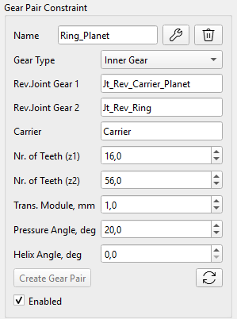 

### Пам'ятка користувача: правила моделювання шестерень і зубчастих передач

**Моделювання шестерень (Gears):**

-   Шестерні можна як створювати безпосередньо в програмі (на вкладці інструментів Gear), так і імпортувати у вигляді файлів форматів .obj або .stl, підготованих в інших CAD-програмах.
-   Геометрія зубців шестерень, створених у програмі, є спрощеною та призначена виключно для візуалізації.
-   Після створення шестерня зберігається як звичайне тверде тіло (Rigid Body) і не має властивостей макрогеометрії (модуль, кількість зубців, кути α, β тощо), які були б доступні розв'язувачу (Solver). Тому ці параметри необхідно задавати в інтерфейсі налаштування зубчастої пари (Gear Pair Constraint).
-   Не слід використовувати центр мас (CoG) зубчастого колеса як базову систему координат під час визначення кінематичного сполучення (Joint), оскільки положення центру мас розраховується на основі 3D-моделі та може не збігатися з теоретичним положенням осі колеса. Така розбіжність може призвести до помилок або некоректної роботи розв'язувача.
-   Значення модуля, яке вводиться в інтерфейсі, інтерпретується як торцевий модуль (а не нормальний модуль). Це правило суворо дотримується як під час створення CAD-моделі, так і під час налаштування кінематичних сполучень зубчастої передачі.
-   Осі сполучень (Joint axes) для косозубих коліс мають бути паралельними одна одній, а відстань між ними має відповідати міжосьовій відстані зубчастої передачі.
-   Під час визначення обертального з'єднання (Revolute Joint) для зубчастого колеса в якості Body_I (першого тіла) має виступати тримач (Carrier), а в якості Body_J (другого тіла) — саме зубчасте колесо.

**Моделювання зубчастих передач (Gear Constraint):**

-   Під час створення шестерневої пари з внутрішнім зачепленням (Inner Gear Constraint) в якості «Сполучення 1» (Joint 1) має виступати сполучення малої шестерні-сателіта (Pinion Gear Joint), а в якості «Сполучення 2» (Joint 2) — сполучення більшого внутрішнього зубчастого колеса (Inner Gear Joint).
-   Під час задання шестерневої пари з конічним зачепленням (Bevel Gear Constraint) кут початкового конуса (Pitch Angle) для першого колеса задається користувачем, а кут для другого колеса розраховується автоматично, виходячи з того, що кут між осями конічних коліс становить 90 градусів.
-   Осі обертальних сполучень (вали) конічних коліс мають точно перетинатися в тривимірному просторі та розташовуватися під кутом 90° одне до одного.
-   Правило визначення тримача (важливо для планетарних передач, диференціалів тощо): тримач (Carrier) — це тіло, відносно якого центри обох зубчастих коліс залишаються нерухомими.
