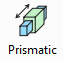
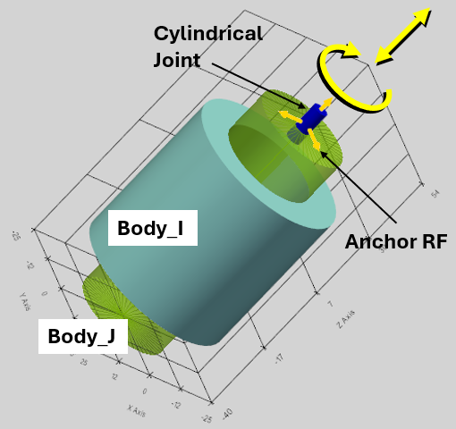
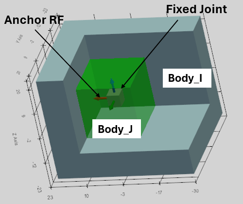

Механічні з'єднання визначають кінематичний зв'язок між тілами в системі. Для підтримки кінематичних обмежень між тілами в програмі передбачено шість типів з'єднань: фіксовані (Fixed Joint), сферичні (Spherical Joint), петльові (Revolute Joint), циліндричні (Cylindrical Joint), призматичні (Prismatic Joint) та плоскі (Planar Joint).

Важливо! Дві деталі можна зв'язати лише одним з'єднанням. Це робиться для усунення надлишкової структури надобмежень у системі.

Необхідне з'єднання (Joint) можна вибрати відповідною кнопкою в головному меню або в розкривному списку на панелі «Властивості з'єднання» (Joint Properties). Нова назва зв'язку генерується автоматично і може змінюватися за запитом. Інтерфейс користувача (user interface UI) однаковий для всіх типів з'єднань. Кожне з'єднання вимагає визначення двох з'єднувальних тіл (Body_I, Body_J), розташування з'єднання (опорна СК - Anchor RF) та напрямку (Target RF або одна з осей XYZ опорної СК).

Коли Зв'язок (Joint) вибирається у 3D-вікні, він стає жовтим, і обидва зв'язані тіла стають прозорими.

Система відліку блокується для змін та перейменування, якщо її було використано для створення зв'язку.

З'єднання (зв'язки) детально описані в послідовності, в якій вони були реалізовані в програмі SimPhant.

## Сферичне з'єднання (Spherical Joint)

Сферичний шарнір усуває можливість взаємного поступального переміщення двох тіл і допускає лише три ступені свободи взаємного обертання.

Сферичний шарнір задається такими параметрами:

-   Body_I: перше пов'язане Тіло,
-   Body_J: друге пов'язане Тіло,
-   Anchor - опорна система відліку місця з'єднання

Спадне меню XYZ і «Target» не враховуються для сферичного з'єднання.

Порада: Ви можете скористатися кнопкою «Unselect All», щоб скинути виділення поточних елементів.

Сферичний шарнір відображається у вигляді маленької червоної сфери у 3D-вікні.

## Поворотне з'єднання (Revolute Joint)

Поворотне з'єднання (Revolute Joint) допускає лише один ступінь свободи — обертання. Воно виключає можливість відносного поступального переміщення та дозволяє двом тілам обертатися один відносно одного навколо осі зчленування.

Обертальне з'єднання задається такими параметрами:

-   Body_I: перше пов'язане Тіло,
-   Body_J: друге пов'язане Тіло,
-   Anchor RF — опорна система відліку місця з'єднання
-   XYZ-выпадаюче меню: вісь опорної системи координат Anchor RF. Вона визначає вісь з'єднання, навколо якої можуть обертатися тіла. Вона враховується, якщо Target RF не визначено.
-   Target: ця система відліку визначає напрямок осі шарніра як осі між системами відліку Anchor і Target. Спадне меню XYZ не враховується, якщо задано Target RF.

Як видно з опису, після визначення Anchor RF існує два способи визначити вісь шарніра, навколо якої обертатимуться тіла:

1.  Якщо вісь з'єднання — одна з осей системи координат Anchor RF, то цю вісь можна вибрати за допомогою випадного меню XYZ. У цьому випадку систему координат Target RF не слід визначати (потрібно залишити поле порожнім);
2.  Якщо задана система координат Target RF, то вісь шарніра з'єднає системи координат Anchor і Target. У цьому випадку XYZ-розкривний список не враховується.

Обертальний шарнір виглядає як невеликий червоний циліндр, співспрямований з віссю обертання з'єднання у 3D-вікні.

## Поступальне з'єднання (Prismatic Joint)

Поступальне з'єднання (Prismatic Joint) допускає лише один ступінь свободи — поступальне переміщення. Воно виключає можливість взаємного повороту та дозволяє двом тілам переміщатися один відносно одного виключно вздовж осі зчленування.

Поступальне з'єднання задається такими параметрами:

-   Body_I: перше пов'язане Тіло,
-   Body_J: друге пов'язане Тіло,
-   Anchor RF — опорна система відліку місця з'єднання
-   XYZ-спадне меню: вісь опорної системи координат Anchor RF. Вона визначає вісь з'єднання, уздовж якої рухатимуться тіла. Вона враховується, якщо Target RF не визначено.
-   Target: ця система відліку визначає напрямок осі з'єднання як осі між системами відліку Anchor і Target. Спадне меню XYZ не враховується, якщо задано Target RF.

Як видно з опису, після визначення системи координат Anchor RF існує два способи визначити вісь з'єднання, уздовж якої рухатимуться тіла:

1.  Якщо вісь з'єднання — одна з осей системи координат Anchor RF, то цю вісь можна вибрати за допомогою випадного меню XYZ. У цьому випадку систему координат Target RF не слід визначати (потрібно залишити поле порожнім);
2.  Якщо задана система координат Target RF, то вісь з'єднає системи координат Anchor і Target. У цьому випадку XYZ-розкривний список не враховується.

Поступальне з'єднання виглядає як невелика синя призма, спрямована в один бік з віссю зсуву з'єднання у 3D-вікні.

## Циліндричне з'єднання (Cylindrical Joint)

Циліндричне з'єднання (Cylindrical Joint) забезпечує два ступені свободи: відносне поступальне переміщення та обертання двох тіл уздовж осі сполучення.

Циліндричне з'єднання задається такими параметрами:

-   Body_I: перше пов'язане Тіло,
-   Body_J: друге пов'язане Тіло,
-   Anchor RF - опорна система відліку місця з'єднання
-   XYZ-розкривне меню: вісь опорної системи координат Anchor RF. Вона визначає вісь з'єднання, вздовж якої рухатимуться та обертатимуться тіла. Вона враховується, якщо Target RF не визначено.
-   Target: ця система відліку визначає напрямок осі з'єднання як осі між системами відліку Anchor і Target. Спадне меню XYZ не враховується, якщо задано Target RF.

Як видно з опису, після визначення системи координат Anchor RF існує два способи визначити вісь з'єднання, уздовж якої рухатимуться та обертатимуться тіла:

1.  Якщо вісь з'єднання — одна з осей системи координат Anchor RF, то цю вісь можна вибрати за допомогою випадного меню XYZ. У цьому випадку систему координат Target RF не слід визначати (потрібно залишити поле порожнім);
2.  Якщо задана система координат Target RF, то вісь з'єднає системи координат Anchor і Target. У цьому випадку XYZ-розкривний список не враховується.

Циліндричне з'єднання виглядає як невеликий синій циліндр, співспрямований з віссю з'єднання у 3D-вікні.

## Плоске з'єднання (Planar Joint)

Плоске з'єднання (Planar Joint) забезпечує три ступені свободи між двома тілами. Воно змушує тіла ковзати та обертатися в межах заданої двовимірної площини.

Плоске з'єднання визначається нормальним вектором (по осі Z), перпендикулярним до площини руху.

Плоске з'єднання задається такими параметрами:

-   Body_I: перше пов'язане Тіло,
-   Body_J: друге пов'язане Тіло,
-   Anchor RF - опорна система відліку місця з'єднання,
-   XYZ-розкривне меню: визначає вісь опорної системи відліку Anchor RF. Ця вісь визначає напрямок нормального вектора, перпендикулярного до площини руху. Вона враховується, якщо Target RF не визначено.
-   Target - ця система відліку визначає напрямок нормального вектора як вісь між системами відліку Anchor і Target. Спадне меню XYZ не враховується, якщо визначено систему відліку Target RF.

Плоский шарнір виглядає як невелика сіра площина, паралельна площині руху в 3D-вікні.

## Жорстке з'єднання (Fixed Joint)

Жорстке з'єднання (Fixed Joint) повністю усуває всі 6 ступенів свободи між двома твердими тілами — Body_I та Body_J. Воно виключає будь-який відносний поступальний або обертальний рух, змушуючи обидва тіла переміщатися як єдине ціле.

Опорна система відліку (Anchor RF) задає положення фіксованого з'єднання.

Плоске з'єднання задається такими параметрами:

-   Body_I: перше пов'язане Тіло,
-   Body_J: друге пов'язане Тіло,
-   Anchor RF - опорна система відліку місця з'єднання.

Спадне меню XYZ і система відліку Target RF не відіграють жодної ролі у функції фіксованого з'єднання та визначають лише візуальний елемент шарніра, який відображається у вигляді невеликого сірого куба в центрі з'єднання.
