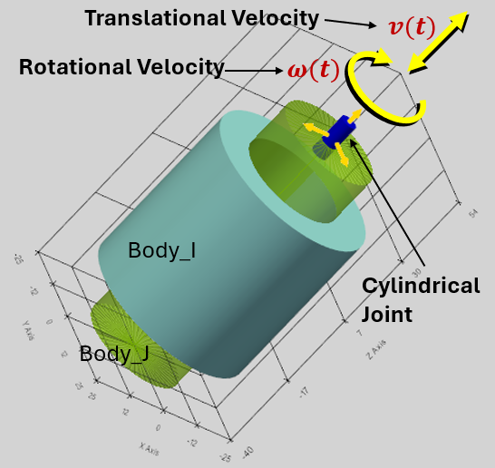
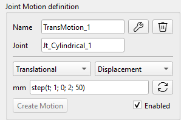
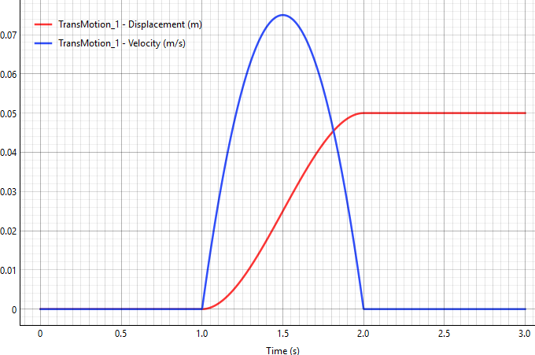
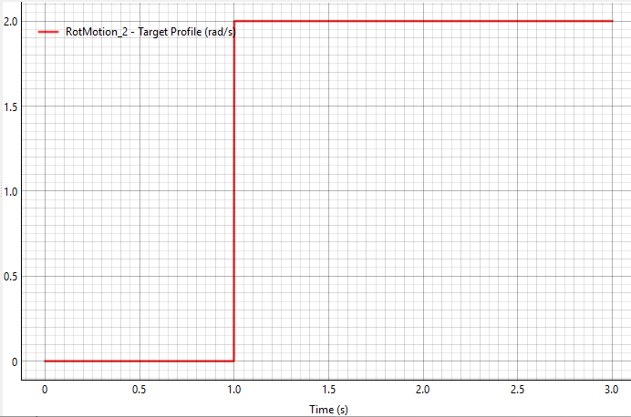

За допомогою інструментів для моделювання поступального та обертального руху користувач може задавати відносне переміщення або швидкість зміни положення двох тіл, з'єднаних шарнірами. Це можна використовувати, наприклад, під час моделювання роботи роботизованих маніпуляторів або аналогічних механізмів: користувач задає відносне кутове переміщення в шарнірі (у вигляді ступінчастої або іншої функції), а розв'язувач обчислює крутний момент, необхідний приводу цього шарніра для забезпечення заданого руху.

## Математична основа для моделювання руху

Облік кінематичного руху означає перехід від зв'язків, які не залежать від часу: $$\Phi ( q ) = \  0$$) до зв'язків, які залежать від часу:

$$\Phi \left( q , \  t \right) = p ( q ) - f ( t ) = 0$$,

де:

-   $$p ( q )$$ — це фактичний фізичний геометричний стан (відстань або кут), що витягується з поточних абсолютних координат тіл $$q$$;
-   $$f ( t )$$ — це користувацька функція, що залежить від часу.

Відсутні значення швидкості та прискорення руху користувача автоматично обчислюються всередині компілятора рухів із використанням високоточного методу скінченних різниць:

Швидкість: $$v ( t ) = \frac{f ( t + h ) - f ( t - h )}{2 h}$$

Прискорення: $$a ( t ) = \frac{f ( t + h ) - 2 f ( t ) + f ( t - h )}{h^{2}}$$

Де: $$h = d t$$ – часовий крок.

На основі заданих обмежень руху оновлюються матриця Якобі ($$\Phi_{q}$$\$) та вектор правої частини для швидкостей і прискорень ($$\gamma^{*}$$) з урахуванням стабілізації за методом Баумгарте.

Отриманий у результаті розв'язання задачі множник Лагранжа (λ), що відповідає даному обмеженню руху, являє собою саме той крутний момент або силу приводу, які необхідні для здійснення руху. Це значення включається до вихідних даних телеметрії.

## Визначення руху

Рух (Motion) задається такими параметрами в інтерфейсі користувача:

-   Joint: шарнір, якому задається рух. Підтримуються такі з'єднання: петльові, призматичні та циліндричні (Revolute, Prismatic, Cylindrical).
-   Translational/ Rotational Motion: Розкривне меню лінійного/обертального руху: Прямолінійний рух застосовується до призматичних і циліндричних з'єднань. Обертальний рух застосовується для петльових і циліндричних з'єднань.
-   Displacement/ Velocity Motion: Випадне меню: Зсув/Швидкість.
-   Поле введення для задання функції руху — це користувацька функція руху, що залежить від часу$$f ( t )$$.

 

Приклади функцій руху:

-   0: Рух обмежений для цього ступеня свободи;
-   t\*10: Рух пропорційний часу.
-   100\*sin(pi\*t): тіло зазнає гармонійних коливань з кутовою частотою π (див. графік нижче).
    -   Рух (заданий), мм: $$x ( t ) = 1 0 0 \cdot \sin  ( \pi t )$$
    -   Швидкість (результат), мм/с: $$v ( t ) = 1 0 0 \pi \cdot \cos  ( \pi t )$$
    -   Прискорення (результат), мм/с\^2: $$a ( t ) = - 1 0 0 \pi^{2} \cdot \sin  ( \pi t )$$

## Математичні функції для визначення руху

Рухи можна визначити як комбінацію математичних функцій часу. У полі введення можна безпосередньо ввести такі функції:

sin(t), cos(t), tan(t), sqrt(t) (квадратний корінь), exp(t) (експонента), abs(t) (абсолютне значення), pi (константа π ≈ 3.14159).

Можна використовувати 'np.' для виклику будь-якої стандартної математичної функції NumPy, наприклад:

np.cosh(t), np.round(t), np.sign(t) тощо.

Повний список підтримуваних математичних функцій:

[https://numpy.org/doc/stable/reference/routines.math.html](https://numpy.org/doc/stable/reference/routines.math.html)

## Користувацькі функції: STEP, IF

Програма підтримує такі користувацькі функції:

**Функція STEP**

Крокова функція плавно змінюється між двома заданими значеннями.

Синтаксис: step(t; t0; F0; t1; F1)

Приклад прямолінійного руху (мм): step(t; 1; 0; 2; 50)

У результаті: тіло залишається в положенні 0 мм до 1 секунди, потім плавно переміщається на 50 мм до моменту часу 2 секунди. Червона крива на графіку показує заданий рух, синя — результат швидкості.

Математична формула для функції «step» широко використовується в комп'ютерній графіці та математиці, відома як кубічна інтерполяція Ерміта або функція плавного кроку.

За умови$$x_{0} < x_{1}$$, функція виражається таким чином:

$$
f ( x ) \  = \begin{cases}h_{0} , \  i f \  x \leq x_{0} \\ h_{0} + \left( h_{1} - h_{0} \right) ( 3 - 2 u ) u^{2} , \  i f \  x_{0} < x < x_{1} \\ h_{1} , i f \  x \geq x_{1}\end{cases}
$$

де — нормоване положення $$x$$ між $$x_{0}$$ і $$x_{1}$$:

$$
u = \frac{x - x_{0}}{x_{1} - x_{0}}
$$

**Функція IF**

Синтаксис: if(\<умова\>; \<значення, якщо менше або дорівнює 0\>; \<значення, якщо більше 0\>).

Приклад: if(t-1; 0; 2)

Результат: якщо t ≤1, вивід 0. Якщо t \> 1, вивід 2.

Тіло залишається нерухомим до першої секунди, потім миттєво починає обертатися зі швидкістю 2 радіани на секунду.

Попередження: Як показано в цьому прикладі, функція демонструє розрив при t=1, що може призвести до нестійкого рішення або навіть до збою розв'язувача. Тому краще використовувати функцію STEP з плавним переходом параметрів.
