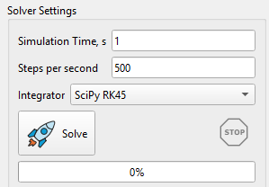
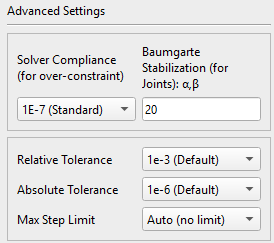
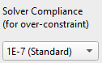
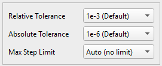
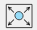
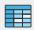
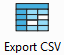

Після завершення налаштування моделі та визначення всіх необхідних компонентів системи (тіла, початкових швидкостей, кінетичних зв'язків, сил, рухів тощо) можна запустити симуляцію. Одне тіло є обов'язковим компонентом для симуляції, інші можна задати за потреби.

## Базові налаштування розв'язувача

Симуляція має такі базові налаштування розв'язувача в інтерфейсі користувача:

-   Simulation Time (s): Час симуляції – це загальний час симуляції, визначений у секундах;
-   Steps per second: кількість кроків інтегрування за одну секунду;
-   Спадне меню для вибору інтегратора: власний Custom або вбудований SciPy для вирішення системи диференціальних рівнянь (ODE);
-   Кнопка «Solve» призначена для запуску симуляції;
-   Кнопка «Stop» призначена для завершення симуляції за запитом (наприклад, у разі тривалого передбачуваного часу симуляції).
-   Індикатор прогресу показує статус запущеного моделювання.

Параметр «Крок часу симуляції» (dt = 1 / кількість кроків на секунду) враховується в циклах симуляції для користувацьких інтеграторів (E uler, Symplectic Euler, Custom RK45), тоді як для інтеграторів SciPy (RK23, Radau, BDF тощо) він служить виключно інтервалом запису результатів у CSV-звіт.

Якщо система поводиться ідеально плавно (наприклад, коливальний маятник), інтегратор SciPy може використовувати дуже великий внутрішній максимальний крок (наприклад, 0,5 секунди), а потім застосовувати метод «щільного виведення» (Dense Output — поліноміальну інтерполяцію) для математичного обчислення значень із заданим користувачем кроком (dt). У деяких випадках (наприклад, під час розрахунку контактної взаємодії) максимальний крок необхідно обмежити в розділі розширених налаштувань (див. далі).

## Вибір інтегратора

Вибір відповідного числового інтегратора має вирішальне значення під час моделювання динаміки систем твердих тіл. Помилковий вибір може призвести до надмірно тривалого розрахунку або — що ще гірше — до отримання результатів, які виглядають правдоподібними, але фізично некоректними.

У програмі доступні два типи інтеграторів:

**Користувацькі розв'язувачі, розроблені на Python:**
-   Euler
-   Symplectic Euler
-   RK45

**Вбудовані інтегратори бібліотеки SciPy:**
-   RK45 (рекомендований вибір за замовчуванням)
-   RK23 (Adaptive)
-   DOP8543
-   Radau (Stiff)
-   BDF (Stiff Heavy)
-   LSODA (ABM Auto)

Нижче наведено докладний посібник, який допоможе зрозуміти переваги, недоліки та оптимальні сценарії використання кожного інтегратора з цього списку.

### Явні та базові інтегратори

Ці методи дозволяють обчислити стан системи в наступний момент часу на основі її стану в поточний момент. Як правило, вони відрізняються високою швидкодією на кожному кроці, проте погано справляються з жорсткими системами.

**Euler (Explicit, 1st Order)**

Метод Ейлера використовується для знаходження координати тіла $$y_{n + 1}$$ на основі попередньої координати $$y_{n}$$ та швидкості $$v_{n}$$:

$$
y_{n + 1} = y_{n} + h \cdot v_{n}
$$

Де $$h = d t$$ це часовий крок симуляції.

-   **Переваги:** Максимально простий алгоритм. Низькі обчислювальні витрати на один крок.
-   **Недоліки:** надзвичайно низька точність і висока нестійкість. Накопичує помилку лінійно і постійно вносить у систему штучну енергію. Не підходить для моделювання зіткнень.
-   **Рекомендації щодо застосування:** Прості відеоігри та рушії реального часу. Використовуйте лише в тих випадках, коли продуктивність важливіша за фізичну точність, а величина кроку жорстко прив'язана до частоти кадрів. Для отримання надійних результатів збільшуйте кількість кроків. Не використовуйте для обробки контактів і в складних інженерних розрахунках.

**Symplectic Euler (Semi-Implicit, 1st Order)**

Стандартний метод Ейлера обчислює нову швидкість і нове положення, використовуючи попередню швидкість. Симплектичний метод Ейлера обчислює нову швидкість, а потім використовує її для обчислення положення.

$$
v_{n + 1} = v_{n} + h \cdot a ( y_{n} , v_{n} )
$$

$$
y_{n + 1} = y_{n} + h \cdot v_{n + 1}
$$

де a — прискорення тіла.

-   **Переваги:** Зберігає симплектичну структуру роздільних гамільтоніанів, що означає, що енергія коливається навколо певного середнього рівня, а не йде в нескінченність під час тривалого моделювання.
-   **Недоліки:** Не працює зі складними зв'язками в системах багатотільних тіл (MBD) і системах, які не допускають поділу змінних (наприклад, тривимірний подвійний маятник). Має лише точність першого порядку, тому «обгортна енергії» може залишатися широкою, якщо не використовувати дуже малий крок інтегрування. Не підходить для обробки зіткнень.
-   **Рекомендована сфера застосування:** космічна механіка та молекулярна динаміка. Відмінно підходить для тривалого моделювання орбітального руху без накладення зв'язків (задача N тіл) або простих систем частинок.

### Адаптивні методи Рунге-Кутта (Adaptive Runge-Kutta Family)**

У цих методах крок за часом коригується «на льоту». Якщо система змінюється швидко, вони роблять дуже малі кроки; якщо ж вона змінюється плавно, то для економії часу використовуються великі кроки. Методи Рунге-Кутти є кращими для нежорстких систем.

**RK23 (Bogacki-Shampine)**

-   RK23 — це адаптивний метод Рунге-Кутти, у якому для динамічного керування розміром кроку порівнюються результати, отримані методами другого та третього порядків.
-   **Переваги**: вимагає відносно невеликого обсягу обчислень на кожному кроці. Відмінно справляється з подоланням незначних розривів (наприклад, у разі простих зіткнень або різких змін сили) та відновленням після них.
-   **Недоліки**: низький порядок точності. Для отримання високоточних результатів метод змушений використовувати надзвичайно малі кроки, що негативно позначається на продуктивності.
-   **Рекомендована сфера застосування**: прості інженерні завдання та налагодження. Підходить для короткочасного моделювання процесів із частими, помірно хаотичними подіями, коли потрібно швидко отримати лише «приблизну» відповідь.

**RK45 (Dormand-Prince)**

На кожному часовому кроці алгоритм обчислює дві незалежні апроксимації: одну — за формулою 4-го порядку, іншу — за формулою 5-го порядку. Порівняння цих результатів дозволяє оцінити локальну похибку наближення. На основі цієї оцінки розв'язувач визначає, чи потрібно зменшити або збільшити часовий крок для наступного обчислення, щоб забезпечити баланс між стійкістю та швидкістю роботи.

-   **Переваги**: безумовна «робоча конячка». Забезпечує ідеальний баланс між швидкістю обчислень і контролем локальної похибки під час розв'язання стандартних рівнянь. Відрізняється високою надійністю та широким поширенням.
-   **Недоліки**: Як і у всіх стандартних явних методів, під час тривалого моделювання спостерігається дрейф енергії. Метод стає вкрай неефективним (або практично зупиняється), якщо система виявляється жорсткою.
-   **Сфера застосування**: Загальне машинобудування та аерокосмічна галузь. Рекомендується як відправна точка за замовчуванням для завдань кінематики систем тіл (MBD) на коротких і середніх інтервалах часу, моделювання плавної роботи робототехнічних систем і розв'язання завдань динаміки, які не характеризуються жорсткістю.

**DOP853 (Explicit 8th Order)**

-   **Переваги**: Виняткова точність. Завдяки високому порядку методу можна використовувати великі кроки за часом у системах з плавним характером руху, зберігаючи при цьому похибку на незначному рівні.
-   **Недоліки**: висока обчислювальна складність кожного кроку. Метод надзвичайно чутливий до розривів (ударів, різких змін тертя) та жорсткості системи.
-   **Рекомендована сфера застосування**: Високоточні завдання в космічній та аерокосмічній галузях. Ідеально підходить для завдань небесної механіки з плавним рухом і відсутністю обмежень, а також для розрахунку орбітальних траєкторій на великих відстанях, де критично важлива точність і відсутні різкі ударні впливи.

### Вирішувачі для жорстких систем (The Stiff Solvers)

Явище «жорсткості» виникає, коли система характеризується суттєво різними часовими масштабами — наприклад, важке жорстке шасі вантажівки, з'єднане з мініатюрною та вкрай жорсткою втулкою підвіски. У таких випадках явні методи розв'язання виявляються неефективними. Вирішувачі для жорстких систем (неявні методи) використовують випереджувальний підхід і вирішують системи рівнянь для забезпечення стійкості, що, однак, вимагає значних обчислювальних витрат на кожному кроці.

**Radau (Implicit Runge-Kutta, 5th Order)**

-   **Переваги**: висока стійкість (L-стійкість) і дуже висока точність. Метод дозволяє безпосередньо працювати з диференційно-алгебраїчними рівняннями (ДАР), що забезпечує виняткову надійність під час моделювання зв'язків і шарнірів у задачах багатотільної динаміки (MBD).
-   **Недоліки**: обчислення внутрішніх матриць Якобі робить кожен крок розрахунку обчислювально витратним.
-   **Рекомендована сфера застосування**: інженерні завдання з «жорсткими» (stiff) системами рівнянь і складні механізми. Відмінно підходить для MBD-зборок середньої розмірності, що містять велику кількість зв'язків у шарнірах, жорсткі контактні взаємодії та гнучкі тіла.

**BDF (Backward Differentiation Formula)**

-   **Переваги**: висока ефективність для великомасштабних систем. Метод використовує дані попередніх кроків для обчислення наступного, що забезпечує економію пам'яті та виняткову стійкість.
-   **Недоліки**: BDF навмисно пригнічує високочастотні коливання для підтримки стійкості. Хоча з математичної точки зору це корисно, такий підхід може фізично «згладжувати» реальні вібрації, які інженеру, можливо, потрібно дослідити. Крім того, метод може повільно запускатися.
-   **Рекомендована сфера застосування**: важке машинобудування (великомасштабні системи). Оптимальний для дуже великих моделей багатотільної динаміки (MBD) (понад 1000 рівнянь), надзвичайно жорстких гнучких конструкцій або складних завдань динаміки транспортних засобів, де потрібне придушення високочастотного шуму.

**LSODA (Livermore Solver with Auto-switching)**

-   **Переваги**: Ідеальний варіант типу «чорний ящик». Алгоритм відстежує стан системи та динамічно перемикається між методом для нежорстких задач (метод Адамса) та методом для жорстких задач (BDF) залежно від того, чого вимагають фізичні процеси в конкретний момент часу.
-   **Недоліки**: Обчислювальні витрати на постійну перевірку жорсткості системи та перемикання алгоритмів можуть знижувати продуктивність, особливо якщо система швидко переходить зі стану жорсткості в стан нежорсткості та навпаки.
-   **Рекомендована сфера застосування**: непередбачувані системи та сценарії використання за принципом «налаштував і забув». Ідеально підходить для моделей, які зазнають різких змін стану — наприклад, космічний апарат, що рухається за інерцією (нежорстка задача), а потім раптово випускає парашут, що зазнає сильного натягу (жорстка задача).

**Коротка матриця вибору інтегратора**

| Характеристика системи                        | Рекомендований інтегратор    |
|-----------------------------------------------|------------------------------|
| Варіант за замовчуванням (плавний рух)        | RK45                         |
| Ігри в реальному часі / VR                    | Euler (якщо примусово), RK23 |
| Довгострокові орбіти (без обмежень)           | Симплектичний Ейлер, DOP853  |
| Висока точність / плавний рух у просторі      | DOP853                       |
| Жорсткі зв'язки та контактні взаємодії        | Radau                        |
| Масштабні системи / жорсткі пружні тіла       | BDF                          |
| Непередбачувана поведінка / змінна жорсткість | LSODA                        |

Інтегратор, придатний для моделювання, вибирається залежно від конкретного типу багатозв'язної системи (наприклад, роботизований маніпулятор, підвіска транспортного засобу або космічний апарат).

## Розширені налаштування розв'язувача

Для користувача доступні такі розширені налаштування Solver:

-   Solver Compliance (для систем із надлишковими зв'язками);
-   Baumgarte Stabilization;
-   Relative Tolerance;
-   Absolute Tolerance;
-   Max Step Limit.

### Матрична регуляризація Тихонова (Solver Compliance: Matrix Tikhonov Regularization)

У машинобудуванні надобмежений механізм — це механізм, що має більшу кількість ступенів свободи, ніж передбачає формула рухливості. Формула рухливості дозволяє визначити число ступенів свободи системи твердих тіл, що виникає при накладенні зв'язків у вигляді кінематичних пар, що з'єднують ланки.

[https://en.wikipedia.org/wiki/Overconstrained_mechanism](https://en.wikipedia.org/wiki/Overconstrained_mechanism)

Якщо ланки системи рухаються в тривимірному просторі, то формула рухливості виглядає так:

$$
M = 6 ( n - j ) + S
$$

де *n* — кількість тіл у системі (земля не розглядається), *j* — кількість з'єднань, а *S* — кількість ступенів свободи всіх зв'язків:

$$
S = \sum_{i = 1}^{j} f_{i}
$$

Якщо Z — загальна кількість обмежених ступенів свободи для всіх зв'язків, то проста формула мобільності виглядає так:

$$
M = 6 n - z
$$

Якщо система має рухливість M = 0 або менше, але все одно рухається, це називається надобмеженим механізмом.

Наприклад, двері (з 6 ступенями свободи) з двома петлями (кожна виключає 5 ступенів свободи) мають таку рухливість:

$$M \  = \  6 \cdot 1 \  – \  2 \cdot 5 \  = \  - 4$$,

Це означає, що ми маємо справу з перевизначеною системою зв'язків (механізмом із надлишковими зв'язками). У такій ситуації фізичний рушій стикається з математично нерозв'язною задачею: «Яке з цих петель сприймає навантаження?» Оскільки тіла вважаються абсолютно жорсткими, існує нескінченна кількість варіантів розподілу навантаження. Це призводить до лінійної залежності рядків матриці Якобі та збою в роботі матричного розв'язувача.

**Метод регуляризації матриць (регуляризація Тихонова)** застосовується для вирішення проблеми надмірних кінематичних зв'язків (overconstraint).

Принцип дії: з математичної точки зору цей метод послаблює умову абсолютно жорсткого кінематичного зв'язку, допускаючи виникнення нескінченно малих прискорень у зчленуванні та мікроскопічного зміщення (дрейфу) під дією сил реакції у поєднанні. Це миттєво усуває проблему виродженості матриць та дозволяє абсолютно жорстким з'єднанням коректно розподіляти навантаження.

В рамках регуляризації Тихонова параметр Epsilon, що задається в інтерфейсі користувача (наприклад, -1E-7), являє собою величину, зворотну масі, з розмірністю кг⁻¹ (або зворотну величину моменту інерції, 1/(кг·м²), для обертального руху). Якщо Epsilon дорівнює нулю (за замовчуванням), це відповідає нескінченній віртуальній масі і абсолютно жорсткому з'єднанню. Збільшення значення Epsilon фактично наділяє з'єднання кінцевою віртуальною масою, дозволяючи йому трохи зміщуватися під дією сил реакції, що запобігає виникненню сингулярності.

**Приклад використання:**

-   Значення 0.0 (деактивовано) означає, що з'єднання нескінченно жорстке. Її можна налаштувати для систем з правильно обмеженими обмеженнями без надлишкових зв'язків.
-   Значення 1E-5 (м'яке) означає, що з'єднання виготовлено з гуми або аналогічного м'якого матеріалу.
-   Значення 1E-7 (за замовчуванням) означає, що з'єднання виготовлено з твердої сталі.
-   Значення 1E-9 (жорстке) призначене для моделювання важких жорстких систем (масивних коліс поїзда).

### Стабілізація Баумгарте (Baumgarte Stabilization)

У процесі чисельного інтегрування з часом накопичуються незначні помилки округлення. У результаті компоненти зв'язків можуть фізично зміститися один відносно одного, а зв'язані тіла — поступово роз'єднатися. Для усунення цієї проблеми в розв'язувач (Solver) впроваджено стабілізацію Баумгарте (Baumgarte Stabilization), яка повертає елементи зчленування у вихідне положення, діючи подібно до системи «пружина-демпфер». З математичного погляду, друга похідна за часом рівняння кінематичного зв'язку

$$
\ddot{\Phi} = 0
$$

модернізується до рівняння системи маса-пружина-демпфер у доповненій матриці:

$$
\ddot{\Phi} = - 2 \alpha \dot{\Phi} - \beta^{2} \Phi
$$

Де:

$$\Phi$$— поточна помилка положення (кінематичний зв'язок),

$$\dot{\Phi}$$ — поточна помилка швидкості,

$$\alpha$$ і $$\beta$$ — параметри (в рад/с), що визначають затухання та жорсткість цієї «віртуальної» пружини в зчленуванні. Залежно від співвідношення $$\alpha$$ і $$\beta$$ можливі три стани:

-   Underdamped ($$\alpha < \  \beta$$): помилка буде здійснювати коливання навколо нульового значення;
-   Overdamped ($$\alpha > \  \beta$$): помилка буде повільно повертатися до нуля;
-   Critically Damped ($$\alpha = \  \beta$$): помилка повертається до нуля максимально швидко, без коливань.

Щоб запобігти виникненню коливань або надмірно довгому процесу усунення помилки, динаміка помилки має відповідати режиму критичного демпфірування. У зв'язку з цим у вирішувачі (Solver) прийнято, що $$\alpha = \beta$$. За замовчуванням ці параметри встановлено на рівні 20 рад/с, проте їх можна змінити в інтерфейсі розширених налаштувань (Advanced Settings):

-   якщо спостерігається значний дрейф зчленувань, збільште значення $$\alpha$$ і $$\beta$$;
-   якщо в процесі симуляції виникають тремтіння або вібрація, зменште ці параметри.

### Допуски похибки (Error Tolerances) та обмеження кроку за часом (Time Step Limit)

Налаштування допусків та кроків інтегрування за часом надає додаткові можливості керування точністю розв'язувача. Параметри відносного допуску та кроку за часом застосовуються до розв'язувачів з адаптивним кроком (усіх інтеграторів SciPy) і не використовуються в розв'язувачах з фіксованим кроком (CustomEuler, Custom Symplectic Euler, CustomRK4).

**Відносний допуск (Relative Tolerance)** визначає допустиму похибку щодо величини змінної стану. Значення за замовчуванням становить 1e-3 (похибка 0,1%); це означає, що допускається похибка 0,1% від обчисленої швидкості на кожному кроці. Якщо заданий допуск не дотримується, крок за часом зменшується.

**Абсолютне допустиме відхилення (Absolute Tolerance)** визначає допустиму похибку змінної стану у відповідних одиницях вимірювання: положення — у метрах (м), швидкість — у метрах на секунду (м/с), кутова швидкість — у радіанах на секунду (рад/с); кватерніони безрозмірні (значення в діапазоні від -1,0 до 1,0). Значення за замовчуванням дорівнює 1e-6; це означає, що розв'язувач вимагатиме точності 0,001 мм для положень і 0,001 мм/с для швидкостей.

**Обмеження максимального кроку (Max Step Limit)** визначає максимальний часовий інтервал (dt) під час симуляції. Для SciPy значення максимального кроку за замовчуванням — Auto (без обмежень); розв'язувач може вільно збільшувати крок за часом, поки математична крива вкладається в задані допуски похибки.

Так, наприклад, під час моделювання зіткнень, якщо залишити максимальний крок рівним нескінченності, розв'язувач може спробувати виконати довгий крок у 0,5 с і повністю «переступити» через зіткнення, тривалість якого становить усього 0,005 с. У завданнях динаміки удару настійно рекомендується примусово встановити Max Step = dt (або менше), щоб змусити розв'язувач виконувати математичні обчислення на кожному кадрі і тим самим забезпечити коректну симуляцію контакту тіл.

## Анімація та відтворення

Після завершення симуляції вона готова до візуалізації та відтворення з використанням стандартних елементів керування медіаплеєром: «Відтворення», «Пауза», «Стоп», «Крок назад» і «Крок уперед» (рівно на один розрахований кадр симуляції). Якість відео можна регулювати за допомогою налаштування частоти кадрів (FPS: кадрів на секунду). Швидкість анімації можна змінювати відносно швидкості симуляції в реальному часі (у відсотках) за допомогою повзунка.

Анімоване відео всієї симуляції можна експортувати у форматі \*.webm.

## Постпроцесор

Результати моделювання зберігаються в масиві даних, і їх можна переглянути у вікні телеметрії.

Доступні такі результати симуляції:

-   Тіла (Body): координати (X, Y, Z) та кутова орієнтація, лінійні та кутові швидкості, кінетична, потенційна та повна енергія;
-   Кінематичні зв'язки / шарніри (Joints): сили реакції та моменти;
-   Сили (Force): проекції на осі X, Y, Z у глобальній системі координат;
-   Моменти (Torque): проекції на осях X, Y, Z у локальній системі координат;
-   Контакти (Contact): нормальна сила та сила тертя (якщо функцію активовано);
-   Пружини стиснення (Compression Spring): деформація, швидкість деформації, сила пружності, сила демпфування та повна сила;
-   Торсіонні пружини (Torsion Spring): кутова деформація, швидкість деформації, пружний момент, момент демпфування та повний момент;
-   Втулки (Bushing): лінійні (X, Y, Z) та кутові деформації, сили реакції та моменти (по осях X, Y, Z);
-   Зубчаста передача (Gear Constraint): тангенціальна (Ft), осьова (Fa), радіальна (Fr) та результуюча (Fc) сили в зоні контакту зубців;
-   Поступальний рух (Translational Motion): переміщення, швидкість та прискорення ланок, а також необхідна сила приводу;
-   Обертальний рух (Rotational Motion): кутове переміщення, кутова швидкість і кутове прискорення ланок, а також необхідний момент приводу.

Нижче наведено приклад результатів моделювання фізичного маятника.

**Одиниці вимірювання** вказані у дужках окремо для кожного графіка.

**Двічі клацніть на графіку**, і вказівник миші буде показувати точні координати (x, y) на графіку.

У вікні телеметрії доступні такі інструменти:

 Підганяти всі графіки до розміру вікна;

 Очистити графік;

 Зберегти зображення у форматі PNG;

 Зберегти зображення у форматі SVG;

 Експорт даних у формат CSV.

## Експорт результатів у CSV-файл

Усі результати симуляції можна експортувати в єдиний CSV-файл.
