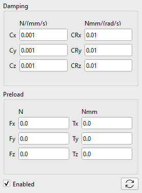

Розділ «Пружини» включає такі компоненти:

-   Компресійна пружина (Compression Spring), яка діє як поступальний пружинний амортизатор,
-   Торсіонна пружина (Torsion Spring), яка діє як обертальний пружинний амортизатор,
-   Втулка (Bushing), що діє як гнучкий сполучний елемент поступального та обертального руху.

## Компресійна пружина (Compression Spring)

Пружину стиснення можна встановити між будь-якими двома жорсткими тілами та землею в конкретних точках простору, визначених вибором систем відліку.

Пружина одночасно діє на обидва тіла (Body_I, Body_J).

### Визначення пружини стиснення

Пружина стиснення визначається такими параметрами в інтерфейсі користувача:

-   Body_I: перше Тіло або земля,
-   Body_J: друге Тіло або земля,
-   RF Body I: Система відліку як точка дії на Body_I,
-   RF Body J: Система відліку як точка дії на Body_J,
-   Stiffness (N/mm) - Жорсткість пружини (k),
-   Damping (Ns/mm): коефіцієнт затухання (C),
-   Preload (N): попереднє натягнення або стиснення пружини: штовхає за позитивного значення і стискає за негативного.

 

Після того як пружину задано, параметри жорсткості, затухання та попереднього натягу можна згодом змінити, проте пов'язані з нею незалежні системи координат стають недоступними для редагування. Водночас, за необхідності, тіла Body_I або Body_J, пов'язані пружиною, можна переміщати разом із пружиною.

Між тими самими тілами можна визначити відразу кілька пружин.

### Розрахунок сили пружини стиснення

Величина сили пружини стиснення розраховується таким чином:

$$
F_{s p r i n g} = F_{p r e l o a d} - k \mathrm{\Delta} L - C \dot{L}
$$

$$
\mathrm{\Delta} L = L - L_{i n i t i a l}
$$

де:

$$L_{i n i t i a l}$$ — початкова відстань між RF_Body_I та RF_Body_J у момент часу t=0,

$$L$$ — фактична відстань як величина вектора між RF_Body_I та RF_Body_J, динамічно обчислюваного розв'язувачем,

$$\mathrm{\Delta} L$$ — це деформація пружини,

$$\dot{L}$$ — відносна швидкість точок приєднання пружини RF_Body_I та RF_Body_J,

Розрахована сила пружини ($$F_{s p r i n g}$$) прикладається до тіл Body_I та Body_J за принципом «дія — протидія». Також прикладаються локальні моменти, що визначаються як векторний добуток важелів, проведених від центрів мас тіл до точок прикладання сили пружини («RF Body I» та «RF Body J»).

## Торсіонна пружина (Torsion Spring)

Торсіонна пружина може бути задана між будь-якими двома жорсткими тілами (або землею) у конкретній точці вздовж певного напрямку.

Торсіонна пружина одночасно додає пару крутних моментів «дія-реакція» до двох тіл (Body_I, Body_J).

### Визначення торсіонної пружини

Торсіонна пружина визначається такими параметрами в інтерфейсі користувача:

-   Body_I: перше Тіло або Земля,
-   Body_J: друге Тіло або Земля,
-   Anchor: система координат пружини,
-   XYZ-спадне меню: вісь системи координат Anchor RF. Вона визначає вісь крутного моменту пружини та враховується, лише якщо систему координат Target не визначено.
-   Target: ця система відліку визначає напрямок крутного моменту пружини як вісь між системами відліку Anchor і Target. Спадне меню XYZ ігнорується, якщо задана система координат Target.
-   Stiffness (Nmm/rad): Жорсткість пружини (k),
-   Damping (Nmms/ rad): коефіцієнт затухання (C),
-   Preload (Nmm): Початкове натягнення пружини.

Як видно з визначення, після визначення системи координат пружини Anchor існує два способи задання осі крутного моменту пружини:

1.  Якщо вісь крутного моменту — одна з осей Anchor RF, то цю вісь можна вибрати за допомогою випадного меню XYZ;
2.  Якщо задана система координат Target RF, то вісь крутного моменту з'єднає системи відліку Anchor і Target. У цьому випадку розкривний список XYZ не розглядається.

 

Після того як пружину задано, параметри жорсткості, затухання та попереднього натягу можна згодом змінити, однак пов'язані з нею незалежні системи координат стають недоступними для редагування. Водночас, за необхідності, пов'язані пружиною тіла Body_I або Body_J можна переміщати разом із пружиною.

Можна визначити кілька торсіонних пружин між тими самими тілами.

### Розрахунок крутного моменту для торсіонної пружини

Дія торсіонної пружини обмежена обертанням навколо головної осі, що визначається системами відліку «Опора» (Anchor) та (опціонально) «Ціль» (Target). Величина крутного моменту торсіонної пружини розраховується таким чином:

$$
T_{s p r i n g} = T_{p r e l o a d} - k \mathrm{\Delta} \theta - C \dot{\theta}
$$

де:

$$\mathrm{\Delta} \theta$$ — деформація пружини, розрахована як відносне обертання Body_I та Body_J вздовж осі крутного моменту,

$$\dot{\theta}$$ — відносна кутова швидкість Body_I та Body_J уздовж осі крутного моменту.

Розрахована величина крутного моменту пружини ($$T_{s p r i n g}$$) застосовується як момент дії та реакції до Body_I та Body_J.

## Втулка (Bushing)

Втулка являє собою узагальнений еластичний сполучний елемент, який створює поступальні та обертальні пружинно-демпферні сили за всіма 6 ступенями свободи.

Математично вона працює виключно в локальній системі координат своєї опорної системи відліку. Елемент втулки діє як три пружини стиснення та три пружини кручення, прикладені до однієї й тієї ж точки.

### Визначення втулки

Втулка визначається такими параметрами в інтерфейсі користувача:

-   Body_I: перше Тіло або Земля,
-   Body_J: друге Тіло або Земля,
-   Anchor RF: глобальна система відліку, що визначає положення втулки як локальні точки в Body_I та Body_J,
-   Stiffness Kx, Ky, Kz (N/mm): лінійна жорсткість, орієнтована вздовж системи координат Anchor RF,
-   Stiffness KRx, KRy, KRz (Nmm/rad): жорсткість обертання, орієнтована вздовж системи координат Anchor RF,
-   Damping Cx, Cy, Cz (Ns/mm): лінійне затухання,
-   Damping CRx, Cry, CRz (Nmms/rad): затухання обертання,
-   Preload Fx, Fy, Fz (N): початкове силове навантаження,
-   Preload Tx, Ty, Tz (Nmm): початковий крутний момент.

 

### Розрахунок сил реакції та крутних моментів втулки

Втулка (також відома як пружинний демпфер із 6 ступенями свободи) — це по суті 3 незалежні пружини стиснення та 3 незалежні торсіонні пружини, що діють вздовж локальних осей X, Y та Z заданої системи відліку Anchor RF. Два тіла мають єдину точку еластичного шарніра, що дозволяє гнучко рухатися у всіх 6 напрямках.

 

У процесі моделювання вимірюються поточне відносне положення та швидкість опорних точок тіл Body_I та Body_J. Отримані значення проектуються на осі локальної системи координат опорної точки тіла Body_I для визначення локальної поступальної деформації ($$\Delta x$$) та швидкості ($$v_{r e l}$$). Одночасно порівнюються поточні матриці відносного повороту тіл Body_I та Body_J для обчислення локальних кутів скручування ($$\Delta \theta$$) та відносних кутових швидкостей ($$\omega_{r e l}$$). Потім для кожної осі розраховуються незалежні сили та моменти з використанням стандартних рівнянь для пружинно-демпфувальних елементів:

$$
F_{l o c} = - K_{t r a n s} \mathrm{\Delta} x - C_{t r a n s} v_{r e l} + F_{p r e l o a d}
$$

$$
T_{l o c} = - K_{r o t} \mathrm{\Delta} \theta - C_{r o t} \omega_{r e l} + T_{p r e l o a d}
$$

Ці локальні вектори сили та крутного моменту множаться на матрицю обертання Anchor RF, щоб отримати їх у глобальному 3D-просторі:

($F_{glob_I} = - F_{glob_J}$ та $T_{glob_I} = - T_{glob_J}$)

Сила ($$F_{g l o b}$$) прикладається в точці кріплення Anchor RF, яка в загальному випадку знаходиться на відстані (R) від центру ваги тіла. У результаті сила ($$F_{g l o b}$$) створює механічний момент для тіл Body_I та Body_J. Нарешті, сумарний момент:

$$
T_{total_I} = T_{glob_I} + ( R_I \times F_{glob_I} )
$$

$$
T_{total_J} = T_{glob_J} + ( R_J \times F_{glob_J} )
$$
